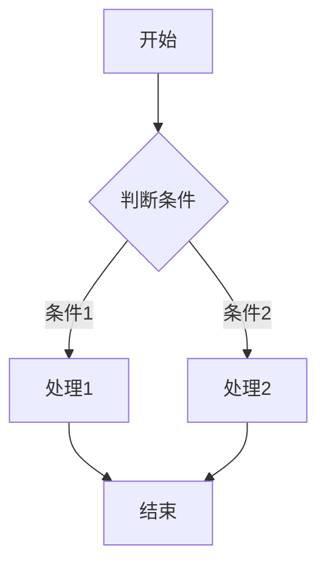
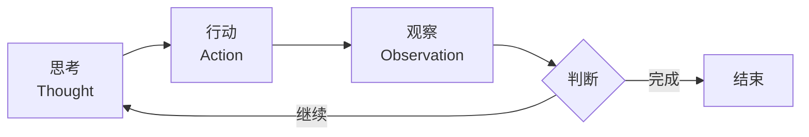
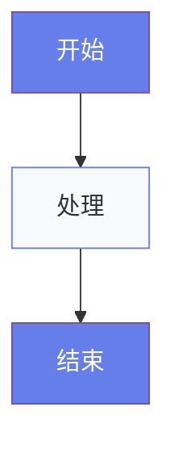

# 内容编写规范

本文档定义 AI种子团队培训课程的内容编写规范，确保所有课程文档的一致性和可维护性。

---

## 📁 文档结构

### 双轨制文档管理

```
AI-Lesson/
├── content/          # 源文件（讲师编辑）
│   ├── pre-lesson/
│   ├── lesson-01/
│   └── projects/
│
└── docs/             # VitePress 站点（自动同步）
    ├── pre-lesson/
    ├── lesson-01/
    ├── projects/
    └── platform-guide/
```

**规则**：
- 所有内容编辑在 `content/` 目录进行
- `docs/` 目录由同步脚本自动生成，**不要手动编辑**
- 同步脚本会根据 `filename-mapping.json` 进行文件映射

---

## 📝 Markdown 规范

### 文件命名

**content/ 目录**（保留原文件名）：
```
✅ Day1-AgenticAI与ReAct模式.md
✅ Pre-Lesson-01-灵知平台入门.md
✅ 智能问数-项目设计.md
```

**docs/ 目录**（自动生成，短横线小写）：
```
day1-ai-trends.md
01-platform-intro.md
smart-query.md
```

### Frontmatter 格式

每个 Markdown 文件必须包含 YAML frontmatter：

```markdown
---
title: "Day 1：AI趋势与Agentic AI基础"
description: "了解近期AI技术发展趋势、深入理解ReAct模式"
outline: deep
prev: /pre-lesson/03-vibe-coding
next: /lesson-01/day2-agent-dev
lastUpdated: 2026-03-05
---
```

**字段说明**：
- `title`：页面标题（显示在浏览器标签和页面顶部）
- `description`：页面描述（用于 SEO 和搜索）
- `outline`：大纲显示级别（`false` 不显示，`deep` 显示所有层级）
- `prev`/`next`：上一页/下一页链接（可选）
- `lastUpdated`：最后更新日期（YYYY-MM-DD）

### 标题层级

```markdown
# 一级标题 - 页面主标题（自动使用 frontmatter.title）

## 二级标题 - 主要章节

### 三级标题 - 小节

#### 四级标题 - 具体内容（尽量少用）
```

**规则**：
- 一级标题 `#` 只使用一次
- 二级标题 `##` 用于主要章节
- 三级标题 `###` 用于小节划分
- 保持层级清晰，不要跳级

### 文本格式

**强调**：
```markdown
**粗体** - 重要概念、关键词
*斜体* - 引用、术语首次出现
~~删除线~~ - 已废弃内容
```

**列表**：
```markdown
## 无序列表
- 第一项
- 第二项
  - 子项（2个空格缩进）
  - 子项

## 有序列表
1. 第一步
2. 第二步
   1. 子步骤
   2. 子步骤
```

**引用**：
```markdown
> 这是引用文本
> 可用于讲师备注或重要提示

> **提示**：带图标的提示框
```

### 代码块

**行内代码**：
```markdown
使用 `console.log()` 输出信息
```

**代码块**：
```markdown
```javascript
function greet(name) {
  return `Hello, ${name}!`;
}
```
```

**指定语言**：
- `javascript` / `js` - JavaScript
- `typescript` / `ts` - TypeScript
- `python` - Python
- `json` - JSON
- `yaml` - YAML
- `bash` / `shell` - 命令行
- `markdown` / `md` - Markdown
- `mermaid` - 流程图

### 表格

```markdown
| 参数名 | 类型 | 默认值 | 说明 |
|--------|------|--------|------|
| temperature | number | 0.7 | 控制随机性 |
| max_tokens | number | 2000 | 最大输出长度 |
```

**规则**：
- 表头使用粗体
- 对齐方式：文字左对齐，数字右对齐
- 保持列宽一致

### 链接

**内部链接**：
```markdown
[Day 1 课程内容](./Day1-AgenticAI与ReAct模式.md)
[返回首页](/)
[项目设计](/projects/smart-query)
```

**外部链接**：
```markdown
[灵知平台](https://example.com){target="_blank"}
```

**规则**：
- 内部链接使用相对路径
- 外部链接添加 `{target="_blank"}` 在新窗口打开

---

## 🔄 流程图规范（Mermaid）

### 基础流程图

```markdown

```

### ReAct 循环流程

```markdown

```

### 流程图最佳实践

1. **使用中文**：流程图文字使用中文
2. **简洁明了**：每个节点文字不超过 10 个字
3. **颜色标注**：使用 classDef 定义样式
4. **方向选择**：
   - `LR` - 从左到右（适合线性流程）
   - `TD` - 从上到下（适合层级结构）

### 样式定义

```markdown

```

---

## 🎨 内容组件

### 提示框

**提示**：
```markdown
> **提示**：这是提示信息
```

> **提示**：这是提示信息

**注意**：
```markdown
> **注意**：这是注意事项
```

> **注意**：这是注意事项

**警告**：
```markdown
> **警告**：这是重要警告
```

> **警告**：这是重要警告

### 步骤列表

```markdown
## 操作步骤

### 步骤 1：准备工作
详细说明...

### 步骤 2：执行操作
详细说明...

### 步骤 3：验证结果
详细说明...
```

### 时间线

```markdown
## 时间安排

**上午**
- 08:30-09:30 内容1
- 09:30-10:30 内容2

**下午**
- 14:00-15:00 内容3
- 15:00-16:00 内容4
```

---

## 📋 课程文档模板

### Day 课程模板

```markdown
---
title: "Day X：课程标题"
description: "课程描述"
outline: deep
prev: /lesson-01/day{X-1}
next: /lesson-01/day{X+1}
lastUpdated: 2026-03-05
---

# Day X：课程标题

## 课程信息

- **日期**：第 X 天
- **总课时**：8课时（每课时40分钟）
- **上午**：4课时
- **下午**：4课时

## 学习目标

1. 目标1
2. 目标2
3. 目标3

## 上午课程

### 课时1：主题1

#### 学习目标
- 目标描述

#### 课程内容

**1. 小节1（时间）**

内容详情...

**2. 小节2（时间）**

内容详情...

#### 讲师备注
> 备注内容...

### 课时2：主题2
...

## 下午课程
...

## 学习资源

- [资源1](./link1)
- [资源2](./link2)

## 课后作业

1. 作业1
2. 作业2
```

### Pre-Lesson 模板

```markdown
---
title: "第X次直播：直播标题"
description: "直播描述"
outline: deep
lastUpdated: 2026-03-05
---

# 第X次直播：直播标题

## 直播信息

- **时间**：Day 1 前 X 天
- **时长**：90分钟（授课60分钟 + 交流30分钟）
- **方式**：线上直播

## 学习目标

1. 目标1
2. 目标2

## 课程内容

### 第一部分：主题1（30分钟）

内容...

### 第二部分：主题2（30分钟）

内容...

## 实操练习

练习内容...

## 课后任务

1. 任务1
2. 任务2
```

### 项目设计模板

```markdown
---
title: "项目名称项目设计"
description: "项目描述"
outline: deep
lastUpdated: 2026-03-05
---

# 项目名称项目设计

## 项目概述

### 项目背景
背景描述...

### 项目目标
目标描述...

### 目标用户
用户描述...

## 功能设计

### 核心功能

#### 功能1：功能名称

**功能描述**：...

**用户故事**：...

**实现方案**：...

## 技术方案

### 技术架构
架构图...

### Agent 设计

#### 编排流程
流程图...

#### 模块配置
配置说明...

## 界面设计

界面描述或原型图...

## 开发计划

| 阶段 | 时间 | 任务 |
|------|------|------|
| 阶段1 | Day X | 任务1 |
| 阶段2 | Day Y | 任务2 |
```

---

## 🔄 同步流程

### 日常编辑流程

1. **编辑内容**
   ```bash
   # 编辑 content/ 目录下的 Markdown 文件
   code content/lesson-01/Day1-AgenticAI与ReAct模式.md
   ```

2. **本地预览**
   ```bash
   # 同步内容并启动预览
   npm run dev
   ```

3. **提交更改**
   ```bash
   git add -A
   git commit -m "更新 Day 1 课程内容"
   git push
   ```

4. **自动部署**
   - GitHub Actions 自动运行同步脚本
   - 自动部署到 GitHub Pages
   - 约 2-3 分钟后线上更新

### 新增文档流程

1. **创建文件**
   ```bash
   # 在 content/ 目录创建新文件
   touch content/lesson-01/新课程.md
   ```

2. **更新映射表**
   ```bash
   # 编辑 scripts/filename-mapping.json
   code scripts/filename-mapping.json
   ```

3. **运行同步**
   ```bash
   npm run sync
   ```

4. **验证结果**
   ```bash
   npm run dev
   ```

---

## ⚠️ 注意事项

### 不要做的事情

❌ **不要在 docs/ 目录直接编辑文件**  
原因：会被同步脚本覆盖

❌ **不要删除或修改 filename-mapping.json 中的现有映射**  
原因：会导致链接失效

❌ **不要使用复杂的 HTML 标签**  
原因：Markdown 是主要格式，复杂 HTML 难以维护

❌ **不要上传大文件（>10MB）到 Git**  
原因：影响仓库性能和 GitHub Pages 部署

### 要做的事情

✅ **定期更新 lastUpdated 字段**  
原因：让学员知道内容的新鲜度

✅ **使用相对路径链接**  
原因：确保链接在本地和线上都有效

✅ **添加适当的描述（description）**  
原因：用于 SEO 和搜索功能

✅ **测试链接有效性**  
原因：避免学员遇到 404 错误

---

## 🆘 常见问题

### Q1：同步脚本失败怎么办？

**检查步骤**：
1. 检查 filename-mapping.json 格式是否正确
2. 检查源文件是否存在
3. 检查是否有权限问题
4. 手动运行 `node scripts/sync-content.js` 查看错误信息

### Q2：如何添加新的映射关系？

**步骤**：
1. 在 content/ 目录创建文件
2. 编辑 scripts/filename-mapping.json
3. 添加新的映射对象
4. 运行同步脚本

### Q3：流程图不显示怎么办？

**检查**：
1. 确保代码块标记为 `mermaid`
2. 检查语法是否正确
3. 查看浏览器控制台是否有错误

### Q4：如何更新导航菜单？

**方式**：
- 编辑 docs/.vitepress/config.ts
- 修改 nav 或 sidebar 配置
- 注意：这属于站点配置，不是内容编辑

---

## 📚 参考资源

- [VitePress 文档](https://vitepress.dev/)
- [Mermaid 文档](https://mermaid.js.org/)
- [Markdown 指南](https://www.markdownguide.org/)

---

**创建日期**：2026-03-05  
**最后更新**：2026-03-05  
**版本**：v1.0
