# ReAct模式在灵知平台的实现方案

**版本**：v1.0  
**创建日期**：2024年3月3日  
**适用对象**：国网四川电力AI种子团队培训  

---

## 目录

- [一、ReAct模式概述](#一react模式概述)
- [二、灵知平台实现架构](#二灵知平台实现架构)
- [三、详细设计](#三详细设计)
- [四、Memory管理](#四memory管理)
- [五、关键提示词设计](#五关键提示词设计)
- [六、实施步骤](#六实施步骤)
- [七、常见问题与解决方案](#七常见问题与解决方案)

---

## 一、ReAct模式概述

### 1.1 什么是ReAct？

**ReAct = Reasoning（推理）+ Acting（行动）**

核心思想：让AI像人类一样思考和行动

```
Thought（思考）→ Action（行动）→ Observation（观察）→ 循环
```

### 1.2 传统ReAct vs Plan-based ReAct

| 特性 | 传统ReAct | Plan-based ReAct（本方案） |
|------|-----------|---------------------------|
| Action生成 | 动态生成 | 预先规划Plan |
| 执行方式 | 单步执行 | 批量执行Action List |
| 工具范围 | 不限制 | 预定义工具集 |
| 控制复杂度 | 高 | 中 |
| 灵知平台适配 | 困难 | 容易 |

### 1.3 本方案的核心优势

1. **适合灵知平台**：充分利用循环模块和Memory机制
2. **可视化流程**：流程清晰，易于理解和调试
3. **可扩展性强**：易于添加新的工具路径
4. **容错机制完善**：支持重试、失败处理、Plan补充

---

## 二、灵知平台实现架构

### 2.1 整体架构

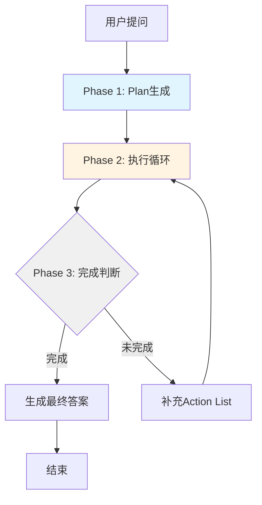

### 2.2 三大阶段

**Phase 1: Plan Generation**
- 分析用户问题
- 生成Action List
- 初始化Memory

**Phase 2: Execution Loop**
- 遍历Action List
- 激活对应工具路径
- 执行工具并验证
- 更新Memory

**Phase 3: Completion Check**
- 判断任务完成度
- 生成最终答案或补充Plan

---

## 三、详细设计

### 3.1 Phase 1: Plan Generation

#### 3.1.1 模块编排图

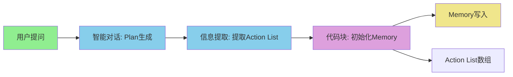

#### 3.1.2 模块详细配置

**模块1：用户提问**
- 类型：用户提问模块
- 输出：`user_question`（字符串）

**模块2：智能对话（Plan生成）**

参数配置：
- 模型：Qwen-Plus
- 回复创意性：0
- 回复字数：1000

提示词：
```
你是一个任务规划专家。分析用户的问题，将其分解为具体的执行步骤。

可用工具：
1. knowledge_search: 知识库搜索
   - 参数：query（查询内容）, knowledge_base（知识库名称）, top_k（返回数量）

2. api_call: API调用
   - 参数：endpoint（接口地址）, method（请求方法）, params（请求参数）

3. db_query: 数据库查询
   - 参数：query（查询语句）, database（数据库名称）

4. doc_gen: 文档生成
   - 参数：template（模板名称）, content_structure（内容结构）

5. code_exec: 代码执行
   - 参数：code（代码内容）, language（编程语言）

6. external_tool: 外部工具调用
   - 参数：tool_name（工具名称）, params（工具参数）

用户问题：{{user_question}}

请生成详细的执行计划，格式如下：

{
  "task_understanding": "对用户问题的理解",
  "actions": [
    {
      "id": 1,
      "type": "knowledge_search",
      "description": "搜索电力安全规程相关内容",
      "parameters": {
        "query": "电力安全规程",
        "knowledge_base": "安规库",
        "top_k": 5
      },
      "success_criteria": "找到至少3条相关文档"
    }
  ],
  "expected_result": "期望达成的目标"
}

只输出JSON，不要其他内容。
```

**模块3：信息提取**

参数配置：
- 提取字段：
  - `plan_json`：字符串，完整JSON
  - `action_list`：字符串，actions数组

提示词：
```
从以下JSON中提取信息：

{{智能对话.回复内容}}

请提取：
1. plan_json：完整的JSON字符串
2. action_list：actions数组部分

输出格式：
{
  "plan_json": "...",
  "action_list": "..."
}
```

**模块4：代码块（初始化Memory）**

语言：JavaScript

代码：
```javascript
function userFunction(input) {
  // 解析plan
  const plan = JSON.parse(input.plan_json);
  
  // 初始化Memory结构
  const memory = {
    "plan": plan,
    "current_index": 0,
    "retry_counts": {},
    "results": {},
    "context": {
      "user_question": "",
      "iteration": 0,
      "summary": ""
    }
  };
  
  // 初始化重试计数
  plan.actions.forEach(action => {
    memory.retry_counts[action.id] = 0;
  });
  
  return {
    "memory_init": JSON.stringify(memory),
    "action_list_json": input.action_list
  };
}
```

**模块5：Memory写入**
- 变量名：`memory`
- 连接：代码块的 `memory_init` 输出

---

### 3.2 Phase 2: Execution Loop

#### 3.2.1 循环体整体结构

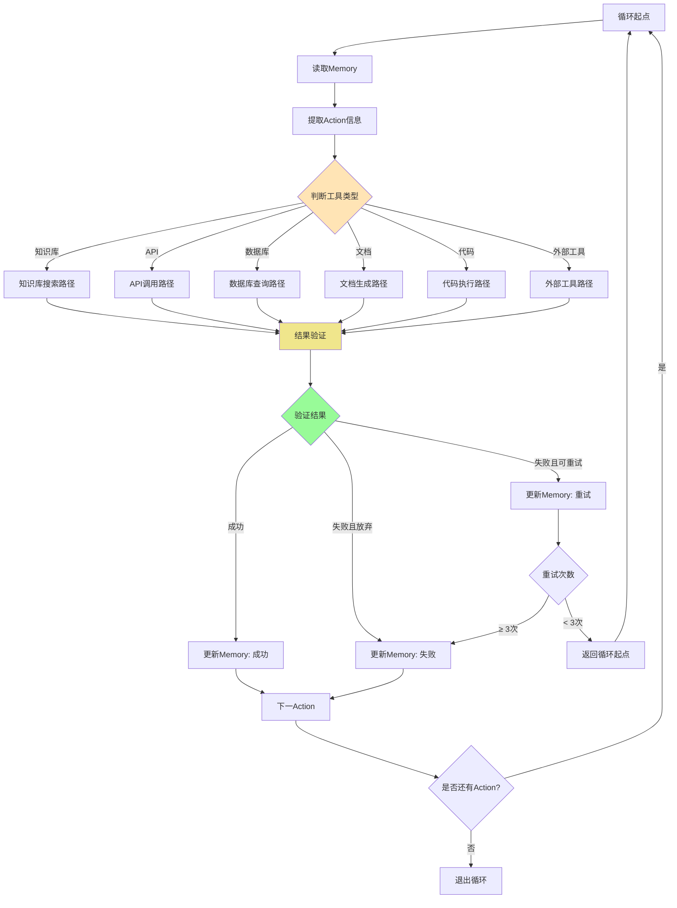

#### 3.2.2 循环模块配置

**模块6：循环模块（For Each）**
- 输入：`action_list_json`（数组）
- 循环变量：
  - `current_action`：当前Action对象
  - `action_index`：当前索引

#### 3.2.3 智能对话（读取Memory + 准备上下文）

提示词：
```
当前执行状态：

Memory：
{{memory}}

当前Action：
{{current_action}}

请分析当前Action的执行需求：
1. 这个Action需要使用哪个工具？
2. 需要什么参数？
3. 是否需要之前Action的结果？

输出格式（JSON）：
{
  "tool_type": "knowledge_search",
  "parameters": {
    "query": "电力安全规程",
    "knowledge_base": "安规库",
    "top_k": 5
  },
  "context_needed": [],
  "execution_note": "注意事项"
}

只输出JSON。
```

#### 3.2.4 信息提取（提取工具类型）

提示词：
```
从以下JSON中提取工具类型：

{{智能对话.回复内容}}

输出格式：
{
  "tool_type": "knowledge_search"
}

只输出工具类型。
```

#### 3.2.5 代码块（路径激活）

语言：JavaScript

代码：
```javascript
function userFunction(input) {
  const toolType = input.tool_type || "";
  
  return {
    "is_knowledge_search": toolType === "knowledge_search",
    "is_api_call": toolType === "api_call",
    "is_db_query": toolType === "db_query",
    "is_doc_gen": toolType === "doc_gen",
    "is_code_exec": toolType === "code_exec",
    "is_external_tool": toolType === "external_tool"
  };
}
```

---

### 3.3 工具路径详细设计

#### 3.3.1 知识库搜索路径

**模块路径**：

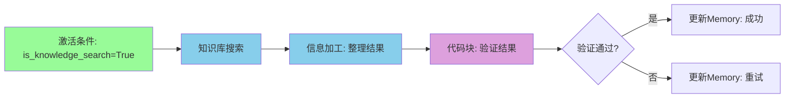

**模块8.1：知识库搜索**
- 输入：`{{current_action.parameters.query}}`
- 知识库：`{{current_action.parameters.knowledge_base}}`
- 参数：
  - 相似度阈值：0.7
  - 召回数：`{{current_action.parameters.top_k}}`

**模块8.2：信息加工（整理结果）**

提示词：
```
知识库搜索结果：
{{知识库搜索.搜索结果}}

请整理搜索结果，提取关键信息：
1. 找到了多少条相关文档？
2. 每条文档的核心内容是什么？
3. 是否回答了用户的查询？

输出格式：
{
  "result_count": 3,
  "documents": [
    {
      "id": 1,
      "content": "文档内容摘要",
      "relevance": "相关性说明"
    }
  ],
  "summary": "整体总结"
}
```

**模块8.3：代码块（验证结果）**

```javascript
function userFunction(input) {
  const memory = JSON.parse(input.memory);
  const currentAction = JSON.parse(input.current_action);
  const result = JSON.parse(input.result_json);
  
  // 验证成功标准
  const successCriteria = currentAction.success_criteria;
  const isSuccess = evaluateSuccess(result, successCriteria);
  
  // 更新Memory
  if (isSuccess) {
    memory.results[currentAction.id] = {
      "status": "success",
      "result": result,
      "timestamp": Date.now()
    };
    memory.current_index++;
  } else {
    memory.retry_counts[currentAction.id]++;
  }
  
  memory.context.iteration++;
  
  return {
    "updated_memory": JSON.stringify(memory),
    "is_success": isSuccess,
    "should_retry": !isSuccess && memory.retry_counts[currentAction.id] < 3
  };
}
```

**模块8.4：Memory更新**
- 连接代码块的 `updated_memory` 输出

#### 3.3.2 API调用路径

**模块路径**：

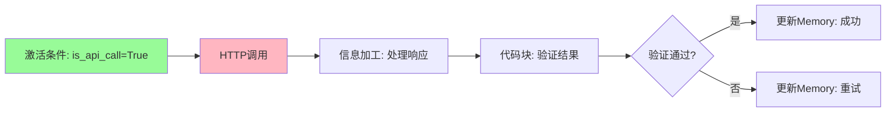

**模块9.1：HTTP调用**
- URL：`{{current_action.parameters.endpoint}}`
- 方法：`{{current_action.parameters.method}}`
- 请求体：`{{current_action.parameters.params}}`

**模块9.2：信息加工（处理响应）**

提示词：
```
API响应：
{{HTTP调用.响应内容}}

请分析API响应：
1. 调用是否成功？
2. 返回的数据是什么？
3. 数据是否完整？

输出格式：
{
  "success": true,
  "data": {...},
  "error": null
}
```

（后续验证逻辑与知识库搜索类似）

#### 3.3.3 数据库查询路径

**模块路径**：

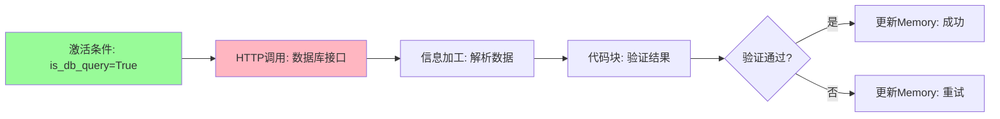

（具体配置参考API调用路径，数据库查询通过HTTP接口实现）

#### 3.3.4 文档生成路径

**模块路径**：

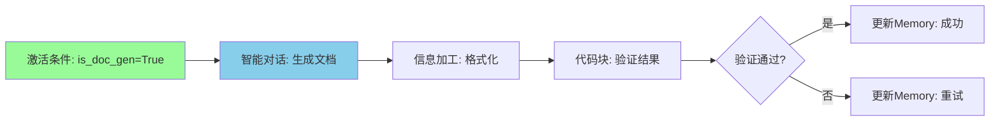

**模块11.1：智能对话（生成文档）**

提示词：
```
模板：{{current_action.parameters.template}}

内容结构：{{current_action.parameters.content_structure}}

上下文信息：
{{memory.context.summary}}

请根据以上信息生成文档内容。

要求：
1. 遵循模板格式
2. 内容结构清晰
3. 语言专业准确

直接输出文档内容，不要其他说明。
```

#### 3.3.5 代码执行路径

**模块路径**：

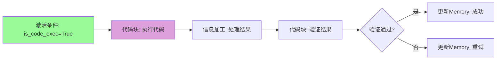

**模块12.1：代码块（执行代码）**

```javascript
function userFunction(input) {
  const code = input.code;
  const language = input.language;
  
  // 执行代码逻辑
  try {
    // 这里需要根据实际需求实现代码执行
    // 注意安全性和执行时间限制
    
    return {
      "success": true,
      "result": "执行结果",
      "error": null
    };
  } catch (error) {
    return {
      "success": false,
      "result": null,
      "error": error.message
    };
  }
}
```

#### 3.3.6 外部工具调用路径

**模块路径**：

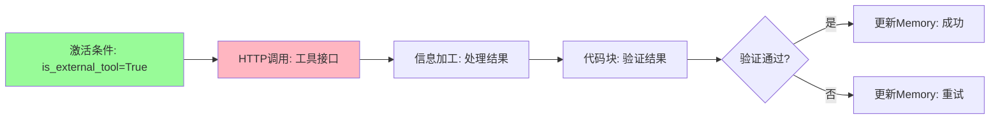

（具体配置参考API调用路径）

---

### 3.4 循环控制与重试机制

#### 3.4.1 重试判断逻辑

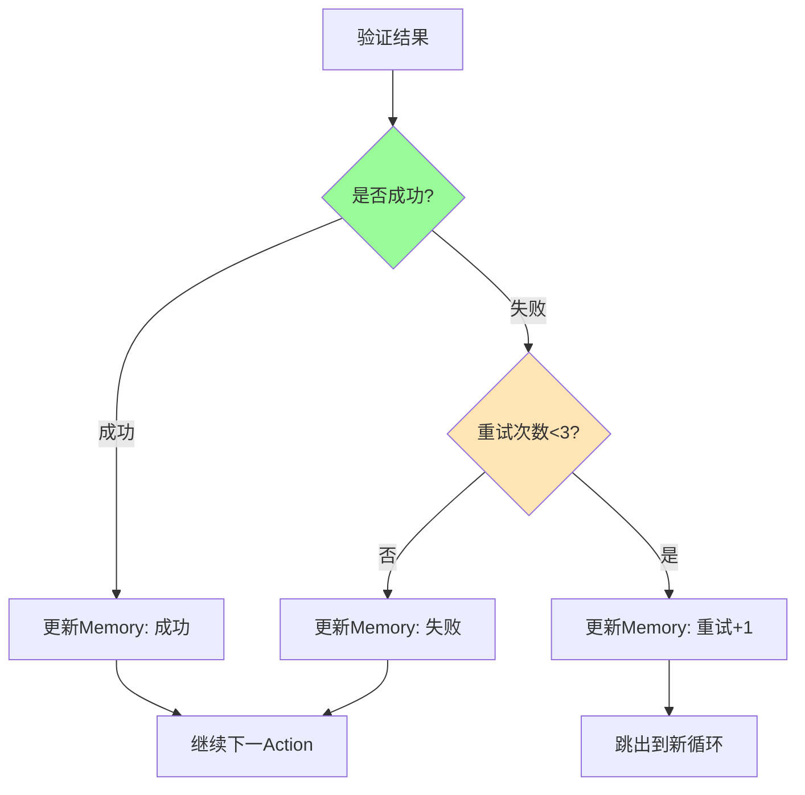

#### 3.4.2 重试实现方案

**方案：跳出循环 + 新数组重启**

当需要重试时：
1. 代码块生成新的Action List（包含当前Action）
2. 跳出当前循环
3. 使用新数组启动新的循环

**代码块（生成重试数组）**：

```javascript
function userFunction(input) {
  const memory = JSON.parse(input.memory);
  const currentAction = JSON.parse(input.current_action);
  const actionList = JSON.parse(input.action_list);
  
  // 当前Action重试次数
  const retryCount = memory.retry_counts[currentAction.id];
  
  if (retryCount < 3) {
    // 生成新数组：当前Action + 后续Action
    const remainingActions = actionList.slice(memory.current_index);
    const newActionList = JSON.stringify(remainingActions);
    
    return {
      "new_action_list": newActionList,
      "should_retry": true,
      "exit_loop": true
    };
  } else {
    // 超过重试次数，标记失败
    return {
      "should_retry": false,
      "exit_loop": false
    };
  }
}
```

**路径控制**：
- `should_retry=True` → 连接到外层新循环起点
- `should_retry=False` → 继续当前循环

---

### 3.5 Phase 3: Completion Check

#### 3.5.1 模块编排图

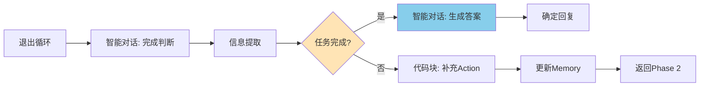

#### 3.5.2 智能对话（完成判断）

提示词：
```
Memory内容：
{{memory}}

用户原始问题：
{{memory.context.user_question}}

任务理解：
{{memory.plan.task_understanding}}

已执行的Action：
{{memory.results}}

失败的Action：
{{memory.failed_actions}}

请判断：
1. 任务是否完成？
2. 完成度是多少？
3. 还缺少什么？
4. 是否需要补充Action？

输出格式（JSON）：
{
  "is_completed": false,
  "completion_rate": 0.7,
  "solved_aspects": ["已解决的问题"],
  "unsolved_aspects": ["未解决的问题"],
  "missing_actions": [
    {
      "id": 10,
      "type": "knowledge_search",
      "description": "补充搜索",
      "parameters": {...}
    }
  ],
  "final_answer": "如果完成，给出最终答案"
}

只输出JSON。
```

#### 3.5.3 代码块（补充Action List）

```javascript
function userFunction(input) {
  const memory = JSON.parse(input.memory);
  const missingActions = JSON.parse(input.missing_actions);
  
  // 补充Action到plan
  if (missingActions && missingActions.length > 0) {
    const newActions = missingActions.map((action, index) => ({
      ...action,
      "id": memory.plan.actions.length + index + 1,
      "status": "pending"
    }));
    
    memory.plan.actions.push(...newActions);
    
    return {
      "updated_memory": JSON.stringify(memory),
      "new_action_list": JSON.stringify(newActions)
    };
  }
  
  return {
    "updated_memory": JSON.stringify(memory),
    "new_action_list": "[]"
  };
}
```

#### 3.5.4 条件分支

**分支A：任务完成**
- 连接：智能对话生成最终答案
- 输出：确定回复给用户

**分支B：任务未完成**
- 连接：更新Memory
- 循环：返回Phase 2执行新的Action List

---

## 四、Memory管理

### 4.1 Memory数据结构

```json
{
  "plan": {
    "task_understanding": "任务理解",
    "actions": [
      {
        "id": 1,
        "type": "knowledge_search",
        "description": "搜索电力安全规程",
        "parameters": {
          "query": "电力安全规程",
          "knowledge_base": "安规库",
          "top_k": 5
        },
        "success_criteria": "找到至少3条相关文档"
      }
    ],
    "expected_result": "期望结果"
  },
  
  "current_index": 0,
  
  "retry_counts": {
    "1": 0,
    "2": 0
  },
  
  "results": {
    "1": {
      "status": "success",
      "result": {...},
      "timestamp": 1234567890
    }
  },
  
  "failed_actions": [3],
  
  "context": {
    "user_question": "用户原始问题",
    "iteration": 5,
    "summary": "执行过程摘要"
  }
}
```

### 4.2 Memory模块配置

**在灵知平台中**：

**Memory模块1**：
- 变量名：`memory`
- 用途：存储完整的状态信息

**Memory模块2**（可选）：
- 变量名：`action_results`
- 用途：存储所有Action的执行结果

**Memory模块3**（可选）：
- 变量名：`context_summary`
- 用途：存储上下文摘要

### 4.3 Memory读写策略

#### 写入方式

```
代码块输出（updated_memory）
  ↓（连线）
Memory模块（自动写入）
```

#### 读取方式

在智能对话提示词中：
```
当前状态：
{{memory}}
```

### 4.4 Memory更新时机

1. **Plan生成后**：初始化Memory
2. **每次Action执行后**：更新results、retry_counts
3. **重试时**：增加retry_count
4. **Plan补充时**：添加新的actions
5. **完成判断时**：更新context.summary

---

## 五、关键提示词设计

### 5.1 Plan生成提示词模板

```
角色：任务规划专家

任务：将用户问题分解为可执行的Action序列

工具清单：
1. knowledge_search: 知识库搜索
   - 参数：query, knowledge_base, top_k
   
2. api_call: API调用
   - 参数：endpoint, method, params
   
3. db_query: 数据库查询
   - 参数：query, database
   
4. doc_gen: 文档生成
   - 参数：template, content_structure
   
5. code_exec: 代码执行
   - 参数：code, language
   
6. external_tool: 外部工具调用
   - 参数：tool_name, params

用户问题：{{user_question}}

约束条件：
- Action数量控制在10个以内
- 每个Action必须有明确的成功标准
- 参数必须具体可执行

输出格式（JSON）：
{
  "task_understanding": "...",
  "actions": [...],
  "expected_result": "..."
}

只输出JSON。
```

### 5.2 结果验证提示词模板

```
任务：验证Action执行结果

Action信息：
- 类型：{{current_action.type}}
- 描述：{{current_action.description}}
- 成功标准：{{current_action.success_criteria}}

执行结果：
{{execution_result}}

请判断：
1. 是否满足成功标准？
2. 结果质量如何？
3. 是否需要重试？

输出格式（JSON）：
{
  "is_success": true,
  "quality_score": 0.8,
  "issues": [],
  "should_retry": false,
  "retry_suggestion": ""
}

只输出JSON。
```

### 5.3 上下文管理提示词模板

```
任务：总结执行上下文

Memory内容：
{{memory}}

请总结：
1. 已完成的关键操作
2. 获得的重要信息
3. 遇到的问题
4. 下一步建议

输出格式（JSON）：
{
  "summary": "执行过程摘要",
  "key_findings": ["关键发现"],
  "issues": ["遇到的问题"],
  "next_steps": "下一步建议"
}

只输出JSON。
```

### 5.4 完成判断提示词模板

```
任务：判断任务完成度

用户问题：
{{memory.context.user_question}}

任务理解：
{{memory.plan.task_understanding}}

执行结果：
{{memory.results}}

请判断：
1. 任务是否完全解决？
2. 完成度是多少？
3. 还缺少什么？
4. 是否需要补充Action？

输出格式（JSON）：
{
  "is_completed": false,
  "completion_rate": 0.7,
  "solved_aspects": [],
  "unsolved_aspects": [],
  "missing_actions": [],
  "final_answer": ""
}

只输出JSON。
```

---

## 六、实施步骤

### 6.1 分步实施建议

**Step 1：实现基础框架（1-2小时）**
- 创建用户提问、Plan生成、信息提取模块
- 初始化Memory
- 验证Plan生成功能

**Step 2：实现单工具路径（2-3小时）**
- 实现知识库搜索路径
- 配置循环模块
- 验证单路径执行

**Step 3：实现多工具路径（3-4小时）**
- 添加其他5个工具路径
- 配置路径激活代码块
- 测试多路径切换

**Step 4：实现重试机制（2小时）**
- 实现验证代码块
- 配置重试逻辑
- 测试重试功能

**Step 5：实现完成判断（2小时）**
- 实现Phase 3
- 配置条件分支
- 测试Plan补充

**Step 6：集成测试（2-3小时）**
- 端到端测试
- 异常情况处理
- 性能优化

**总计：约12-16小时**

### 6.2 关键注意事项

1. **Memory大小控制**
   - 避免存储过大的数据
   - 定期清理不需要的结果
   - 使用摘要代替完整数据

2. **代码块执行时间**
   - 保持代码简洁
   - 避免复杂计算
   - 必要时分拆逻辑

3. **循环次数限制**
   - 设置最大循环次数（如20次）
   - 防止死循环
   - 超时保护

4. **错误处理**
   - 每个模块考虑异常情况
   - 提供降级方案
   - 记录错误日志

5. **性能优化**
   - 减少不必要的智能对话
   - 优化提示词长度
   - 合理配置并发

---

## 七、常见问题与解决方案

### 7.1 Memory相关问题

**问题1：Memory内容过大**

解决方案：
```javascript
// 定期清理Memory
function cleanMemory(memory) {
  // 只保留最近的10个结果
  const recentResults = {};
  const keys = Object.keys(memory.results).slice(-10);
  keys.forEach(key => {
    recentResults[key] = memory.results[key];
  });
  memory.results = recentResults;
  
  return memory;
}
```

**问题2：Memory读写冲突**

解决方案：
- 使用单一Memory模块
- 所有更新通过代码块统一处理
- 避免并发写入

### 7.2 循环相关问题

**问题1：死循环**

解决方案：
```javascript
// 添加全局循环计数
if (memory.context.iteration > 50) {
  // 强制退出，生成部分答案
  return {
    "force_exit": true,
    "reason": "Exceeded maximum iterations"
  };
}
```

**问题2：重试无限进行**

解决方案：
```javascript
// 严格限制重试次数
if (memory.retry_counts[actionId] >= 3) {
  // 标记失败，继续下一个Action
  memory.failed_actions.push(actionId);
  memory.current_index++;
}
```

### 7.3 工具路径问题

**问题1：API调用超时**

解决方案：
- 设置合理的超时时间
- 添加重试机制
- 提供降级响应

**问题2：知识库搜索无结果**

解决方案：
- 降低相似度阈值
- 增加召回数量
- 尝试不同的查询关键词

### 7.4 Plan相关问题

**问题1：Plan质量差**

解决方案：
- 优化Plan生成提示词
- 提供更多上下文
- 添加Plan验证步骤

**问题2：Action补充过多**

解决方案：
```javascript
// 限制补充Action数量
if (missingActions.length > 5) {
  // 只取优先级最高的5个
  missingActions = missingActions.slice(0, 5);
}
```

---

## 八、扩展与优化

### 8.1 性能优化建议

1. **提示词优化**
   - 精简不必要的描述
   - 使用结构化输出
   - 减少示例数量

2. **并发执行**
   - 多个Action并行执行
   - 减少总执行时间

3. **缓存机制**
   - 缓存常见的查询结果
   - 减少重复计算

### 8.2 功能扩展方向

1. **支持更多工具**
   - 添加新的工具类型
   - 自定义工具接口

2. **智能Plan优化**
   - 根据执行结果调整Plan
   - 自动合并相似Action

3. **可视化调试**
   - 实时显示执行过程
   - 记录详细日志

---

## 九、总结

### 9.1 方案优势

1. ✅ **适配灵知平台**：充分利用平台的模块化特性
2. ✅ **流程可视化**：清晰的执行流程，易于理解和调试
3. ✅ **容错能力强**：完善的重试和失败处理机制
4. ✅ **扩展性好**：易于添加新工具和新功能
5. ✅ **可维护性高**：模块化设计，便于修改和优化

### 9.2 适用场景

- ✅ 复杂的多步骤任务
- ✅ 需要调用多种工具的场景
- ✅ 需要容错和重试的场景
- ✅ 需要动态调整执行策略的场景

### 9.3 不适用场景

- ❌ 简单的单步查询
- ❌ 对实时性要求极高的场景
- ❌ 需要大量并发调用的场景

---

**文档版本**：v1.0  
**创建日期**：2024年3月3日  
**维护者**：培训团队  
**更新频率**：根据实施反馈持续优化
