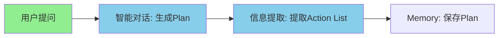
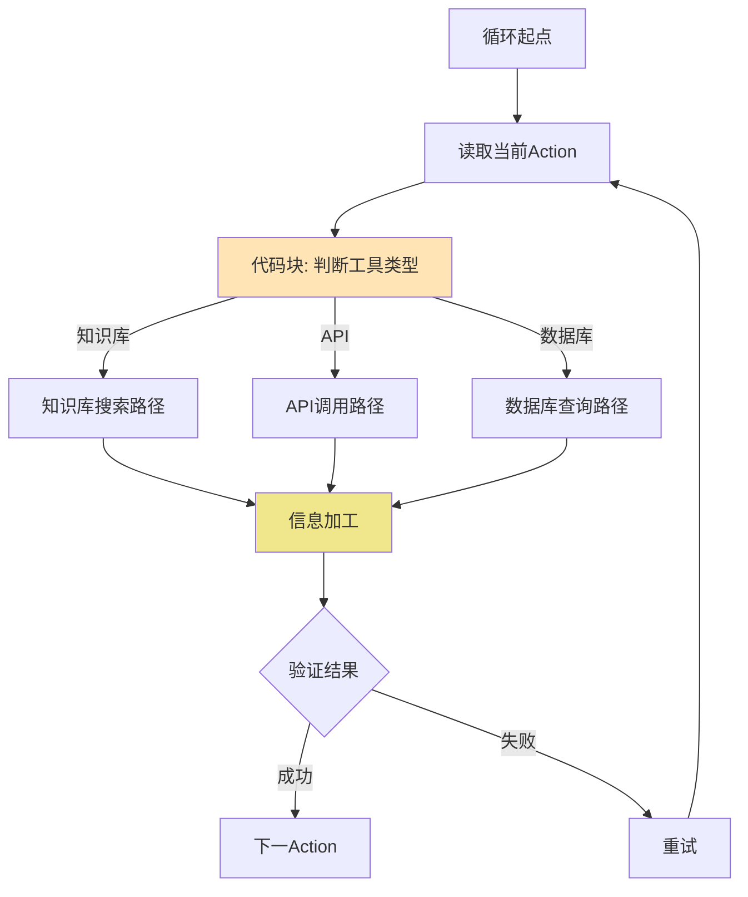
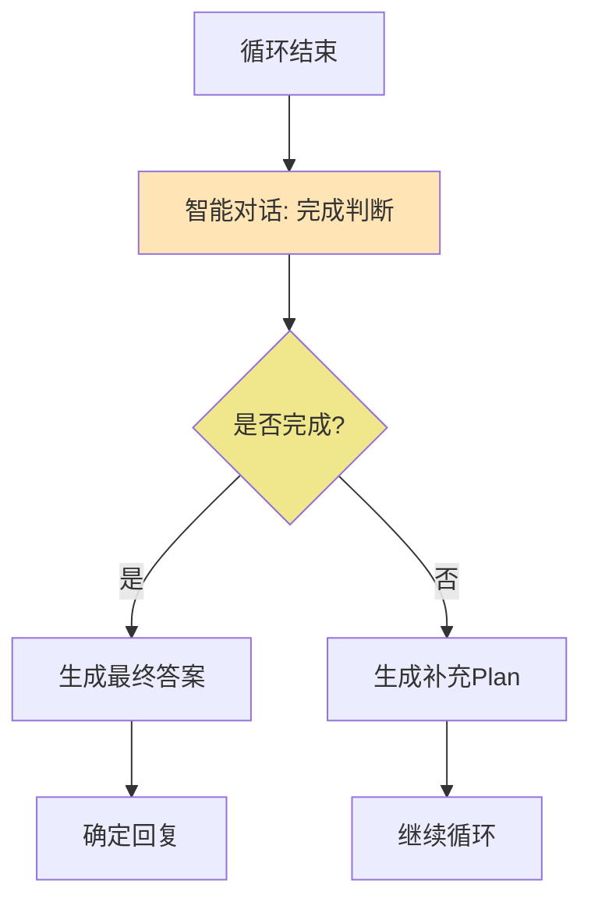
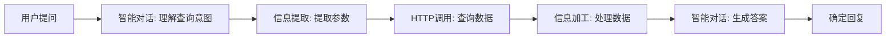
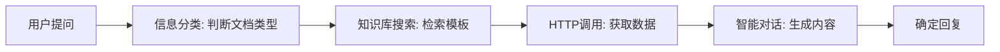
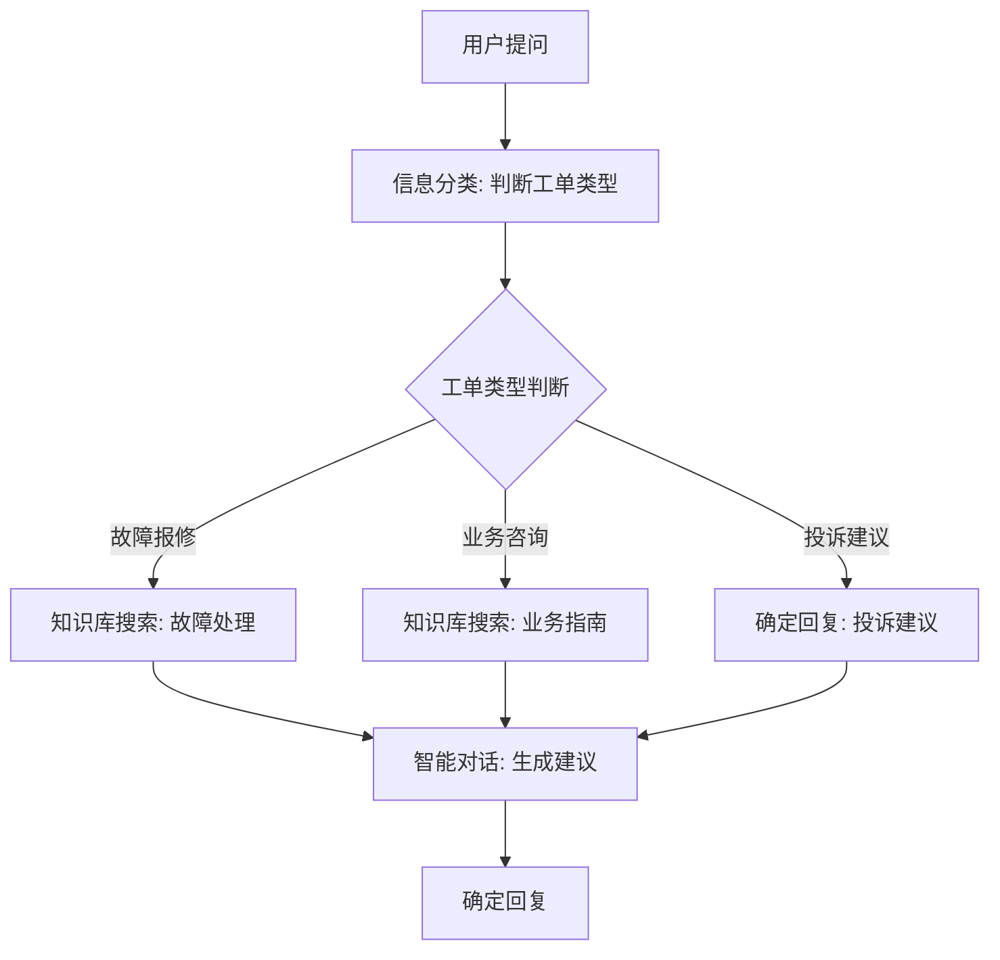

# ReAct模式在灵知平台的实现方案（简化版）

**版本**：v2.1（简化版）  
**创建日期**：2024年3月3日  
**最后更新**：2024年3月4日  
**适用对象**：国网四川电力AI种子团队培训（Day 2-3）  

---

## 重要说明

本文档提供**简化版ReAct实现方案**，适合Day 2-3教学使用

**核心思想**：
- ReAct是设计思想，可简单实现
- 重点在流程设计：Plan → Loop → State → Judge → Continue/Finish
- 使用简单循环+条件分支
- 可简化错误处理和复杂Memory设计

---

## 目录

- [一、ReAct核心思想](#一react核心思想)
- [二、简化版实现方案](#二简化版实现方案)
- [三、灵知平台具体实现](#三灵知平台具体实现)
- [四、三个选题实现案例](#四三个选题实现案例)
- [五、常见问题与解决方案](#五常见问题与解决方案)
- [六、完整版方案说明](#六完整版方案说明)

---

## 一、ReAct核心思想

### 1.1 什么是ReAct？

**ReAct = Reasoning（推理）+ Acting（行动）**

核心流程：
```
Thought（思考）→ Action（行动）→ Observation（观察）
```

### 1.2 ReAct的价值

**为什么需要ReAct？**
- ✅ 让AI有思考过程
- ✅ 可以调用外部工具
- ✅ 流程透明可追溯
- ✅ 适合复杂任务

**ReAct vs 传统方法**：
| 维度 | 传统方法 | ReAct方法 |
|------|---------|-----------|
| 过程 | 直接给答案 | 思考→行动→观察 |
| 工具 | 无法调用 | 可调用工具 |
| 透明度 | 黑盒 | 每步可见 |
| 适用场景 | 简单问答 | 复杂任务 |

### 1.3 简化版 vs 完整版

**简化版（Day 2-3使用）**：
- ✅ 固定次数循环（1-3次）
- ✅ 简单条件判断
- ✅ 不需要复杂Memory
- ✅ 易于理解和实现

**完整版（高级使用）**：
- 动态循环
- 复杂Memory管理
- 自动重试机制
- 完整错误处理

---

## 二、简化版实现方案

### 2.1 整体架构

```
┌─────────────────────────────────────────────────────┐
│   简化版ReAct流程（v2.1）                            │
├─────────────────────────────────────────────────────┤
│                                                   │
│  用户提问                                          │
│     ↓                                             │
│  【阶段1】Plan生成（智能对话）                      │
│     → 输出Action List                              │
│     ↓                                             │
│  【阶段2】循环执行（For Each Action）              │
│     ├─ 读取当前Action                              │
│     ├─ 判断类型并路由到不同工具分支                 │
│     │   ├─ 知识库搜索分支                          │
│     │   ├─ API调用分支                             │
│     │   └─ 数据库查询分支                          │
│     ├─ 执行工具                                     │
│     └─ 记录执行结果到Memory                        │
│     ↓                                             │
│  【阶段3】状态记录（Memory累积）                    │
│     → 每次循环结果追加到results数组                │
│     → 下次循环可读取前面结果                        │
│     ↓                                             │
│  【阶段4】完成判断（智能对话判断）                  │
│     ├─ 已完成所有Action？                          │
│     ├─ 是否需要补充Plan？                          │
│     └─ 决策：继续Action Plan 或 完成任务           │
│     ↓                                             │
│  【阶段5】最终反馈或继续                            │
│     ├─ 如需继续：回到阶段1，生成补充Plan            │
│     └─ 如已完成：生成最终答案，告知用户             │
│                                                   │
└─────────────────────────────────────────────────────┘
```

**核心流程说明**：

1. **Plan生成**：分析用户问题，生成Action List
2. **循环执行**：基于Action List逐一执行，判断类型路由到不同工具
3. **状态记录**：每次执行结果记录到Memory，供后续使用
4. **完成判断**：判断是否完成或需要补充Plan
5. **反馈决策**：继续执行新Plan或生成最终答案

**可简化部分**：
- ✅ 错误处理：简单验证即可，无需复杂重试
- ✅ Memory设计：只需简单的results数组即可

---

## 三、灵知平台具体实现

### 3.0 Memory简化设计

**Memory结构（极简版）**：
```json
{
  "results": [
    {
      "action_id": 1,
      "tool": "api_call",
      "success": true,
      "data": {...},
      "summary": "四川电网2024年2月用电量：120亿千瓦时"
    },
    {
      "action_id": 2,
      "tool": "knowledge_search",
      "success": true,
      "data": [...],
      "summary": "找到3个相关模板"
    }
  ]
}
```

**Memory读写机制**：
- **写入**：每次Action执行后，通过连接线自动写入Memory模块
- **读取**：在智能对话中使用 `{{Memory.results}}` 引用所有结果
- **累积**：每次循环追加结果，不覆盖

**示例配置**：
```
循环模块（For Each）
    ↓ 执行结果
Memory模块（保存结果）
    ↓ 循环结束
智能对话（读取 {{Memory.results}}）
```

---

### 3.1 Plan生成阶段

#### 模块编排



#### 模块1：智能对话（生成Plan）

**参数配置**：
- 模型：Qwen-Plus
- 回复创意性：0
- 回复字数：500

**提示词**：
```
你是任务规划专家。分析用户问题，生成执行计划。

可用工具：
1. knowledge_search: 知识库搜索
   参数：query（查询内容）, knowledge_base（知识库名）

2. api_call: API调用
   参数：endpoint（接口地址）, params（请求参数）

3. db_query: 数据库查询
   参数：query（查询语句）, database（数据库名）

用户问题：{{user_question}}

生成执行计划（JSON格式）：
{
  "actions": [
    {
      "id": 1,
      "type": "api_call",
      "endpoint": "/api/electricity/query",
      "params": {
        "region": "四川电网",
        "time": "2024-02",
        "metric": "用电量"
      }
    }
  ]
}

只输出JSON，不要其他内容。
```

#### 模块2：信息提取

**提示词**：
```
从以下内容中提取Action List：

{{智能对话.回复内容}}

输出格式：
{
  "action_list": [...]
}

只输出JSON。
```

---

### 3.2 循环执行阶段

#### 模块编排



#### 模块3：循环模块（For Each）

**参数配置**：
- 输入：`action_list`（数组）
- 变量：`current_action`（当前Action对象）

#### 模块4：代码块（工具选择）

**JavaScript代码**：
```javascript
function userFunction(input) {
  const action = JSON.parse(input.current_action);
  const toolType = action.type;
  
  return {
    "is_knowledge_search": toolType === "knowledge_search",
    "is_api_call": toolType === "api_call",
    "is_db_query": toolType === "db_query"
  };
}
```

#### 模块5：知识库搜索路径

**激活条件**：`is_knowledge_search == True`

**模块配置**：
- 知识库搜索模块
  - 输入：`{{current_action.params.query}}`
  - 知识库：`{{current_action.params.knowledge_base}}`
  - 相似度：0.7
  - 召回数：5

**信息加工模块**：
- 提示词：
```
整理搜索结果，提取关键信息。

搜索结果：{{知识库搜索.结果}}

输出格式：
{
  "summary": "结果摘要",
  "count": 3,
  "key_points": ["要点1", "要点2"]
}
```

#### 模块6：API调用路径

**激活条件**：`is_api_call == True`

**模块配置**：
- HTTP调用模块
  - URL：`{{current_action.params.endpoint}}`
  - 方法：POST
  - 请求体：`{{current_action.params.params}}`

**信息加工模块**：
- 提示词：
```
处理API响应结果。

响应内容：{{HTTP调用.响应}}

输出格式：
{
  "success": true,
  "data": {...},
  "message": "处理结果说明"
}
```

#### 模块7：数据库查询路径

**激活条件**：`is_db_query == True`

**模块配置**：
- HTTP调用模块（调用数据库接口）
  - URL：数据库接口地址
  - 请求体：查询参数

---

### 3.3 完成判断阶段（可选）

**说明**：此阶段为高级功能，Day 2-3可简化。如需实现动态补充Plan，可添加此阶段。

#### 模块编排



#### 模块8：智能对话（完成判断）

**提示词**：
```
判断任务是否完成。

用户问题：{{user_question}}

已执行结果：
{{Memory.results}}

分析：
1. 当前结果是否已回答用户问题？
2. 是否需要更多信息？
3. 是否需要补充Action？

输出JSON：
{
  "is_complete": true/false,
  "reason": "判断理由",
  "need_more_actions": true/false,
  "suggested_actions": [
    {
      "type": "...",
      "params": {...}
    }
  ]
}
```

#### 模块9：条件分支

**分支1：任务完成**
- 激活条件：`is_complete == True`
- 执行：进入最终反馈阶段

**分支2：需要补充Plan**
- 激活条件：`is_complete == False`
- 执行：将 `suggested_actions` 添加到循环，继续执行

---

### 3.4 最终反馈阶段

#### 模块10：智能对话（生成答案）

**提示词**：
```
根据执行结果生成最终答案。

用户问题：{{user_question}}

执行结果：
{{Memory.results}}

生成自然、准确的答案。
直接输出答案，不要其他内容。
```

#### 模块11：确定回复

- 输入：智能对话的回复内容
- 输出：返回给用户

---

## 四、三个选题实现案例

### 4.1 智能问数

**业务场景**：自然语言查询电力数据

**用户提问示例**：
```
"查询四川电网2024年2月的用电量"
"对比去年同期，哪些区域增长最快？"
"昨天半夜为什么负荷突然升高？"
```

**Plan生成示例**：
```json
{
  "actions": [
    {
      "id": 1,
      "type": "api_call",
      "endpoint": "/api/electricity/query",
      "params": {
        "region": "四川电网",
        "time": "2024-02",
        "metric": "用电量"
      }
    }
  ]
}
```

**灵知平台实现**：



**关键提示词**：

**智能对话（理解意图）**：
```
分析用户的查询请求，提取关键信息。

用户问题：{{user_question}}

提取：
- 时间范围
- 查询对象
- 查询指标
- 其他条件

输出JSON格式。
```

**信息提取**：
```
提取字段：
- time: 时间范围
- region: 查询对象
- metric: 查询指标
```

**智能对话（生成答案）**：
```
根据查询结果生成答案。

用户问题：{{user_question}}
查询结果：{{http调用.结果}}

生成专业、准确的答案。
包含数据和分析结论。
```

---

### 4.2 智能写作

**业务场景**：公文报告智能生成

**用户提问示例**：
```
"生成月度运行分析报告"
"帮我写一份故障处理总结"
"生成会议纪要"
```

**Plan生成示例**：
```json
{
  "actions": [
    {
      "id": 1,
      "type": "knowledge_search",
      "params": {
        "query": "月度运行分析报告模板",
        "knowledge_base": "模板库"
      }
    },
    {
      "id": 2,
      "type": "api_call",
      "params": {
        "endpoint": "/api/data/summary",
        "params": {
          "time": "本月",
          "type": "运行数据"
        }
      }
    }
  ]
}
```

**灵知平台实现**：



**关键提示词**：

**信息分类**：
```
判断用户需要生成什么类型的文档。

用户问题：{{user_question}}

分类类型：
- 月度报告
- 故障总结
- 会议纪要
- 其他文档

只输出类型名称。
```

**智能对话（生成内容）**：
```
根据模板和数据生成文档内容。

文档类型：{{信息分类.结果}}
模板：{{知识库搜索.结果}}
数据：{{http调用.结果}}

生成完整、专业的文档内容。
遵循模板格式，语言准确专业。
```

---

### 4.3 工单处理

**业务场景**：工单智能分类与处理建议

**用户提问示例**：
```
"设备故障报修：变压器冒烟"
"业务咨询：如何办理用电增容"
"投诉建议：电费账单有误"
```

**Plan生成示例**：
```json
{
  "actions": [
    {
      "id": 1,
      "type": "knowledge_search",
      "params": {
        "query": "变压器冒烟 故障处理",
        "knowledge_base": "故障库"
      }
    },
    {
      "id": 2,
      "type": "api_call",
      "params": {
        "endpoint": "/api/tickets/similar",
        "params": {
          "type": "故障报修",
          "keyword": "变压器"
        }
      }
    }
  ]
}
```

**灵知平台实现**：



**关键提示词**：

**信息分类**：
```
判断工单类型。

用户提问：{{user_question}}

分类：
- 故障报修
- 业务咨询
- 投诉建议
- 其他

只输出类型名称。
```

**智能对话（生成建议）**：
```
根据工单类型和处理流程生成建议。

工单类型：{{信息分类.结果}}
处理流程：{{知识库搜索.结果}}

生成：
1. 处理步骤
2. 注意事项
3. 推荐方案
```

---

## 五、常见问题与解决方案

### 5.1 Plan生成问题

**问题1：生成的计划不合理**

解决方案：
```
优化提示词：
- 添加更多约束条件
- 提供示例
- 明确工具参数格式

提示词改进：
"确保每个Action都是必要的、可执行的。
参数必须具体明确。
Action数量控制在3个以内。"
```

**问题2：信息提取不准确**

解决方案：
```
调整提取字段：
- 必填字段标记
- 添加字段说明
- 提供提取示例

提取字段配置：
- endpoint（必填）：接口地址
- params（必填）：请求参数对象
- timeout（可选）：超时时间
```

### 5.2 循环执行问题

**问题1：工具选择错误**

解决方案：
```
检查代码块逻辑：
- 确保type字段正确
- 检查布尔值返回
- 验证激活条件

调试方法：
在智能对话中输出当前Action：
"当前Action：{{current_action}}"
```

**问题2：知识库搜索无结果**

解决方案：
```
调整参数：
- 降低相似度阈值（0.7 → 0.5）
- 增加召回数（5 → 10）
- 优化查询关键词

查询优化：
"尝试不同的关键词组合
使用更通用的搜索词
结合上下文信息"
```

**问题3：API调用失败**

解决方案：
```
检查配置：
- 验证URL正确性
- 检查请求格式
- 确认认证信息

错误处理：
添加信息加工模块：
"如果API调用失败，输出错误信息"
```

### 5.3 结果整合问题

**问题1：最终答案不准确**

解决方案：
```
优化提示词：
- 提供更多上下文
- 明确答案格式
- 添加质量要求

提示词改进：
"答案必须：
1. 直接回答用户问题
2. 包含关键数据
3. 语言专业准确
4. 提供分析结论"
```

**问题2：答案格式不统一**

解决方案：
```
在提示词中指定格式：
"答案格式：
【数据概览】
...

【关键发现】
...

【建议】
..."
```

---

## 六、完整版方案说明

### 6.1 完整版 vs 简化版对比

| 特性 | 简化版（Day 2-3） | 完整版（高级） |
|------|------------------|---------------|
| 循环机制 | 固定次数（1-3次） | 动态循环 |
| Plan补充 | 无 | 支持补充Plan |
| Memory管理 | 简单传递 | 完整管理 |
| 重试机制 | 基本验证 | 自动重试 |
| 错误处理 | 简单处理 | 完整处理 |
| 实现难度 | ⭐⭐⭐ | ⭐⭐⭐⭐⭐ |
| 适用阶段 | 教学培训 | 生产优化 |

### 6.2 完整版特性

**动态循环**：
- 根据任务完成度判断是否继续
- 自动生成补充Plan
- 智能调整执行策略

**Memory管理**：
- 完整状态记录
- 上下文管理
- 历史追溯

**高级错误处理**：
- 自动重试（最多3次）
- 降级方案
- 错误恢复

### 6.3 升级路径

**从简化版到完整版**：

1. 添加Memory管理
   - 设计Memory结构
   - 实现读写控制

2. 实现动态循环
   - 添加完成判断
   - 支持Plan补充

3. 完善错误处理
   - 添加重试机制
   - 实现降级方案

**升级时机**：
- Day 4：前端开发时
- 项目优化阶段
- 生产环境部署前

---

## 七、实施建议

### 7.1 教学安排

**Day 1**：ReAct理论（30分钟）
- 核心概念讲解
- 与传统方法对比
- 简化版原理说明

**Day 2**：ReAct实践（60分钟）
- 灵知平台实现
- 三个选题案例
- 实操演练

**Day 3**：ReAct优化（30分钟）
- 参数调优
- 常见问题
- 效果提升

### 7.2 学员指导

**入门学员**：
- 使用简化版方案
- 固定2-3个Action
- 提供详细提示词模板

**进阶学员**：
- 尝试更多Action
- 优化提示词
- 调整参数配置

**高级学员**：
- 尝试完整版特性
- 添加重试机制
- 实现错误处理

### 7.3 验收标准

**基础验收**：
- ✅ 能正确理解用户意图
- ✅ 能生成合理的Plan
- ✅ 能按计划执行Action
- ✅ 能给出准确答案

**进阶验收**：
- ✅ 流程设计合理
- ✅ 提示词优化得当
- ✅ 参数配置合适
- ✅ 错误处理完善

**高级验收**：
- ✅ 实现动态循环
- ✅ Memory管理完善
- ✅ 错误处理全面
- ✅ 性能优化良好

---

## 八、总结

### 核心要点

1. ✅ **ReAct是设计思想**
   - 重点在流程设计：Plan → Loop → State → Judge → Continue/Finish
   - 不必追求完美实现
   - 简化版足够应对业务需求

2. ✅ **简化版适合教学**
   - 降低学习门槛
   - 突出核心思想
   - 实用性强
   - 可简化错误处理和Memory设计

3. ✅ **状态记录机制**
   - 每次Action结果记录到Memory
   - 后续循环可读取前面状态
   - Memory只需简单数组即可

4. ✅ **完成判断机制**
   - 循环结束后判断是否完成
   - 可选择补充Plan继续执行
   - 或直接生成最终答案

5. ✅ **循序渐进**
   - Day 2-3：简化版（固定循环）
   - Day 4+：完整版特性（动态循环）
   - 生产环境：完整版

### 实施建议

**立即执行**：
1. ✅ 按简化版实施
2. ✅ 提供详细案例
3. ✅ 准备提示词模板

**后续优化**：
1. 🔄 收集学员反馈
2. 🔄 完善案例库
3. 🔄 准备完整版方案

**持续改进**：
1. 📊 统计实施效果
2. 📝 记录常见问题
3. 🔄 优化教学方案

---

**文档版本**：v2.1（简化版）  
**创建日期**：2024年3月3日  
**最后更新**：2024年3月4日  
**维护者**：培训团队

**v2.1更新说明**：
- ✅ 明确5阶段流程：Plan → Loop → State → Judge → Continue/Finish
- ✅ 简化Memory设计（仅需results数组）
- ✅ 强调可简化错误处理
- ✅ 增加状态记录和完成判断说明
- ✅ 支持Plan补充机制

**重要提示**：本文档强调简化版ReAct实现方案，适合Day 2-3教学使用。完整版方案适合生产环境和高级优化。
