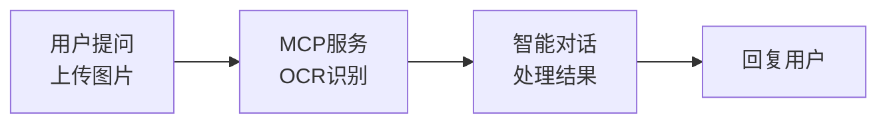
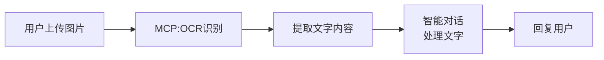
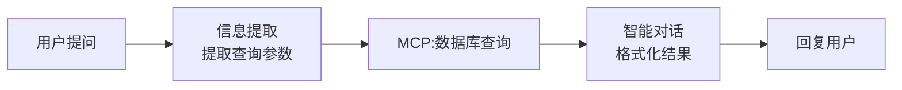
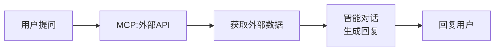
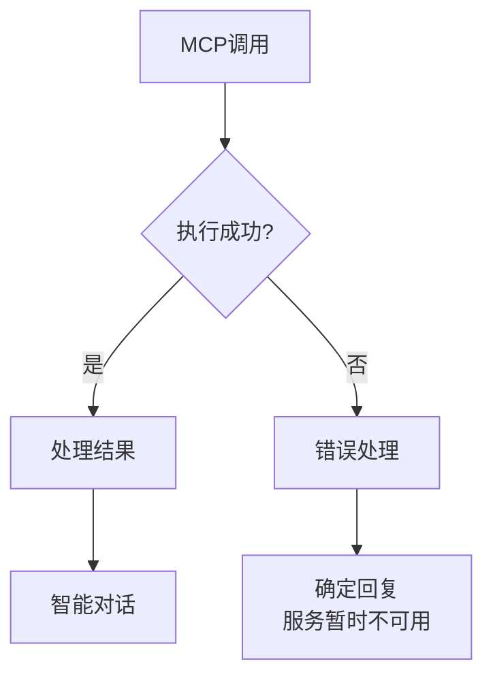

# MCP 创建与调用

## MCP 概述

**MCP**（Model Context Protocol）是通用协议，用于打通 Agent 与外部工具、数据源的交互。

**应用场景**：
- 外部 API 调用
- 数据库连接
- 第三方服务集成
- 自定义工具扩展

---

## 创建 MCP 服务

### 步骤 1：进入 MCP 管理页面

1. 点击左侧菜单 **"MCP"**
2. 点击右上角 **"创建MCP服务"**

---

### 步骤 2：填写基本信息

| 配置项 | 内容 |
|--------|------|
| 服务名称 | OCR识别服务 |
| 描述 | 百度OCR文字识别服务 |

---

### 步骤 3：配置连接方式

**安装方式**：
- 目前只支持 **SSE**（Server-Sent Events）

**MCP配置**（JSON格式）：

```json
{
  "mcpServers": {
    "ocr_service": {
      "url": "https://aip.baidubce.com/mcp/ocr_general/sse?Authorization=Bearer+YOUR_ACCESS_TOKEN"
    }
  }
}
```

**参数说明**：
- `mcpServers`：MCP服务配置
- `ocr_service`：服务名称（自定义）
- `url`：MCP服务地址（SSE端点）

---

### 步骤 4：保存配置

点击 **"确定"** 完成创建

---

## 调用 MCP 服务

### 步骤 1：进入智能体规划页面

1. 打开智能体
2. 点击 **"规划"** 标签

---

### 步骤 2：添加 MCP 到画布

1. 在左侧菜单找到 **"MCP"** 标签
2. 展开已创建的MCP服务
3. 拖拽MCP服务到画布

---

### 步骤 3：选择 MCP 工具

点击MCP模块，选择要使用的工具：

**示例工具**：
- `ocr_general`：通用文字识别
- `ocr_accurate`：高精度文字识别
- `ocr_handwriting`：手写文字识别

---

### 步骤 4：连接流程



**配置**：

1. **用户提问**：
   - 上传图片：✅ 开启

2. **MCP服务**：
   - 图片信息：连接用户提问的图片信息
   - 工具：选择 `ocr_general`

3. **智能对话**：
   - 信息输入：连接MCP服务的输出
   - 提示词：
     ```markdown
     根据OCR识别结果回答用户问题。
     
     识别结果：
     {{MCP输出}}
     
     用户问题：{{用户输入}}
     ```

---

## MCP 配置示例

### 示例 1：百度OCR服务

```json
{
  "mcpServers": {
    "baidu_ocr": {
      "url": "https://aip.baidubce.com/mcp/ocr_general/sse?Authorization=Bearer+YOUR_TOKEN"
    }
  }
}
```

**使用场景**：图片文字识别、文档数字化

---

### 示例 2：天气查询服务

```json
{
  "mcpServers": {
    "weather_api": {
      "url": "https://api.weather.com/mcp/sse?api_key=YOUR_API_KEY"
    }
  }
}
```

**使用场景**：实时天气查询、天气预报

---

### 示例 3：数据库查询服务

```json
{
  "mcpServers": {
    "mysql_query": {
      "url": "https://your-server.com/mcp/mysql/sse",
      "headers": {
        "Authorization": "Bearer YOUR_TOKEN"
      }
    }
  }
}
```

**使用场景**：数据库查询、数据分析

---

## 使用场景

### 场景 1：图片文字识别

**流程**：


**配置**：
1. MCP工具：`ocr_general`
2. 输入：图片信息
3. 输出：识别的文字内容

---

### 场景 2：实时数据查询

**流程**：


**配置**：
1. 信息提取：提取查询参数（如日期、类型）
2. MCP工具：数据库查询工具
3. 智能对话：格式化查询结果

---

### 场景 3：第三方API集成

**流程**：


**示例**：
- 天气查询API
- 股票数据API
- 地图服务API

---

## 最佳实践

### 1. MCP服务设计

✅ **推荐**：
- 单一职责：每个MCP服务专注一个功能
- 错误处理：返回清晰的错误信息
- 性能优化：缓存常用结果
- 安全考虑：使用认证和授权

❌ **避免**：
- MCP服务功能过于复杂
- 缺少错误处理
- 频繁调用慢速API
- 暴露敏感信息

---

### 2. 错误处理

**方案**：添加错误判断节点



**配置**：
1. MCP模块输出：
   - 执行成功（布尔型）
   - 执行异常（布尔型）
   - 执行结果

2. 错误处理：
   - 连接"执行异常"到确定回复
   - 提供友好的错误提示

---

### 3. 性能优化

**优化方向**：
1. **缓存结果**：缓存常用查询结果
2. **异步处理**：耗时操作异步执行
3. **批量处理**：合并多个请求
4. **超时设置**：设置合理的超时时间

---

### 4. 安全考虑

**安全措施**：
1. **认证授权**：使用API Key或Token
2. **权限控制**：限制MCP服务的访问权限
3. **数据加密**：敏感数据加密传输
4. **日志记录**：记录MCP调用日志

---

## 常见问题

### Q1: MCP服务连接失败？

**排查步骤**：
1. 检查URL是否正确
2. 检查网络连接
3. 检查认证信息是否有效
4. 检查MCP服务是否正常运行

---

### Q2: MCP调用超时？

**解决方案**：
1. 检查外部API响应时间
2. 增加超时时间
3. 优化查询参数
4. 使用缓存机制

---

### Q3: 如何调试MCP服务？

**方法**：
1. 使用"试运行"功能测试
2. 查看MCP模块的输出结果
3. 检查外部API的返回数据
4. 查看错误日志

---

### Q4: MCP服务如何收费？

**说明**：
- MCP服务本身不收费
- 外部API可能收费（如百度OCR、天气API等）
- 具体费用查看外部API的定价策略

---

## 相关资源

- [MCP协议官方文档](https://modelcontextprotocol.io/)
- [工具创建](./custom-tools) - 创建自定义工具
- [代码块模块](../modules/code-block) - 使用代码实现复杂逻辑

---

**最后更新**：2026-03-04
