# Agent对话结束模块

## 模块概述

**功能**：用于多 Agents 联动场景，只有引入此模块才能在"规划"画布左侧"Agents"处找到此 Agent

**位置**：协作模块

**类型**：系统模块

**应用场景**：多 Agent 协作、子 Agent 调用、任务分发

---

## 模块结构

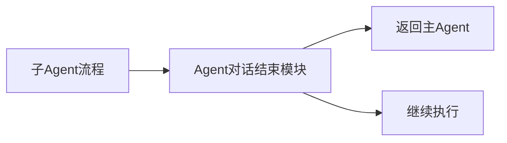

---

## 参数配置

### 激活条件

| 参数 | 类型 | 说明 |
|------|------|------|
| 联动激活 | 布尔型 | 上游所有条件均为 True 时激活 |
| 任一激活 | 布尔型 | 上游任一条件为 True 时激活 |

---

### 确认配置

| 参数 | 类型 | 说明 |
|------|------|------|
| 展示确认弹窗 | - | 开启后子 Agent 运行结束时弹出提示框 |
| 子 Agent 运行结束后确认 | - | 设定弹窗提问话术 |
| 重新执行母 Agent | - | 重新执行母 Agent 的话术 |
| 满意，继续执行母 Agent | - | 后续用户输入不再执行此 Agent |
| 不满意，重新执行子 Agent | - | 仅重新执行该子 Agent |

---

## 输出节点

### 模块运行结束（黄色 - 布尔型）

模块运行结束输出 True

**用途**：触发下游流程（返回主 Agent）

---

## 使用场景

### 场景 1：主从 Agent 协作

**需求**：主 Agent 负责任务分发，子 Agent 负责具体执行

**主 Agent 流程**：
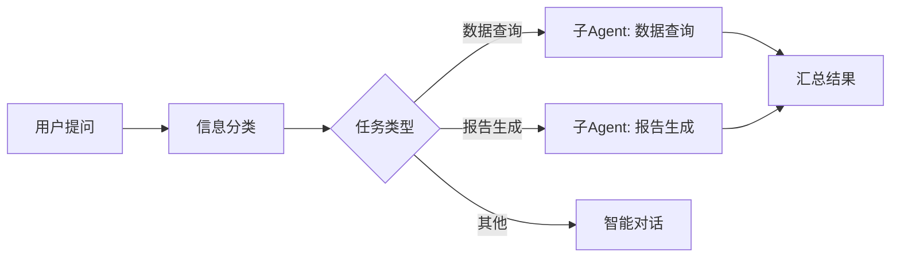

**子 Agent（数据查询）流程**：
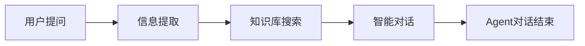

**配置步骤**：

1. **创建子 Agent**：
   - 创建一个新的智能体
   - 添加业务流程
   - 添加 **Agent对话结束** 模块

2. **在主 Agent 中调用**：
   - 进入主 Agent 的规划页面
   - 左侧找到 **"Agents"** 标签
   - 拖拽子 Agent 到画布
   - 连接流程

---

### 场景 2：专业能力分工

**需求**：不同 Agent 负责不同专业领域

**架构设计**：
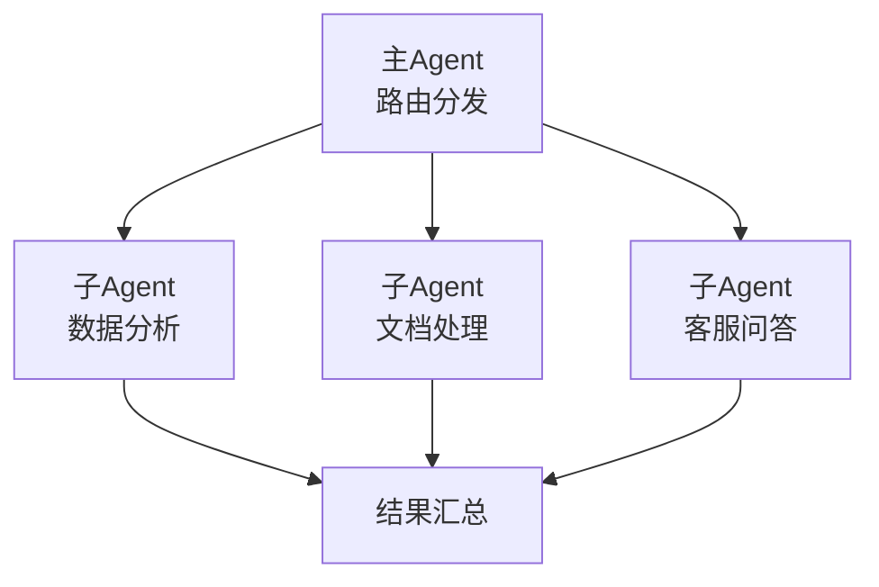

**优势**：
- 职责清晰，易于维护
- 专业性强，效果更好
- 可独立优化每个子 Agent

---

### 场景 3：流水线处理

**需求**：多个 Agent 按顺序处理任务

**流程**：
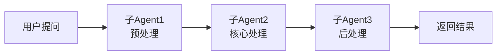

**每个子 Agent 都需要添加 Agent对话结束模块**

---

### 场景 4：并行处理

**需求**：多个 Agent 并行处理不同任务

**流程**：
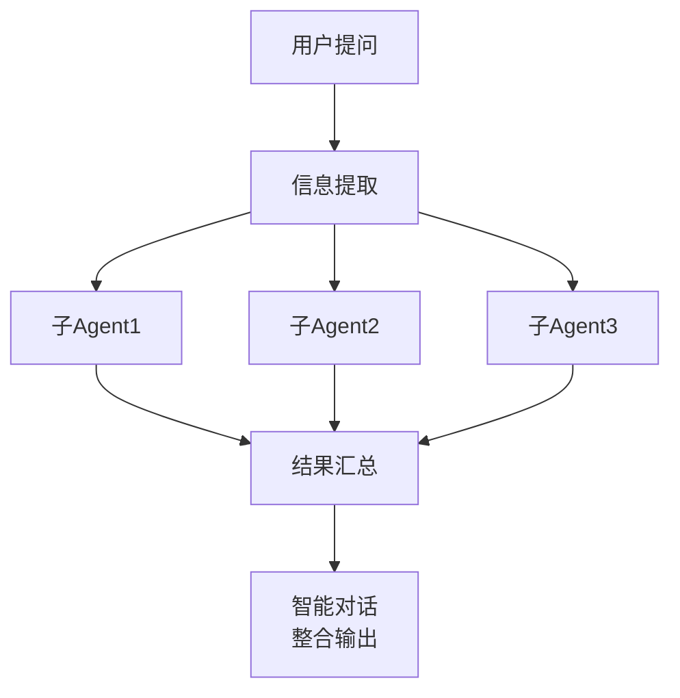

---

## Agent对话结束配置

### 基础配置（无确认）

**适用场景**：子 Agent 执行完毕后直接返回结果

**配置**：
- 展示确认弹窗：❌ 关闭
- 子 Agent 执行完毕后自动返回主 Agent

---

### 高级配置（带确认）

**适用场景**：需要用户确认子 Agent 的执行结果

**配置**：

| 配置项 | 内容 |
|--------|------|
| 展示确认弹窗 | ✅ 开启 |
| 子 Agent 运行结束后确认 | "子任务已完成，是否满意？" |
| 重新执行母 Agent | "重新开始整个流程" |
| 满意，继续执行母 Agent | "满意，继续" |
| 不满意，重新执行子 Agent | "不满意，重新执行" |

**效果**：
```
[子Agent执行结果]

是否满意？
[重新开始整个流程] [满意，继续] [不满意，重新执行]
```

---

## 最佳实践

### 1. Agent 分层设计

✅ **推荐**：
```
主Agent（路由层）
  ├── 子Agent 1（业务层）
  ├── 子Agent 2（业务层）
  └── 子Agent 3（业务层）
```

**优点**：
- 职责清晰
- 易于维护
- 可复用

❌ **避免**：
- 过深的嵌套（>3层）
- 职责不清晰
- 重复的子Agent

---

### 2. 数据传递

**主 Agent → 子 Agent**：
- 通过连接节点传递数据
- 子 Agent 的"用户提问"接收输入

**子 Agent → 主 Agent**：
- 子 Agent 的输出通过 Agent对话结束返回
- 主 Agent 可以引用子 Agent 的结果

---

### 3. 错误处理

**方案**：
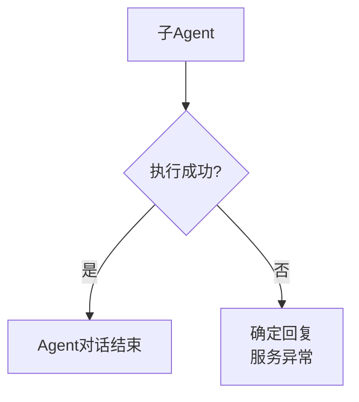

**配置**：
- 在子 Agent 中添加错误判断
- 失败时返回错误信息
- 主 Agent 根据错误信息处理

---

### 4. 性能优化

**优化方向**：
- 避免过多的子 Agent 嵌套
- 合并相似的子 Agent
- 缓存常用子 Agent 结果
- 异步执行独立的子 Agent

---

## 常见问题

### Q1: 主 Agent 找不到子 Agent？

**排查步骤**：
1. 确认子 Agent 已发布
2. 确认子 Agent 包含 Agent对话结束 模块
3. 刷新主 Agent 的规划页面
4. 检查子 Agent 是否有访问权限

---

### Q2: 子 Agent 如何传递数据？

**方法**：
1. **输入**：主 Agent 连接节点到子 Agent 的"用户提问"
2. **输出**：子 Agent 通过 Agent对话结束 返回结果

---

### Q3: 如何调试子 Agent？

**方法**：
1. 单独测试子 Agent
2. 使用"试运行"功能
3. 查看中间输出
4. 在主 Agent 中查看子 Agent 的执行日志

---

### Q4: 子 Agent 执行失败会影响主 Agent 吗？

**说明**：
- 子 Agent 执行失败，主 Agent 会收到错误信息
- 主 Agent 可以选择继续执行或中断
- 建议在主 Agent 中添加错误处理逻辑

---

## 多 Agent 协作模式

### 1. 路由模式

**适用场景**：根据用户意图路由到不同子 Agent

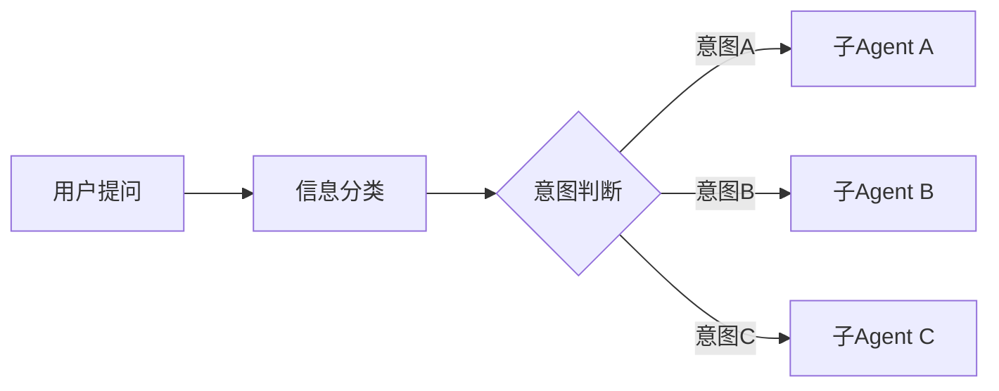

---

### 2. 管道模式

**适用场景**：流水线式处理

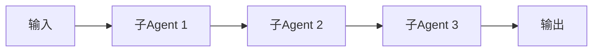

---

### 3. 并行模式

**适用场景**：并行处理多个独立任务

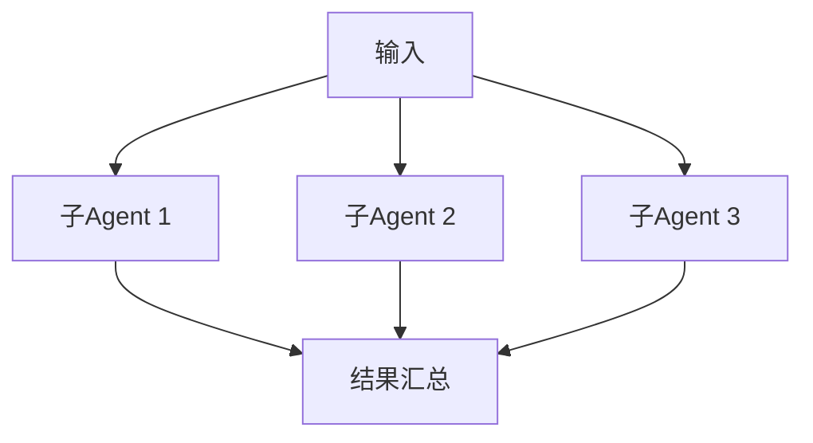

---

### 4. 递归模式

**适用场景**：需要迭代优化的任务

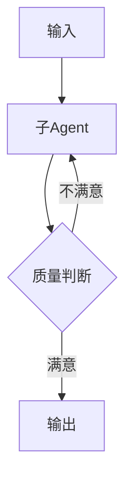

---

## 相关模块

- [信息分类](./info-classification) - 任务分发
- [循环](./loop) - 迭代处理
- [智能对话](./smart-dialogue) - 结果整合

---

**最后更新**：2026-03-04
