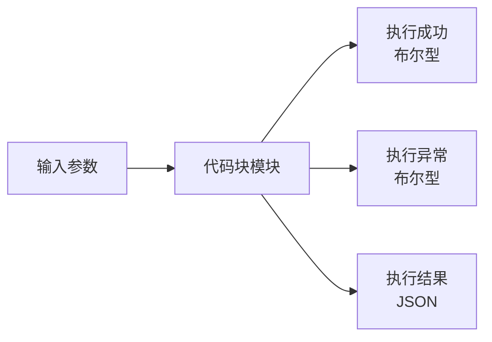
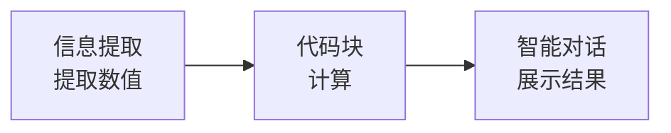
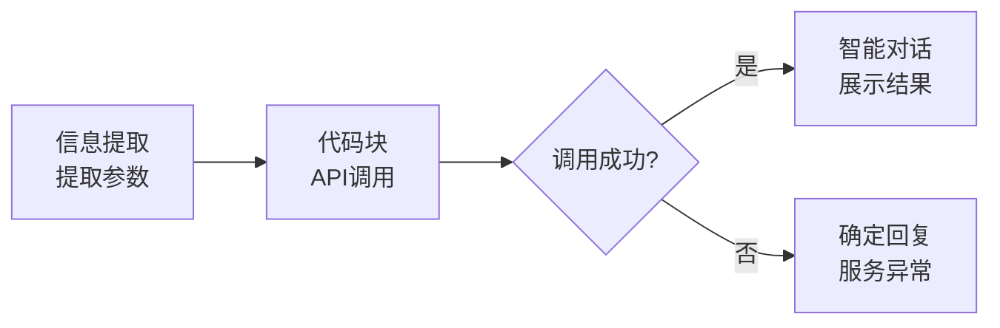
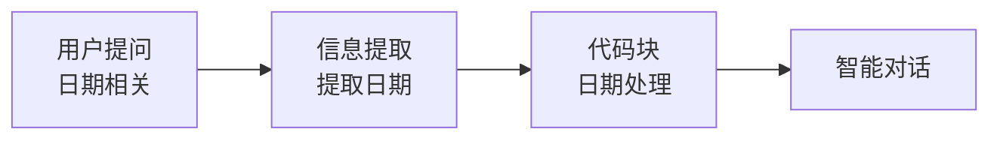
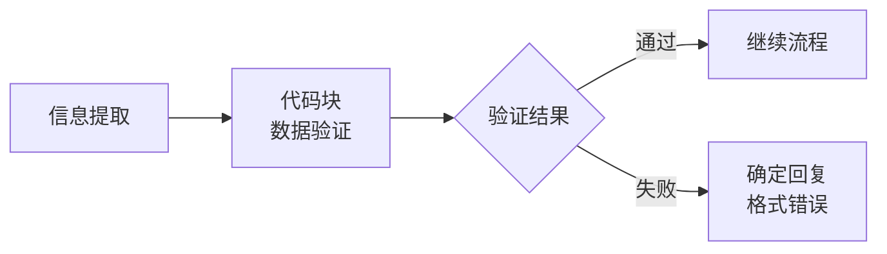

# 代码块模块

## 模块概述

**功能**：通过添加 JavaScript 或 Python 代码进行数据处理

**位置**：扩展模块

**类型**：系统模块

**应用场景**：数据处理、API 调用、复杂逻辑判断

---

## 模块结构



---

## 参数配置

### 激活条件

| 参数 | 类型 | 说明 |
|------|------|------|
| 联动激活 | 布尔型 | 上游所有条件均为 True 时激活 |
| 任一激活 | 布尔型 | 上游任一条件为 True 时激活 |

---

### 输入输出配置

| 参数 | 类型 | 说明 |
|------|------|------|
| 添加入参 | 多种类型 | 布尔型、字符串型或知识库搜索结果 |
| 语言选择 | - | JavaScript 或 Python |
| 代码描述 | - | 备注，非必填 |
| 代码内容 | - | Python 函数名需为 userFunction，输入输出为 Key-Value |
| 添加出参 | 多种类型 | 设定出参信息 |

---

## 输出节点

### 执行成功（黄色 - 布尔型）

代码执行成功时输出 True

**用途**：判断执行状态，触发成功流程

---

### 执行异常（黄色 - 布尔型）

代码执行异常时输出 True

**用途**：触发错误处理流程

---

### 执行结果（蓝色 - 字符串/JSON）

代码执行的返回结果

**格式**：字符串或 JSON

**用途**：传递给下游模块

---

### 模块运行结束（黄色 - 布尔型）

模块运行结束输出 True

**用途**：触发下游流程

---

## 使用场景

### 场景 1：数据处理

**需求**：计算统计指标

**流程**：


**代码示例（JavaScript）**：
```javascript
function userFunction(input) {
  const data = JSON.parse(input.data);
  
  // 计算统计指标
  const sum = data.reduce((a, b) => a + b, 0);
  const avg = sum / data.length;
  const max = Math.max(...data);
  const min = Math.min(...data);
  
  return {
    sum: sum,
    average: avg.toFixed(2),
    max: max,
    min: min
  };
}
```

---

### 场景 2：API 调用

**需求**：调用外部 API 获取数据

**流程**：


**代码示例（JavaScript）**：
```javascript
async function userFunction(input) {
  try {
    const response = await fetch('https://api.example.com/data', {
      method: 'POST',
      headers: {
        'Content-Type': 'application/json'
      },
      body: JSON.stringify({
        query: input.query,
        date: input.date
      })
    });
    
    const data = await response.json();
    
    return {
      success: true,
      data: data
    };
  } catch (error) {
    return {
      success: false,
      error: error.message
    };
  }
}
```

---

### 场景 3：日期处理

**需求**：处理日期格式转换

**流程**：


**代码示例（JavaScript）**：
```javascript
function userFunction(input) {
  const dateStr = input.date;
  
  // 解析自然语言日期
  const dateMap = {
    '今天': new Date(),
    '昨天': new Date(Date.now() - 86400000),
    '明天': new Date(Date.now() + 86400000),
    '本周一': getMonday(new Date()),
    '下周一': getMonday(new Date(Date.now() + 7 * 86400000))
  };
  
  const targetDate = dateMap[dateStr] || new Date(dateStr);
  
  // 格式化输出
  const year = targetDate.getFullYear();
  const month = String(targetDate.getMonth() + 1).padStart(2, '0');
  const day = String(targetDate.getDate()).padStart(2, '0');
  
  return {
    formatted: `${year}-${month}-${day}`,
    timestamp: targetDate.getTime()
  };
}

function getMonday(date) {
  const d = new Date(date);
  const day = d.getDay();
  const diff = d.getDate() - day + (day === 0 ? -6 : 1);
  return new Date(d.setDate(diff));
}
```

---

### 场景 4：数据验证

**需求**：验证用户输入的数据格式

**流程**：


**代码示例（JavaScript）**：
```javascript
function userFunction(input) {
  const phone = input.phone;
  const email = input.email;
  
  const errors = [];
  
  // 验证手机号
  const phoneRegex = /^1[3-9]\d{9}$/;
  if (!phoneRegex.test(phone)) {
    errors.push('手机号格式不正确');
  }
  
  // 验证邮箱
  const emailRegex = /^[^\s@]+@[^\s@]+\.[^\s@]+$/;
  if (!emailRegex.test(email)) {
    errors.push('邮箱格式不正确');
  }
  
  return {
    valid: errors.length === 0,
    errors: errors
  };
}
```

---

### 场景 5：复杂计算

**需求**：执行复杂的数学计算

**代码示例（Python）**：
```python
import json
from datetime import datetime, timedelta

def userFunction(input_data):
    data = json.loads(input_data)
    
    # 计算工作日
    start_date = datetime.strptime(data['start_date'], '%Y-%m-%d')
    end_date = datetime.strptime(data['end_date'], '%Y-%m-%d')
    
    workdays = 0
    current = start_date
    while current <= end_date:
        if current.weekday() < 5:  # 周一到周五
            workdays += 1
        current += timedelta(days=1)
    
    # 计算平均值
    values = data['values']
    average = sum(values) / len(values)
    
    return {
        'workdays': workdays,
        'average': round(average, 2)
    }
```

---

## 最佳实践

### 1. 代码规范

✅ **推荐**：
- 代码清晰、注释完整
- 函数命名语义化
- 错误处理完善
- 输入输出格式明确

❌ **避免**：
- 代码复杂难懂
- 缺少错误处理
- 函数命名模糊
- 输入输出不确定

---

### 2. 错误处理

**JavaScript**：
```javascript
function userFunction(input) {
  try {
    // 主要逻辑
    const result = processData(input);
    return { success: true, data: result };
  } catch (error) {
    return { success: false, error: error.message };
  }
}
```

**Python**：
```python
def userFunction(input_data):
    try:
        # 主要逻辑
        result = process_data(input_data)
        return {'success': True, 'data': result}
    except Exception as e:
        return {'success': False, 'error': str(e)}
```

---

### 3. 性能优化

**建议**：
- 避免复杂计算（超时风险）
- 使用异步操作（JavaScript）
- 减少网络请求次数
- 缓存计算结果

---

### 4. 安全考虑

**注意事项**：
- 不要执行敏感操作
- 不要访问文件系统
- 不要执行系统命令
- 验证输入数据

---

## 常见问题

### Q1: 代码执行超时？

**解决方案**：
1. 简化代码逻辑
2. 减少循环次数
3. 优化算法效率
4. 避免长时间等待

---

### Q2: 如何调试代码？

**方法**：
1. 使用 console.log（JavaScript）或 print（Python）
2. 查看执行结果输出
3. 检查错误信息
4. 分段测试

---

### Q3: 如何处理异步操作？

**JavaScript**：
```javascript
async function userFunction(input) {
  const result = await asyncOperation();
  return result;
}
```

**注意**：Python 代码块不支持 async/await

---

### Q4: 可以使用哪些库？

**JavaScript**：
- 标准 JavaScript API
- 不支持 npm 包

**Python**：
- Python 标准库
- 常用库：json, datetime, re, math
- 不支持 pip 安装的包

---

## 代码示例库

### 1. JSON 处理

```javascript
function userFunction(input) {
  const data = JSON.parse(input.jsonStr);
  const result = {
    field1: data.field1,
    field2: data.field2 * 2
  };
  return result;
}
```

---

### 2. 字符串处理

```javascript
function userFunction(input) {
  const text = input.text;
  
  // 提取数字
  const numbers = text.match(/\d+/g);
  
  // 统计字数
  const wordCount = text.length;
  
  return {
    numbers: numbers,
    wordCount: wordCount
  };
}
```

---

### 3. 数组处理

```javascript
function userFunction(input) {
  const arr = input.array;
  
  // 去重
  const unique = [...new Set(arr)];
  
  // 排序
  const sorted = arr.sort((a, b) => a - b);
  
  // 过滤
  const filtered = arr.filter(x => x > 10);
  
  return {
    unique: unique,
    sorted: sorted,
    filtered: filtered
  };
}
```

---

### 4. 正则表达式

```javascript
function userFunction(input) {
  const text = input.text;
  
  // 提取邮箱
  const emailRegex = /[^\s@]+@[^\s@]+\.[^\s@]+/g;
  const emails = text.match(emailRegex);
  
  // 提取手机号
  const phoneRegex = /1[3-9]\d{9}/g;
  const phones = text.match(phoneRegex);
  
  return {
    emails: emails,
    phones: phones
  };
}
```

---

## 相关模块

- [信息提取](./info-extraction) - 提取结构化数据
- [信息加工](./info-processing) - 使用 LLM 加工内容
- [循环](./loop) - 批量处理数据

---

**最后更新**：2026-03-04
