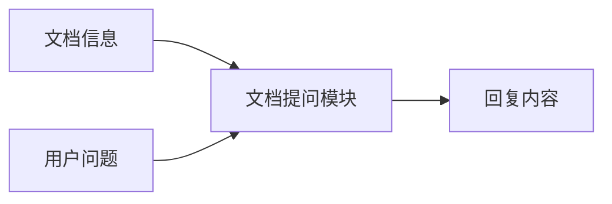
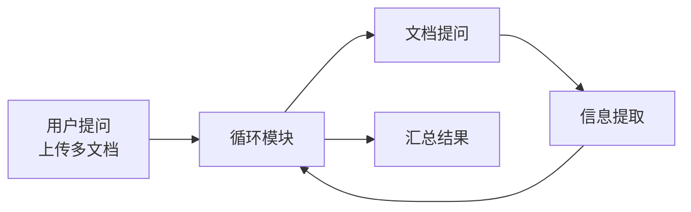
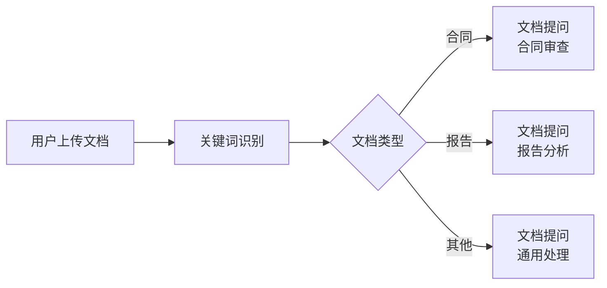
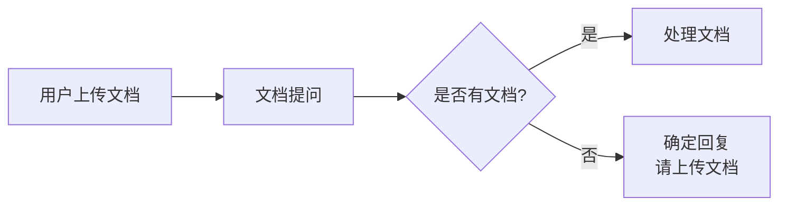

# 文档提问模块

## 模块概述

**功能**：用户上传文档后，直接输入问题，利用大语言模型读取文档后回复

**位置**：扩展模块

**类型**：系统模块

**应用场景**：文档问答、文档摘要、文档分析

---

## 模块结构



---

## 参数配置

### 激活条件

| 参数 | 类型 | 说明 |
|------|------|------|
| 联动激活 | 布尔型 | 上游所有条件均为 True 时激活 |
| 任一激活 | 布尔型 | 上游任一条件为 True 时激活 |

---

### 输入参数

| 参数 | 类型 | 说明 |
|------|------|------|
| 信息输入 | 字符串 | 用户提出的问题 |
| 文档信息 | 字符串 | 连接"用户提问"模块中"文档信息"节点 |

---

### 模型配置

| 参数 | 说明 | 推荐值 |
|------|------|--------|
| 选择模型 | 选择视觉/语言模型 | GLM-4v / Qwen-Plus |
| 提示词(Prompt) | 说明处理任务 | 根据问题类型设置 |
| 回复对用户可见 | 控制是否输出给用户 | 开启（用于最终回复） |
| 回复创意性 | 0-1，控制发散性 | 0.7 |
| 回复字数上限 | 100-8192 | 2000 |

---

## 输出节点

### 回复结束（黄色 - 布尔型）

回复是否完成

**用途**：判断回复状态

---

### 回复内容（蓝色 - 字符串）

模型生成的回复内容

**用途**：输出给用户或传递给下游模块

---

### 模块运行结束（黄色 - 布尔型）

模块运行结束输出 True

**用途**：触发下游流程

---

## 使用场景

### 场景 1：单文档问答

**需求**：用户上传一份文档，回答相关问题

**流程**：


**用户提问配置**：
- 输入文本：✅ 开启
- 上传文档：✅ 开启

**文档提问配置**：
- 信息输入：用户问题
- 文档信息：用户上传的文档
- 提示词：
  ```markdown
  根据上传的文档回答用户问题。
  
  要求：
  1. 准确理解文档内容
  2. 直接回答用户问题
  3. 如果文档中没有相关信息，请诚实说明
  4. 可以引用文档中的具体内容
  ```

---

### 场景 2：多文档处理

**需求**：用户上传多份文档，逐一处理

**流程**：


**配置**：
1. 用户提问：上传多个文档
2. 循环模块：遍历文档数组
3. 文档提问：处理单个文档
4. 信息提取：提取关键信息
5. 汇总：整合所有文档的结果

---

### 场景 3：文档分类后问答

**需求**：先判断文档类型，再进行相应处理

**流程**：


---

### 场景 4：文档摘要生成

**需求**：为上传的文档生成摘要

**流程**：


**提示词**：
```markdown
请为上传的文档生成一份摘要。

要求：
1. 总结文档的核心内容（200字以内）
2. 列出关键要点（3-5个）
3. 说明文档的主要价值

格式：
## 文档摘要
[摘要内容]

## 关键要点
1. [要点1]
2. [要点2]
3. [要点3]
```

---

## 提示词设计

### 问答型提示词

```markdown
# 任务
根据上传的文档回答用户问题。

## 用户问题
{{用户输入}}

## 要求
1. 优先使用文档中的内容回答
2. 标注引用的具体段落
3. 如果文档中没有相关信息，请诚实说明
4. 回答要准确、简洁

## 格式
**回答**：[直接回答]

**依据**：[引用文档内容]
```

---

### 分析型提示词

```markdown
# 任务
分析上传的文档，提取关键信息。

## 分析维度
1. **文档类型**：判断文档类型
2. **主要内容**：总结核心内容
3. **关键数据**：提取重要数据
4. **潜在问题**：指出可能的问题

## 输出格式
### 文档类型
[类型描述]

### 主要内容
[内容总结]

### 关键数据
- 数据1：[值]
- 数据2：[值]

### 潜在问题
1. [问题1]
2. [问题2]
```

---

### 对比型提示词

```markdown
# 任务
对比分析多份文档的差异。

## 对比维度
1. 内容差异
2. 数据差异
3. 观点差异

## 输出格式
| 维度 | 文档A | 文档B | 差异说明 |
|------|-------|-------|----------|
| ... | ... | ... | ... |
```

---

## 最佳实践

### 1. 文档准备

✅ **推荐**：
- 文档格式：PDF、Word、TXT
- 文档大小：< 50MB
- 文档质量：清晰、完整
- 文档语言：与模型语言一致

❌ **避免**：
- 扫描件（OCR 可能不准确）
- 加密文档
- 损坏的文档
- 格式混乱的文档

---

### 2. 问题设计

✅ **推荐**：
- 问题具体、明确
- 一次问一个核心问题
- 可以追问和细化

❌ **避免**：
- 问题过于宽泛
- 一次问多个问题
- 问题含糊不清

---

### 3. 提示词优化

**基础版**：
```markdown
根据文档回答用户问题。
```

**优化版**：
```markdown
# 角色
你是一个专业的文档分析助手。

# 任务
根据上传的文档回答用户问题。

# 要求
1. 准确理解文档内容
2. 直接回答问题，不要冗余
3. 如果文档中没有答案，请诚实说明
4. 可以引用文档中的具体内容

# 用户问题
{{用户输入}}

# 输出格式
**回答**：[直接回答]

**依据**：[引用文档内容，标注页码或段落]
```

---

### 4. 错误处理

**流程设计**：


---

## 常见问题

### Q1: 文档内容识别不准确？

**排查步骤**：
1. 检查文档格式是否支持
2. 检查文档是否清晰（扫描件需OCR）
3. 检查文档语言是否正确
4. 尝试更换模型

---

### Q2: 如何处理大型文档？

**方案**：
1. 提前切分文档（< 50MB）
2. 使用循环模块逐段处理
3. 先提取关键信息，再详细分析
4. 设置合理的回复字数上限

---

### Q3: 如何引用文档的具体内容？

**提示词**：
```markdown
回答问题时请标注引用的内容：

格式：
**回答**：[答案]

**依据**：文档第X页/第X段提到："[引用内容]"
```

---

### Q4: 可以同时上传图片和文档吗？

**可以**：
- 用户提问模块支持同时开启"上传文档"和"上传图片"
- 文档提问模块只处理文档信息
- 图片需要使用"图片提问"模块

---

## 与知识库搜索的区别

| 特性 | 文档提问 | 知识库搜索 |
|------|----------|------------|
| 文档来源 | 用户临时上传 | 预先上传到知识库 |
| 处理方式 | 实时读取文档 | 预先索引切片 |
| 适用场景 | 临时文档、个性化需求 | 常用文档、公共知识 |
| 响应速度 | 较慢（需读取文档） | 较快（索引检索） |
| 准确度 | 高（完整文档上下文） | 依赖检索质量 |

**选择建议**：
- **文档提问**：用户临时上传的文档、个性化文档
- **知识库搜索**：公共文档、常用知识库

---

## 相关模块

- [用户提问](./user-question) - 上传文档
- [文档审查](./doc-review) - 批量审核文档
- [关键词识别](./keyword-recognition) - 识别文档关键词
- [循环](./loop) - 批量处理文档

---

**最后更新**：2026-03-04
