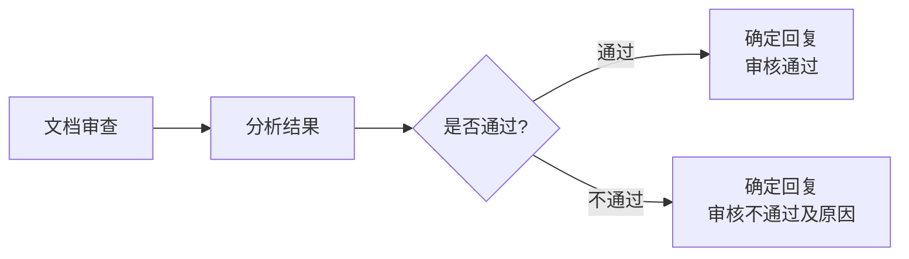

# 文档审查模块

## 模块概述

**功能**：用于文档读取和审核场景，根据设定好的提问依次回答

**位置**：扩展模块

**类型**：系统模块

**应用场景**：合规审查、内容审核、文档分析

---

## 模块结构


---

## 参数配置

### 激活条件

| 参数 | 类型 | 说明 |
|------|------|------|
| 联动激活 | 布尔型 | 上游所有条件均为 True 时激活 |
| 任一激活 | 布尔型 | 上游任一条件为 True 时激活 |

---

### 输入参数

| 参数 | 类型 | 说明 |
|------|------|------|
| 文档信息 | 字符串 | 连接"用户提问"模块中"文档信息"节点 |

---

### 批量提问配置

| 配置项 | 说明 | 限制 |
|--------|------|------|
| 批量提问(添加) | 设置审核内容，最多100个 | 最多100个问题 |
| 批量提问(模板添加) | 上传csv文件一次性导入 | 支持CSV格式 |
| 选择模型 | 选择大语言模型 | Qwen-Plus等 |
| 提示词(Prompt) | 说明处理任务 | 审核要求和标准 |

---

## 输出节点

### 回复结束（黄色 - 布尔型）

回复是否完成

### 回复内容（蓝色 - 字符串）

所有问题的回答结果

**格式**：
```markdown
### 问题1：[问题内容]
**回答**：[回答内容]

### 问题2：[问题内容]
**回答**：[回答内容]
```

### 模块运行结束（黄色 - 布尔型）

模块运行结束输出 True

---

## 使用场景

### 场景 1：合同审查

**需求**：审查合同中的关键条款

**审查问题**：
1. 合同是否包含双方签字？
2. 合同金额是否明确？
3. 违约责任条款是否清晰？
4. 争议解决方式是否指定？
5. 合同有效期是否明确？

**流程**：


---

### 场景 2：报告审核

**需求**：审核工作报告的完整性

**审核问题**：
1. 报告是否包含工作目标？
2. 工作完成情况是否描述清楚？
3. 是否包含数据支撑？
4. 存在问题是否分析到位？
5. 下一步计划是否明确？

---

### 场景 3：合规性检查

**需求**：检查文档是否符合合规要求

**检查项目**：
1. 是否包含敏感信息？
2. 是否符合保密要求？
3. 是否遵循格式规范？
4. 是否包含必要审批？
5. 是否过时需要更新？

---

## 批量提问模板

### CSV 格式

```csv
问题编号,问题内容,期望答案类型
1,合同是否包含双方签字？,是/否
2,合同金额是否明确？,是/否/金额
3,违约责任条款是否清晰？,是/否/详细说明
```

---

## 最佳实践

### 1. 问题设计

**建议**：
- 问题要具体明确
- 使用封闭式问题（是/否）+ 开放式问题（说明）
- 按重要性排序
- 数量控制在10-50个

### 2. 审核标准

**提示词示例**：
```markdown
请严格按照以下标准审核文档：
1. 准确性：信息是否准确无误
2. 完整性：内容是否完整
3. 合规性：是否符合相关法规
4. 清晰度：表达是否清晰易懂

对每个问题给出明确答案，并提供依据。
```

### 3. 结果处理

**流程**：


---

## 常见问题

### Q1: 如何导入大量问题？

**方案**：
1. 准备CSV文件
2. 使用"模板添加"功能导入
3. 检查和调整导入的问题

### Q2: 审查结果如何汇总？

**方案**：
- 使用信息加工模块处理结果
- 生成统计报告
- 突出显示关键问题

---

## 相关模块

- [用户提问](./user-question) - 上传文档
- [文档提问](./doc-question) - 文档问答
- [关键词识别](./keyword-recognition) - 关键词检测
- [信息分类](./info-classification) - 文档分类

---

**最后更新**：2026-03-04
