# 确定回复模块

## 模块概述

**功能**：将特定内容回复给用户，触发条件成立时直接显示配置内容

**位置**：辅助模块

**类型**：系统模块

**应用场景**：错误提示、引导语、固定回复、兜底消息

---

## 模块结构

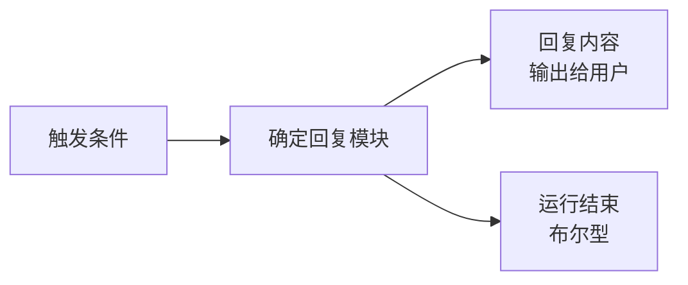

---

## 参数配置

### 激活条件

| 参数 | 类型 | 说明 |
|------|------|------|
| 联动激活 | 布尔型 | 上游所有条件均为 True 时激活 |
| 任一激活 | 布尔型 | 上游任一条件为 True 时激活 |

---

### 回复配置

| 参数 | 类型 | 说明 |
|------|------|------|
| 回复对用户可见 | - | 控制是否输出给用户（关闭后用于中间流程） |
| 回复内容（输入） | 字符串 | 节点有输入时直接输出输入内容；无输入时输出文本框内容 |

---

## 输出节点

### 回复内容（输出）（蓝色 - 字符串）

输出的回复内容

**用途**：传递给下游模块

---

### 模块运行结束（黄色 - 布尔型）

模块运行结束输出 True

**用途**：触发下游流程

---

## 使用场景

### 场景 1：错误提示

**需求**：知识库未找到相关信息时，提示用户

**流程**：
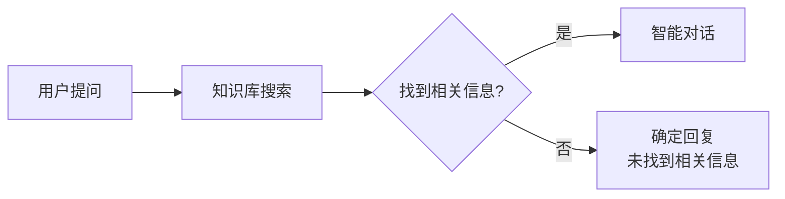

**配置**：
- 联动激活：连接知识库搜索的"未搜索到相关知识"
- 回复内容：
  ```
  抱歉，我在知识库中没有找到相关信息。
  
  您可以：
  1. 换个方式提问
  2. 联系人工客服
  3. 查看其他相关文档
  ```

---

### 场景 2：欢迎引导

**需求**：用户首次进入时显示欢迎消息

**流程**：
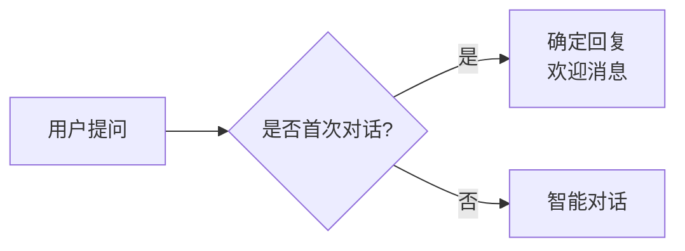

**配置**：
- 回复内容：
  ```
  👋 欢迎使用智能客服！
  
  我可以帮您：
  ✅ 查询业务数据
  ✅ 生成工作报告
  ✅ 解答常见问题
  
  请问有什么可以帮助您的？
  ```

---

### 场景 3：功能介绍

**需求**：用户询问功能时，展示功能列表

**流程**：
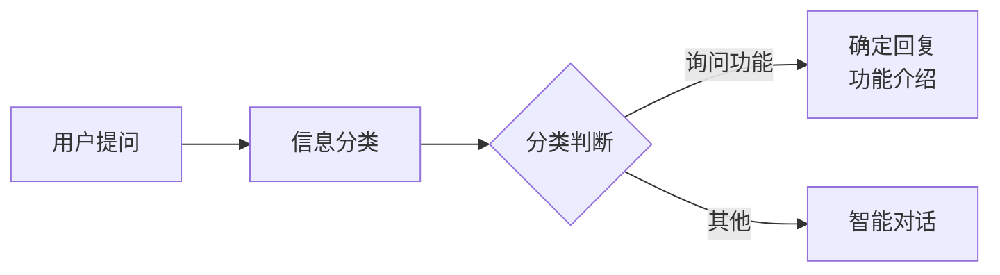

**配置**：
- 回复内容：
  ```markdown
  ## 🤖 我能为您做什么？
  
  ### 数据查询
  - 查询业务数据
  - 生成统计报表
  - 数据分析
  
  ### 报告生成
  - 日报、周报、月报
  - 自定义报告
  - 模板报告
  
  ### 常见问题
  - 产品使用指南
  - 常见问题解答
  - 操作流程说明
  
  请告诉我您需要哪项服务？
  ```

---

### 场景 4：兜底回复

**需求**：无法处理时，给出友好提示

**流程**：
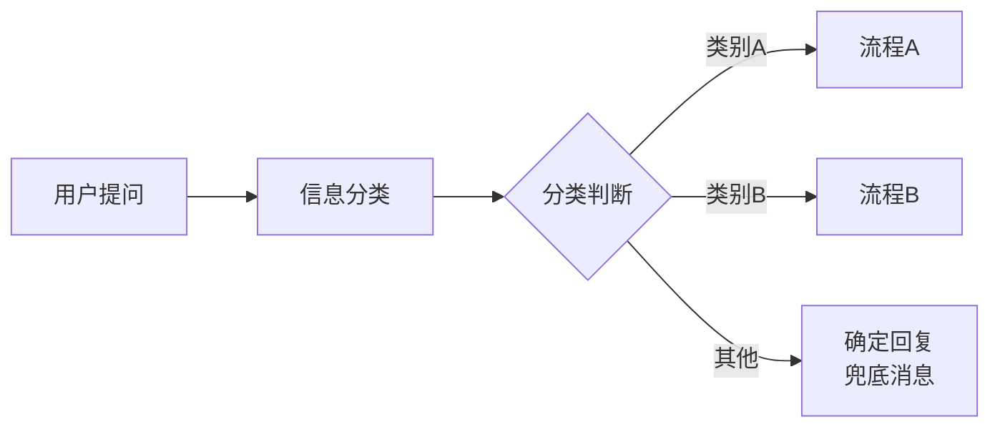

**配置**：
- 回复内容：
  ```
  抱歉，我暂时无法处理这类问题。
  
  您可以：
  1. 联系人工客服：400-xxx-xxxx
  2. 发送邮件：support@example.com
  3. 工作时间：周一至周五 9:00-18:00
  ```

---

### 场景 5：动态回复

**需求**：根据上游输入动态回复

**流程**：
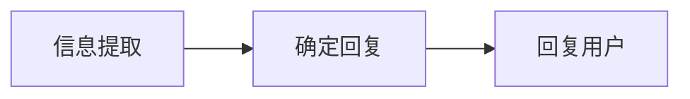

**配置**：
- 回复内容（输入）：连接信息提取的结果
- 自动输出输入的内容

**示例**：
```
上游输出："查询成功！找到 5 条记录。"
确定回复输出："查询成功！找到 5 条记录。"
```

---

## 最佳实践

### 1. 回复内容设计

✅ **推荐**：
- 语气友好、专业
- 提供明确的下一步指引
- 内容简洁、重点突出
- 使用表情符号增加亲和力

❌ **避免**：
- 语气生硬
- 缺少引导
- 内容冗长
- 纯文本、无格式

---

### 2. Markdown 格式

**支持格式**：
```markdown
# 标题
## 二级标题

**粗体** *斜体*

- 列表项1
- 列表项2

1. 有序列表1
2. 有序列表2

[链接文字](URL)

`代码片段`
```

**示例**：
```markdown
## 查询结果

✅ **查询成功**

找到 **5** 条相关记录：

1. 记录1
2. 记录2
3. 记录3

[查看详情](链接)
```

---

### 3. 条件组合

**多条件触发**：

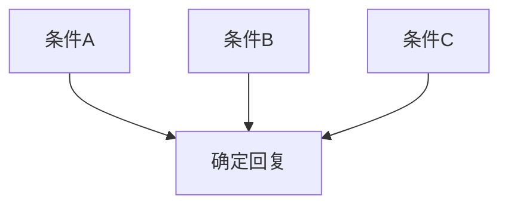

**配置**：
- 任一激活：任意一个条件成立即触发
- 联动激活：所有条件都成立才触发

---

### 4. 回复链

**场景**：需要多个固定回复时

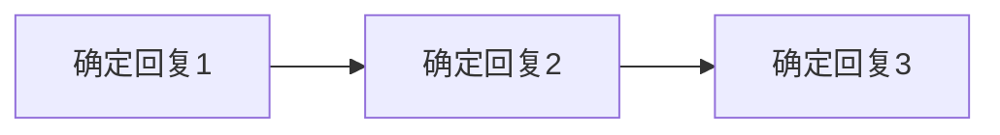

**配置**：
- 确定回复1：关闭"回复对用户可见"
- 确定回复2：关闭"回复对用户可见"
- 确定回复3：开启"回复对用户可见"

**用途**：组合多个信息源

---

## 常见问题

### Q1: 回复内容显示不正确？

**排查**：
1. 检查 Markdown 格式是否正确
2. 检查是否有特殊字符需要转义
3. 检查回复内容是否过长
4. 检查是否开启了"回复对用户可见"

---

### Q2: 如何插入动态内容？

**方案**：
1. 使用智能对话模块，在提示词中引用变量
2. 使用信息加工模块，组合内容
3. 使用确定回复的"回复内容（输入）"节点

---

### Q3: 如何实现多语言回复？

**方案1：多个确定回复**
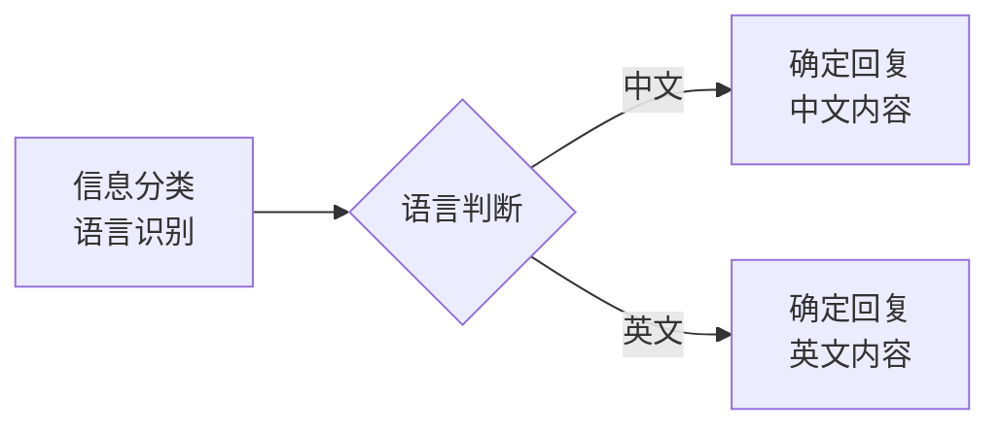

**方案2：智能对话**
```markdown
根据用户语言自动切换回复语言：
{{用户输入}}
```

---

### Q4: 确定回复不触发？

**排查步骤**：
1. 检查激活条件是否满足
2. 检查上游模块是否正确连接
3. 检查布尔型节点值是否为 True
4. 检查是否被其他流程拦截

---

## 高级技巧

### 1. 按钮组合

**配置**：在用户提问模块添加按钮，确定回复后显示

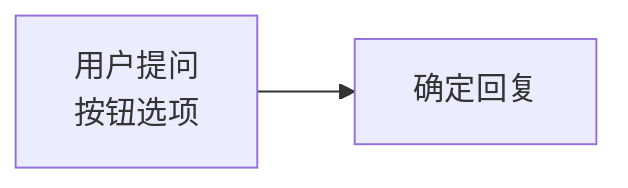

**效果**：
```
[确定回复内容]

[按钮1] [按钮2] [按钮3]
```

---

### 2. 超链接引导

**配置**：
```markdown
您可以：

- [查看文档](https://docs.example.com)
- [联系客服](https://support.example.com)
- [常见问题](https://faq.example.com)
```

---

### 3. 表格展示

**配置**：
```markdown
## 查询结果

| 项目 | 数值 | 说明 |
|------|------|------|
| 销售额 | 100万 | 同比+20% |
| 订单数 | 500个 | 同比+15% |
| 客户数 | 200人 | 同比+10% |
```

---

### 4. 上下文保持

**场景**：确定回复后继续对话

**配置**：
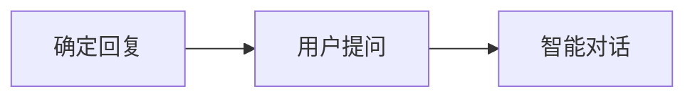

**提示词**：
```markdown
之前的对话：
{{确定回复内容}}

用户继续提问：
{{用户输入}}

请根据上下文回答。
```

---

## 相关模块

- [用户提问](./user-question) - 获取用户输入
- [信息分类](./info-classification) - 判断触发条件
- [智能对话](./smart-dialogue) - 动态回复
- [信息加工](./info-processing) - 组合内容

---

**最后更新**：2026-03-04
