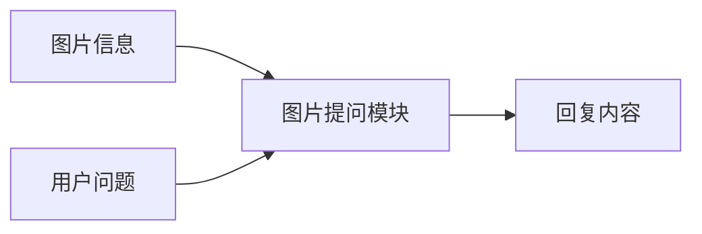
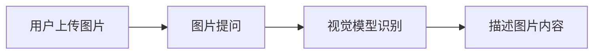
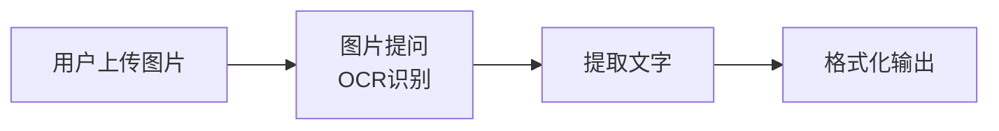
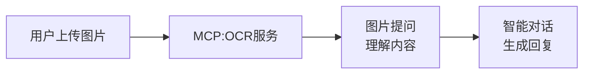
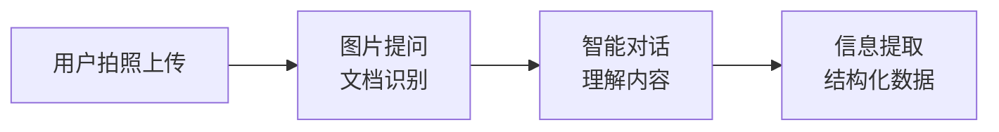
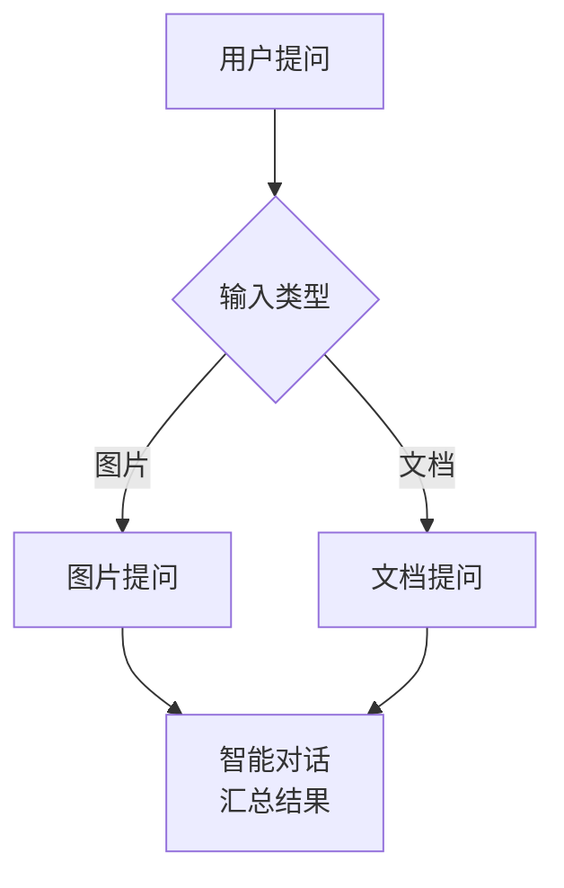
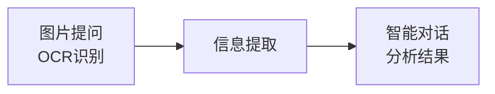

# 图片提问模块

## 模块概述

**功能**：用户上传图片后，借助视觉模型识图能力回复

**位置**：扩展模块

**类型**：系统模块

**应用场景**：图片识别、OCR文字识别、图像分析

---

## 模块结构



---

## 参数配置

### 激活条件

| 参数 | 类型 | 说明 |
|------|------|------|
| 联动激活 | 布尔型 | 上游所有条件均为 True 时激活 |
| 任一激活 | 布尔型 | 上游任一条件为 True 时激活 |

---

### 输入参数

| 参数 | 类型 | 说明 |
|------|------|------|
| 信息输入 | 字符串 | 用户提出的问题 |
| 图片信息 | 字符串 | 连接"用户提问"模块中"图片信息"节点 |

---

### 模型配置

| 参数 | 说明 | 推荐值 |
|------|------|--------|
| 选择模型 | 选择视觉模型 | GLM-4v（推荐） |
| 回复对用户可见 | 控制是否输出给用户 | 开启 |
| 回复创意性 | 0-1，控制发散性 | 0.7 |
| 核采样 TOP_P | 0-1 | 0.9 |
| 回复字数上限 | 100-1000 | 500 |

---

## 输出节点

### 回复结束（黄色 - 布尔型）

回复是否完成

### 回复内容（蓝色 - 字符串）

模型生成的回复内容

### 模块运行结束（黄色 - 布尔型）

模块运行结束输出 True

---

## 使用场景

### 场景 1：图片内容识别

**需求**：识别图片中的物体、场景、文字

**用户输入**：
```
请描述这张图片的内容
```

**流程**：


**示例回复**：
```
这张图片显示了一张办公桌，桌上有：
- 一台笔记本电脑
- 一杯咖啡
- 一些文件和文具
- 窗外可以看到城市景观

整体环境整洁明亮，看起来是一个现代化的办公空间。
```

---

### 场景 2：OCR 文字识别

**需求**：提取图片中的文字内容

**用户输入**：
```
请提取图片中的所有文字
```

**流程**：


**结合MCP**：


---

### 场景 3：图像分析

**需求**：分析图表、数据可视化

**用户输入**：
```
分析这张图表的数据趋势
```

**分析维度**：
- 图表类型（柱状图、折线图、饼图等）
- 数据趋势（上升、下降、波动）
- 关键数据点
- 异常值识别

---

### 场景 4：文档拍照识别

**需求**：识别拍照的文档内容

**流程**：


---

## 最佳实践

### 1. 图片质量

**建议**：
- 图片清晰，分辨率适中
- 光线充足，避免反光
- 主体突出，背景简洁
- 文件大小 < 30MB

### 2. 问题设计

**建议**：
- 问题具体明确
- 与图片内容相关
- 可以追问深入

**示例**：
```
✅ 推荐：
- "这张图片中的主要物体是什么？"
- "提取图片中的所有文字"
- "描述这张数据图表的趋势"

❌ 避免：
- "这是什么？"（过于宽泛）
- "分析一下"（不够具体）
```

### 3. 结合其他模块

**方案 1：图片 + 文档**


**方案 2：图片 + OCR + 分析**


---

## 与文档提问的区别

| 特性 | 图片提问 | 文档提问 |
|------|----------|----------|
| 输入类型 | 图片 | 文档 |
| 处理模型 | 视觉模型 | 语言模型 |
| 适用场景 | 图像识别、OCR | 文档阅读、问答 |
| 文件格式 | png, jpg, jpeg | pdf, doc, docx, txt |

---

## 常见问题

### Q1: 图片识别不准确？

**排查**：
1. 检查图片清晰度
2. 检查图片方向
3. 尝试更换视觉模型
4. 调整提示词

### Q2: 如何处理多张图片？

**方案**：
- 使用循环模块批量处理
- 或使用多个图片提问模块

### Q3: 可以识别手写文字吗？

**说明**：
- 取决于视觉模型的能力
- 手写清晰时识别率较高
- 复杂手写建议使用专业OCR服务

---

## 相关模块

- [用户提问](./user-question) - 上传图片
- [智能对话](./smart-dialogue) - 分析结果
- [信息提取](./info-extraction) - 结构化提取
- [代码块](./code-block) - 处理数据

---

**最后更新**：2026-03-04
