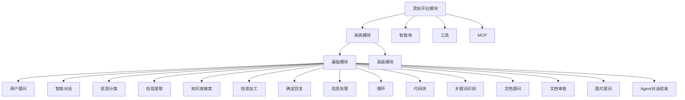
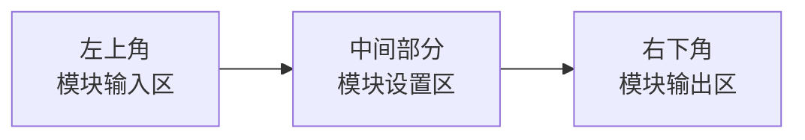
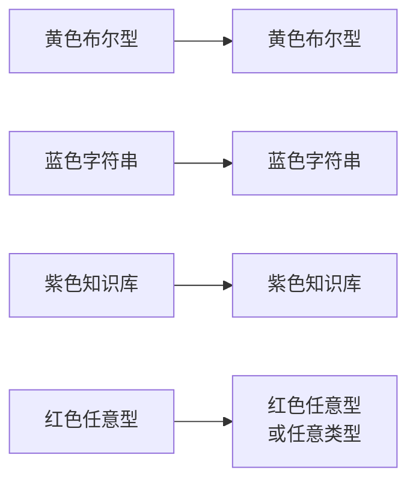
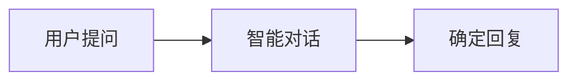
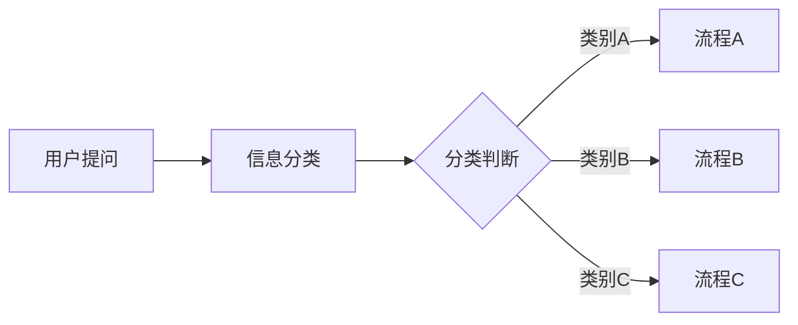
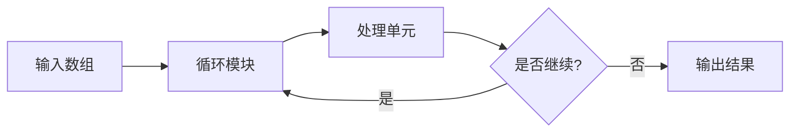
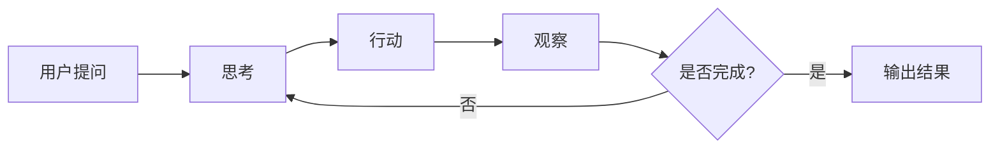
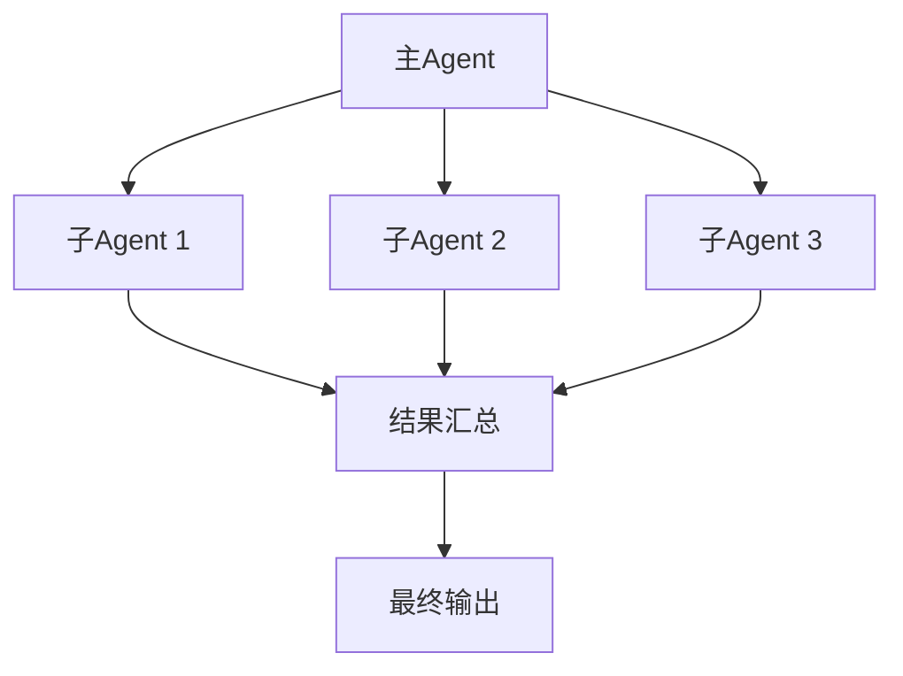

# 模块概览

## 模块分类

灵知平台的模块分为 **4 大类**：

---

## 系统模块

### 基础模块（15个）

基础模块是构建 Agent 的核心组件，提供 AI 能力和数据处理功能。

| 模块 | 功能 | 类型 | 重要程度 |
|------|------|------|----------|
| [用户提问](./user-question) | 获取用户输入 | 入口模块 | ⭐⭐⭐⭐⭐ |
| [智能对话](./smart-dialogue) | LLM 对话交互 | 核心模块 | ⭐⭐⭐⭐⭐ |
| [知识库搜索](./knowledge-search) | RAG 检索增强 | 核心模块 | ⭐⭐⭐⭐⭐ |
| [信息分类](./info-classification) | 文本分类 | 核心模块 | ⭐⭐⭐⭐ |
| [信息提取](./info-extraction) | 结构化提取 | 核心模块 | ⭐⭐⭐⭐ |
| [信息加工](./info-processing) | 信息加工处理 | 辅助模块 | ⭐⭐⭐ |
| [确定回复](./fixed-reply) | 固定内容回复 | 辅助模块 | ⭐⭐⭐ |
| [信息处理](./data-processing) | 正则处理数据 | 辅助模块 | ⭐⭐⭐ |
| [循环](./loop) | 批量处理 | 控制模块 | ⭐⭐⭐⭐ |
| [代码块](./code-block) | 执行代码 | 扩展模块 | ⭐⭐⭐ |
| [关键词识别](./keyword-recognition) | 识别关键词 | 辅助模块 | ⭐⭐ |
| [文档提问](./doc-question) | 文档问答 | 扩展模块 | ⭐⭐⭐ |
| [文档审查](./doc-review) | 文档审核 | 扩展模块 | ⭐⭐⭐ |
| [图片提问](./image-question) | 图片识别 | 扩展模块 | ⭐⭐⭐ |
| [Agent对话结束](./agent-end) | 多Agent协作 | 协作模块 | ⭐⭐⭐⭐ |

---

## 智能体

**功能**：调用已上线的智能体，进行更复杂能力规划

**使用场景**：
- 多 Agent 协作
- 能力复用
- 模块化设计

**相关文档**：
- [多智能体协作](../advanced/multi-agent)

---

## 工具

**分类**：
- **自定义工具**：亲自创建的独特工具
- **官方工具**：系统提供的预设工具集

**使用方式**：将工具拖拽至画布上使用

**相关文档**：
- [创建自定义工具](../advanced/custom-tools)

---

## MCP

**功能**：通用协议打通 Agent 与外部工具、数据源的交互

**使用场景**：
- 外部 API 调用
- 数据库连接
- 第三方服务集成

**相关文档**：
- [MCP 创建](../advanced/mcp-create)
- [MCP 调用](../advanced/mcp-use)

---

## 模块结构

每个模块由三部分组成：

### 1. 模块输入区（左上角）

**功能**：连接节点将信息输入

**节点类型**：
- 🟡 黄色：布尔型（true/false）
- 🔵 蓝色：字符串（文本）
- 🟣 紫色：知识库结果
- 🔴 红色：任意类型

---

### 2. 模块设置区（中间）

**功能**：设置模块参数、提示词等

**常见配置**：
- 激活条件
- 模型选择
- 提示词
- 参数调整

---

### 3. 模块输出区（右下角）

**功能**：将模块执行后的信息输出

**输出类型**：
- 状态输出（布尔型）
- 内容输出（字符串）
- 特殊输出（知识库类型）

---

## 节点连接原则

### 连接规则

✅ **可以连接**：
- 输入节点 ↔ 输出节点
- 同类型节点互相连接

❌ **不能连接**：
- 输入节点 ↔ 输入节点
- 输出节点 ↔ 输出节点
- 不同类型节点

---

### 节点类型匹配

**例外**：红色节点（任意类型）可以连接到其他类型节点

---

## 常见编排模式

### 1. 线性流程

**适用场景**：简单的顺序处理

---

### 2. 条件分支

**适用场景**：根据不同情况执行不同操作

---

### 3. 循环处理

**适用场景**：批量处理、迭代优化

---

### 4. ReAct 循环

**适用场景**：复杂推理、工具调用

**相关文档**：
- [ReAct 实现方案](/lesson-01/resources/ReAct实现方案)

---

### 5. 多 Agent 协作

**适用场景**：复杂任务、能力分工

**相关文档**：
- [多智能体协作](../advanced/multi-agent)

---

## 快速参考

### 最常用模块组合

| 场景 | 模块组合 |
|------|----------|
| 简单问答 | 用户提问 + 智能对话 + 确定回复 |
| 知识库问答 | 用户提问 + 知识库搜索 + 智能对话 + 确定回复 |
| 文档问答 | 用户提问 + 文档提问 + 确定回复 |
| 信息提取 | 用户提问 + 信息提取 + 智能对话 + 确定回复 |
| 多轮对话 | 用户提问 + 智能对话（上下文）+ 确定回复 |

---

### 模块选择指南

**需要 AI 能力？**
- ✅ → 智能对话、信息分类、信息提取、信息加工

**需要检索知识库？**
- ✅ → 知识库搜索

**需要处理文档？**
- ✅ → 文档提问、文档审查、关键词识别

**需要处理图片？**
- ✅ → 图片提问

**需要批量处理？**
- ✅ → 循环模块

**需要执行代码？**
- ✅ → 代码块

**需要多Agent协作？**
- ✅ → Agent对话结束

---

## 学习路径

### 初级（必学）

1. [用户提问](./user-question) - 理解输入
2. [智能对话](./smart-dialogue) - 掌握 LLM 交互
3. [确定回复](./fixed-reply) - 学会输出
4. [知识库搜索](./knowledge-search) - 理解 RAG

---

### 中级（推荐）

5. [信息分类](./info-classification) - 实现条件分支
6. [信息提取](./info-extraction) - 结构化提取
7. [循环](./loop) - 批量处理
8. [信息加工](./info-processing) - 内容加工

---

### 高级（可选）

9. [代码块](./code-block) - 自定义逻辑
10. [Agent对话结束](./agent-end) - 多Agent协作
11. [文档提问](./doc-question) - 文档处理
12. [图片提问](./image-question) - 图片识别

---

## 相关资源

- [快速开始](../quick-start) - 创建第一个 Agent
- [基础配置](../basic-config) - Agent 配置详解
- [规划概述](../planning-overview) - 理解编排界面
- [最佳实践](../advanced/best-practices) - 常见问题解决

---

**最后更新**：2026-03-04
