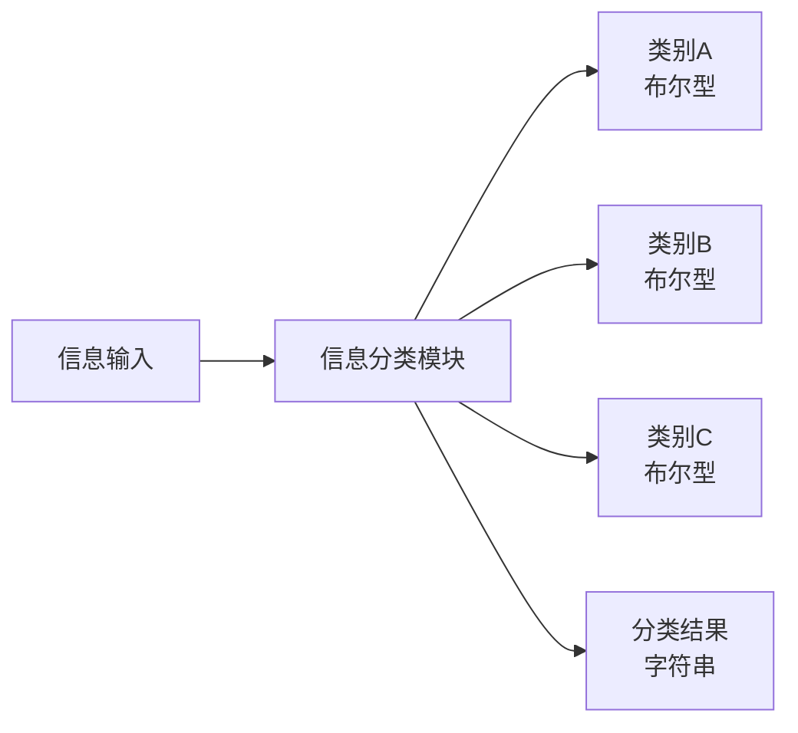
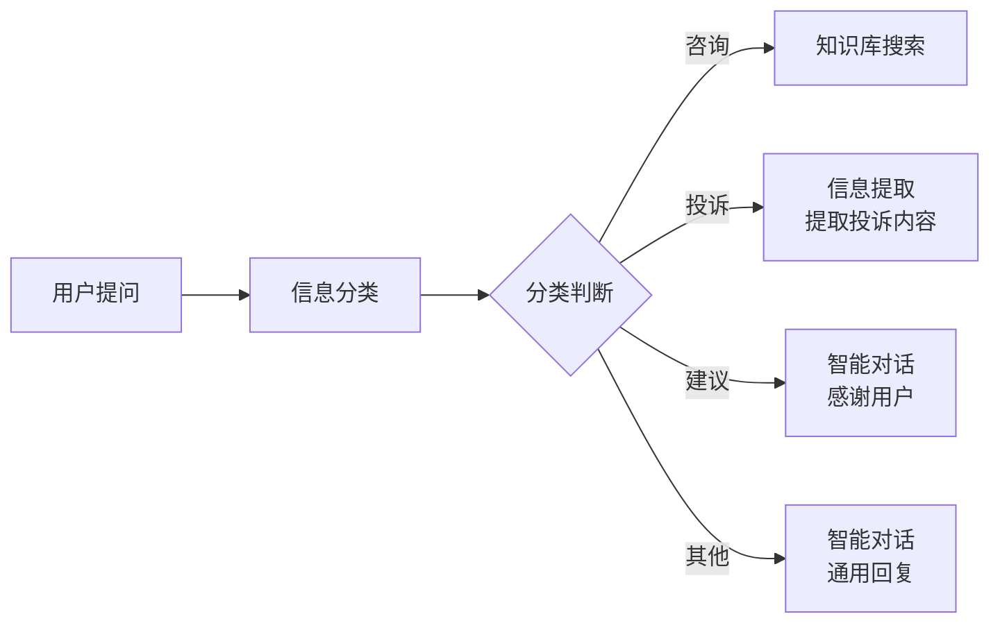
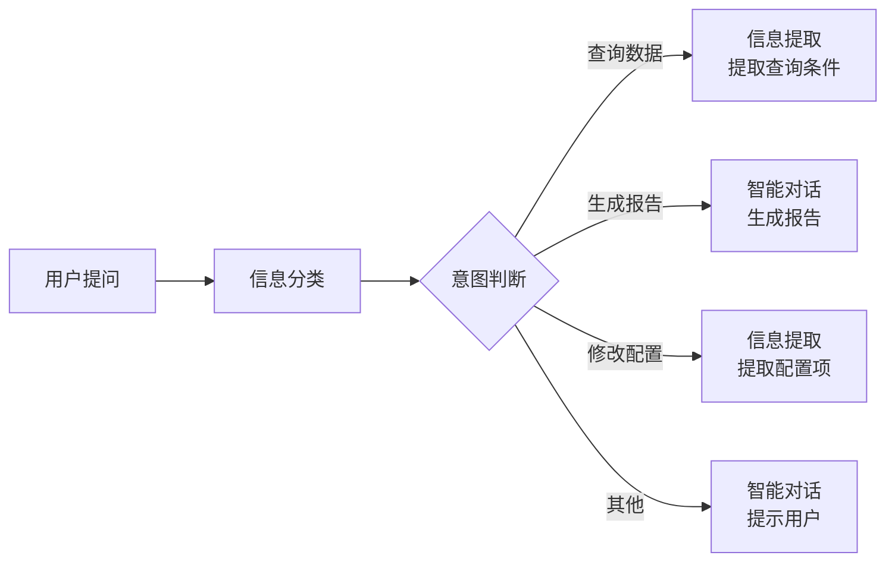
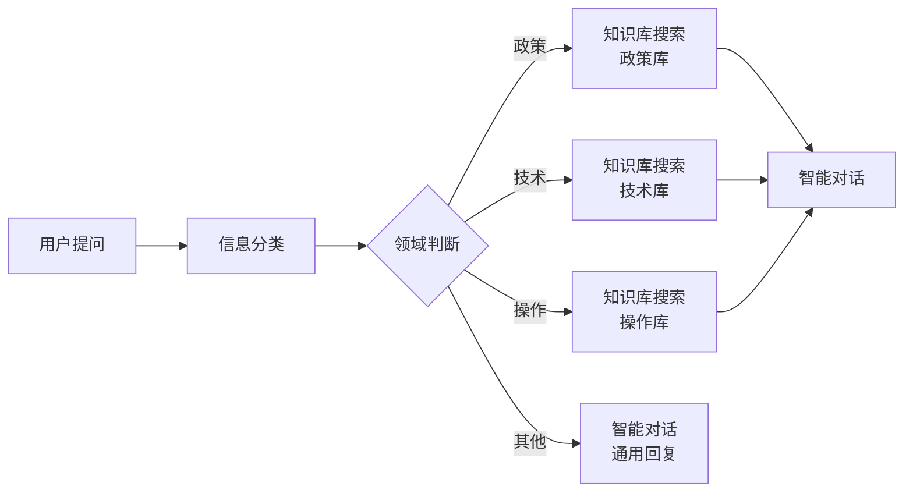

# 信息分类模块

## 模块概述

**功能**：将用户输入问题进行分类，针对不同类型执行不同操作

**位置**：核心模块

**类型**：系统模块

**应用场景**：意图识别、问题分类、流程路由

---

## 模块结构



---

## 参数配置

### 激活条件

| 参数 | 类型 | 说明 |
|------|------|------|
| 联动激活 | 布尔型 | 上游所有条件均为 True 时激活 |
| 任一激活 | 布尔型 | 上游任一条件为 True 时激活 |

---

### 输入参数

| 参数 | 类型 | 说明 |
|------|------|------|
| 信息输入 | 字符串 | 连接上游输出的文本 |
| 知识库搜索结果 | 知识库类型 | 连接知识库搜索结果 |
| 聊天上下文 | - | 可设置 0-6 条聊天记录 |

---

### 分类配置

| 参数 | 类型 | 说明 | 示例 |
|------|------|------|------|
| 模型选择 | - | 选择大语言模型 | Qwen-Plus |
| 提示词(Prompt) | - | 说明分类任务 | "对用户问题进行分类" |
| 标签(添加) | - | 设置分类类别 | "咨询"、"投诉"、"建议" |

---

## 输出节点

### 标签节点（黄色 - 布尔型）

每个标签对应一个布尔型输出节点，符合该分类输出 True

**用途**：作为下游流程的触发条件

**示例**：
```
咨询 → 布尔型（True/False）
投诉 → 布尔型（True/False）
建议 → 布尔型（True/False）
```

---

### 分类结果（蓝色 - 字符串）

JSON 格式输出分类结果

**格式**：
```json
{
  "category": "咨询",
  "confidence": 0.95
}
```

**用途**：记录分类详情，可用于日志或调试

---

### 模块运行结束（黄色 - 布尔型）

模块运行结束输出 True

**用途**：触发下游流程

---

## 使用场景

### 场景 1：客服问题分类

**标签**：咨询、投诉、建议、其他

**流程**：


**提示词**：
```markdown
将用户的问题分类到以下类别之一：
- 咨询：用户咨询产品或服务信息
- 投诉：用户表达不满或投诉
- 建议：用户提出改进建议
- 其他：不属于以上类别

用户问题：{{用户输入}}

请输出分类结果和分类理由。
```

---

### 场景 2：意图识别

**标签**：查询数据、生成报告、修改配置、其他

**流程**：


**提示词**：
```markdown
识别用户的意图，分类到以下类别：
- 查询数据：用户想查询数据或信息
- 生成报告：用户想生成报告或文档
- 修改配置：用户想修改系统配置
- 其他：其他意图

用户输入：{{用户输入}}
```

---

### 场景 3：多知识库路由

**标签**：政策、技术、操作、其他

**流程**：


**优势**：
- 提高检索精度
- 减少无关内容
- 提升响应速度

---

## 提示词设计

### 分类提示词模板

```markdown
# 任务
将用户输入分类到以下类别之一：

## 类别说明
1. **类别A**：[描述特征]
2. **类别B**：[描述特征]
3. **类别C**：[描述特征]

## 用户输入
{{输入内容}}

## 输出要求
1. 选择最匹配的类别
2. 简要说明分类理由
3. 如果不确定，选择"其他"
```

---

### 高级提示词技巧

#### 1. 多维度分类

```markdown
从多个维度对用户问题进行分类：

## 维度1：问题类型
- 数据查询
- 报告生成
- 配置修改

## 维度2：紧急程度
- 紧急
- 一般
- 不紧急

## 维度3：部门
- 销售部
- 技术部
- 行政部

用户问题：{{用户输入}}

请按三个维度进行分类。
```

#### 2. 置信度输出

```markdown
对用户问题进行分类，并输出置信度：

## 类别
- 类别A
- 类别B
- 类别C

## 输出格式
```json
{
  "category": "类别名称",
  "confidence": 0.95,
  "reasoning": "分类理由"
}
```

用户问题：{{用户输入}}
```

---

## 最佳实践

### 1. 标签设计原则

✅ **推荐**：
- 标签数量：3-6 个
- 互斥性：每个标签对应不同处理流程
- 完备性：覆盖所有可能的情况
- 清晰性：标签名称和描述清晰

❌ **避免**：
- 标签过多（>8个）
- 标签含义重叠
- 缺少"其他"类别
- 标签描述模糊

---

### 2. 提示词优化

**基础版**：
```markdown
将用户问题分类到：咨询、投诉、建议、其他
用户问题：{{输入}}
```

**优化版**：
```markdown
# 角色
你是一个专业的问题分类助手。

# 类别定义
- 咨询：用户询问产品、服务、政策等信息
- 投诉：用户表达不满、投诉或抱怨
- 建议：用户提出改进建议或意见
- 其他：不属于以上类别

# 分类规则
1. 优先选择最明确的类别
2. 如果同时符合多个类别，选择最核心的意图
3. 不确定时选择"其他"

# 用户问题
{{输入}}

# 输出
请输出分类结果和简要理由。
```

---

### 3. 分类准确性提升

**方法1：增加示例**
```markdown
# 示例
用户："这个产品的价格是多少？" → 咨询
用户："你们的服务太差了！" → 投诉
用户："建议增加夜间服务" → 建议

用户问题：{{输入}}
```

**方法2：上下文参考**
- 开启聊天上下文（2-3条）
- 结合历史对话进行分类

**方法3：多次分类**
- 第一次：粗分类（咨询/投诉/建议）
- 第二次：细分类（具体业务领域）

---

## 常见问题

### Q1: 分类不准确？

**排查步骤**：
1. 检查标签定义是否清晰
2. 优化提示词，增加示例
3. 检查标签是否互斥
4. 增加聊天上下文
5. 调整模型参数

---

### Q2: 用户问题符合多个标签？

**解决方案**：
1. 明确标签优先级
2. 在提示词中说明规则："选择最核心的意图"
3. 使用多级分类
4. 输出多个分类结果

---

### Q3: 分类速度慢？

**优化方案**：
1. 简化提示词
2. 减少标签数量
3. 使用更快的模型
4. 缓存常见问题的分类结果

---

### Q4: 如何处理边界情况？

**方案**：
1. 添加"其他"类别
2. 在提示词中说明不确定时的处理
3. 结合知识库搜索辅助判断
4. 人工审核边界案例

---

## 相关模块

- [用户提问](./user-question) - 获取用户输入
- [信息提取](./info-extraction) - 提取结构化信息
- [智能对话](./smart-dialogue) - 根据分类生成回复
- [知识库搜索](./knowledge-search) - 根据分类查询知识库

---

**最后更新**：2026-03-04
