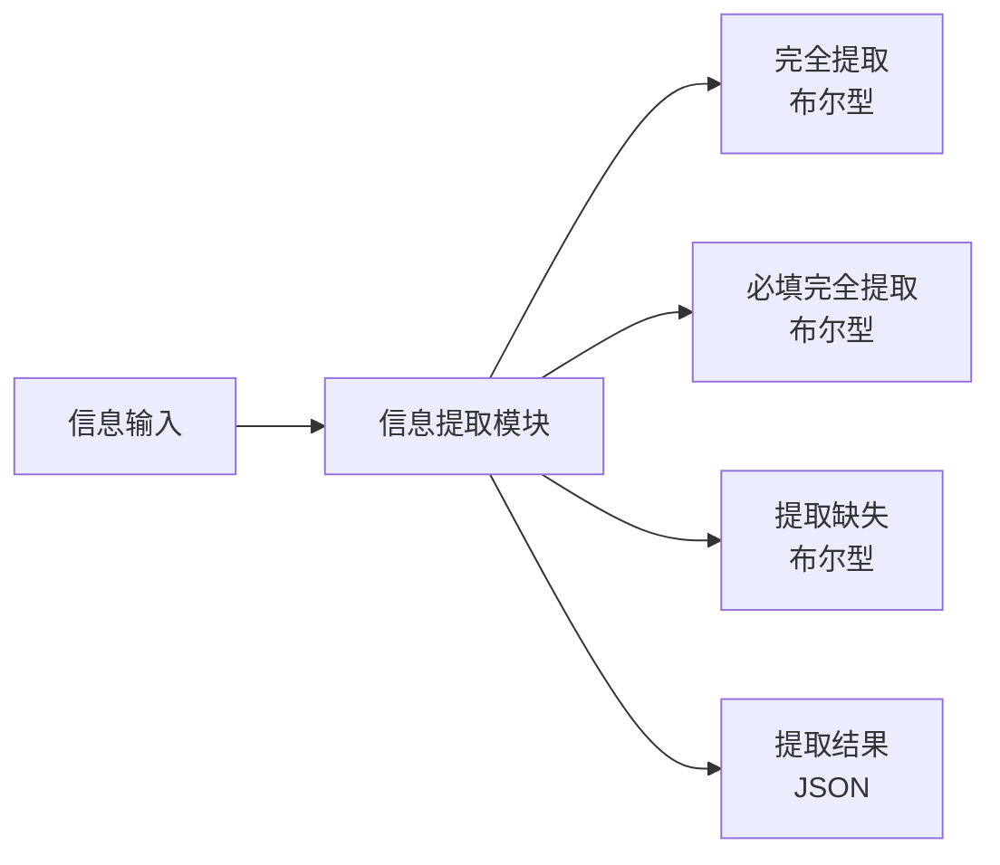
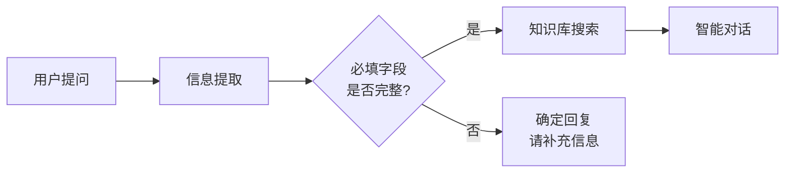
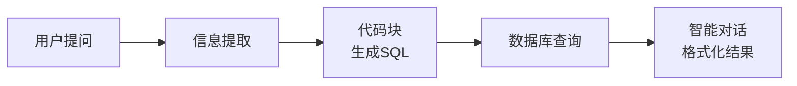
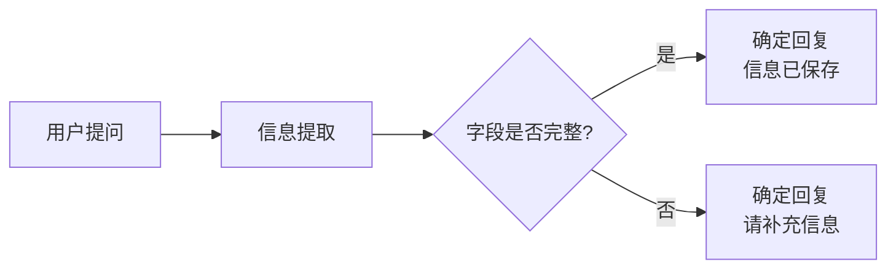
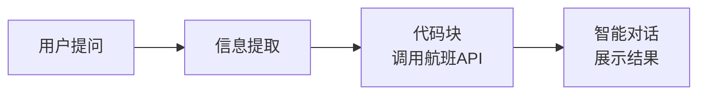
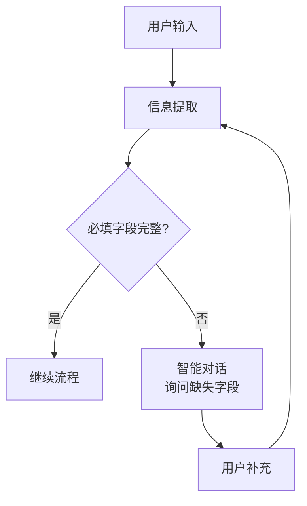
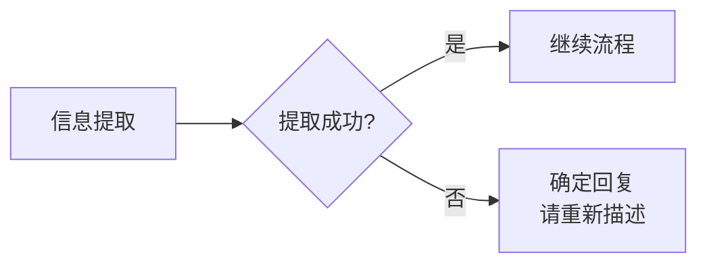

# 信息提取模块

## 模块概述

**功能**：从输入信息中提取目标信息（关键词、SQL语句等），结合 API/工具使用

**位置**：核心模块

**类型**：系统模块

**应用场景**：实体识别、参数提取、结构化数据提取

---

## 模块结构



---

## 参数配置

### 激活条件

| 参数 | 类型 | 说明 |
|------|------|------|
| 联动激活 | 布尔型 | 上游所有条件均为 True 时激活 |
| 任一激活 | 布尔型 | 上游任一条件为 True 时激活 |

---

### 输入参数

| 参数 | 类型 | 说明 |
|------|------|------|
| 信息输入 | 字符串 | 连接上游输出的文本 |
| 知识库搜索结果 | 知识库类型 | 连接知识库搜索结果 |
| 聊天上下文 | - | 可设置 0-6 条聊天记录 |

---

### 提取配置

| 参数 | 类型 | 说明 | 示例 |
|------|------|------|------|
| 模型选择 | - | 选择大语言模型 | Qwen-Plus |
| 提示词(Prompt) | - | 说明提取任务 | "从用户输入中提取关键信息" |
| 提取字段 | - | 配置字段 key、描述、是否必填 | 见下方说明 |

---

### 提取字段配置

**字段配置格式**：

| 配置项 | 说明 | 示例 |
|--------|------|------|
| 字段Key | 字段名称（英文） | `query_date` |
| 字段描述 | 字段含义说明 | 查询日期 |
| 是否必填 | 必须提取的字段 | ✅ 是 |

**示例配置**：
```json
[
  {
    "key": "query_date",
    "description": "查询日期",
    "required": true
  },
  {
    "key": "query_type",
    "description": "查询类型（日报/周报/月报）",
    "required": true
  },
  {
    "key": "department",
    "description": "部门名称",
    "required": false
  }
]
```

---

## 输出节点

### 完全提取（黄色 - 布尔型）

全部字段完成提取时输出 True

**用途**：判断是否所有字段都成功提取

---

### 必填完全提取（黄色 - 布尔型）

必填字段全部提取时输出 True

**用途**：判断必填字段是否提取完成

---

### 提取缺失（黄色 - 布尔型）

必填字段部分未提取时输出 True

**用途**：触发补充信息的流程

---

### 全部提取结果（蓝色 - 字符串）

JSON 字符串，包含所有提取的 key 和值

**格式**：
```json
{
  "query_date": "2026-03-04",
  "query_type": "日报",
  "department": "销售部"
}
```

**用途**：传递给下游模块或 API 调用

---

### 模块运行结束（黄色 - 布尔型）

模块运行结束输出 True

**用途**：触发下游流程

---

## 使用场景

### 场景 1：查询参数提取

**需求**：从用户自然语言中提取查询参数

**用户输入**：
```
我想查询2026年3月4日销售部的日报数据
```

**流程**：


**提取配置**：
| 字段Key | 字段描述 | 是否必填 |
|---------|----------|----------|
| query_date | 查询日期 | ✅ 是 |
| query_type | 查询类型 | ✅ 是 |
| department | 部门名称 | ❌ 否 |

**提取结果**：
```json
{
  "query_date": "2026-03-04",
  "query_type": "日报",
  "department": "销售部"
}
```

---

### 场景 2：SQL 生成辅助

**需求**：提取查询条件，辅助生成 SQL

**用户输入**：
```
查询北京地区2026年第一季度的订单金额
```

**流程**：


**提取配置**：
| 字段Key | 字段描述 | 是否必填 |
|---------|----------|----------|
| region | 地区 | ✅ 是 |
| time_period | 时间段 | ✅ 是 |
| metric | 指标名称 | ✅ 是 |

**提取结果**：
```json
{
  "region": "北京",
  "time_period": "2026年第一季度",
  "metric": "订单金额"
}
```

**SQL 生成**：
```sql
SELECT SUM(order_amount) as total_amount
FROM orders
WHERE region = '北京'
  AND order_date BETWEEN '2026-01-01' AND '2026-03-31'
```

---

### 场景 3：表单填充

**需求**：从对话中提取信息，自动填充表单

**用户输入**：
```
我叫张三，手机号13800138000，邮箱zhangsan@example.com
```

**流程**：


**提取配置**：
| 字段Key | 字段描述 | 是否必填 |
|---------|----------|----------|
| name | 姓名 | ✅ 是 |
| phone | 手机号 | ✅ 是 |
| email | 邮箱 | ✅ 是 |

**提取结果**：
```json
{
  "name": "张三",
  "phone": "13800138000",
  "email": "zhangsan@example.com"
}
```

---

### 场景 4：API 参数准备

**需求**：提取参数，准备调用外部 API

**用户输入**：
```
帮我查询明天北京到上海的航班
```

**流程**：


**提取配置**：
| 字段Key | 字段描述 | 是否必填 |
|---------|----------|----------|
| date | 出发日期 | ✅ 是 |
| departure | 出发地 | ✅ 是 |
| destination | 目的地 | ✅ 是 |

**提取结果**：
```json
{
  "date": "2026-03-05",
  "departure": "北京",
  "destination": "上海"
}
```

---

## 提示词设计

### 基础提示词模板

```markdown
# 任务
从用户输入中提取以下信息：

## 字段说明
1. **query_date**：查询日期（必填）
   - 格式：YYYY-MM-DD
   - 说明：用户想查询的具体日期

2. **query_type**：查询类型（必填）
   - 取值：日报、周报、月报
   - 说明：用户想查询的报告类型

3. **department**：部门名称（选填）
   - 说明：用户所在或查询的部门

## 用户输入
{{输入内容}}

## 输出要求
1. 严格按照 JSON 格式输出
2. 如果找不到某个字段，输出 null
3. 日期格式统一为 YYYY-MM-DD
```

---

### 高级提示词技巧

#### 1. 智能推断

```markdown
# 任务
从用户输入中提取信息，并进行智能推断：

## 字段说明
- date：日期（必填）
  - 如果用户说"今天"，推断为当前日期
  - 如果用户说"明天"，推断为当前日期+1天
  - 如果用户说"下周一"，推断为下周一的日期

当前日期：2026-03-04

用户输入：{{输入}}
```

#### 2. 多值提取

```markdown
# 任务
从用户输入中提取多个值：

## 字段说明
- keywords：关键词列表（数组）
  - 提取所有提到的关键词

用户输入："我想查询销售、市场、研发三个部门的数据"

输出格式：
{
  "keywords": ["销售", "市场", "研发"]
}
```

#### 3. 类型转换

```markdown
# 任务
提取并转换数据类型：

## 字段说明
- amount：金额（数字）
  - 从文本中提取数字
  - 单位统一为元

用户输入："查询五千万元的订单"

输出：
{
  "amount": 50000000
}
```

---

## 最佳实践

### 1. 字段设计原则

✅ **推荐**：
- 字段数量：3-8 个（太多影响准确性）
- 字段命名：清晰的英文 key
- 字段描述：详细的说明和示例
- 必填判断：合理设置必填字段

❌ **避免**：
- 字段过多（>10个）
- 字段命名模糊
- 描述不清楚
- 所有字段都设为必填

---

### 2. 提取准确性提升

**方法1：详细的字段描述**
```markdown
- phone：手机号码（必填）
  - 格式：11位数字
  - 示例：13800138000
  - 说明：用户联系手机号
```

**方法2：提供示例**
```markdown
## 示例
输入："查询2026年3月北京地区的销售数据"
输出：
{
  "year": "2026",
  "month": "3",
  "region": "北京",
  "metric": "销售数据"
}
```

**方法3：多轮确认**


---

### 3. 错误处理

**流程设计**：


**提示词优化**：
```markdown
如果无法确定某个字段的值，请输出 null，不要猜测。
```

---

## 常见问题

### Q1: 提取结果不准确？

**排查步骤**：
1. 检查字段描述是否清晰
2. 增加示例说明
3. 优化提示词
4. 检查用户输入是否含糊

---

### Q2: 必填字段无法提取？

**解决方案**：
1. 重新设计字段描述
2. 提供更多示例
3. 使用多轮对话确认
4. 考虑降低为选填字段

---

### Q3: 如何处理复杂结构？

**方案**：
```json
{
  "user_info": {
    "name": "张三",
    "contact": {
      "phone": "13800138000",
      "email": "zhangsan@example.com"
    }
  }
}
```

**提示词**：
```markdown
输出嵌套的 JSON 结构，准确反映数据层级关系。
```

---

### Q4: 如何验证提取结果？

**方案1：代码块验证**
```javascript
const result = JSON.parse(提取结果);
if (!result.query_date) {
  return { error: "缺少日期信息" };
}
// 验证日期格式
const dateRegex = /^\d{4}-\d{2}-\d{2}$/;
if (!dateRegex.test(result.query_date)) {
  return { error: "日期格式不正确" };
}
return { valid: true };
```

**方案2：智能对话验证**
```markdown
你提取的信息：
- 日期：{{query_date}}
- 类型：{{query_type}}
- 部门：{{department}}

请确认是否正确？
```

---

## 相关模块

- [信息分类](./info-classification) - 先分类再提取
- [代码块](./code-block) - 处理提取结果
- [智能对话](./smart-dialogue) - 多轮确认
- [确定回复](./fixed-reply) - 错误提示

---

**最后更新**：2026-03-04
