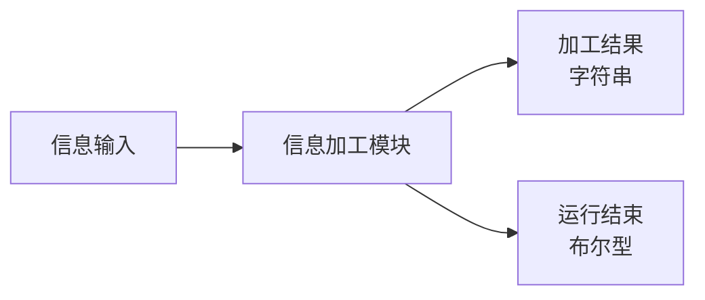
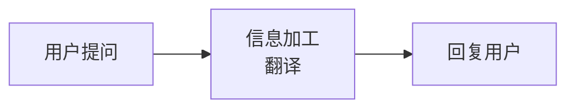
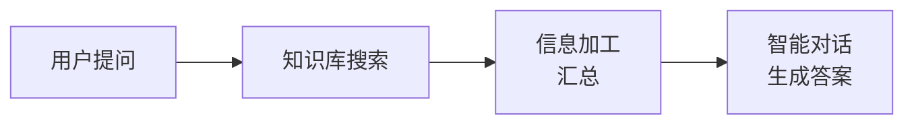
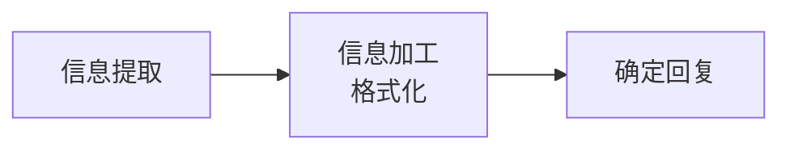
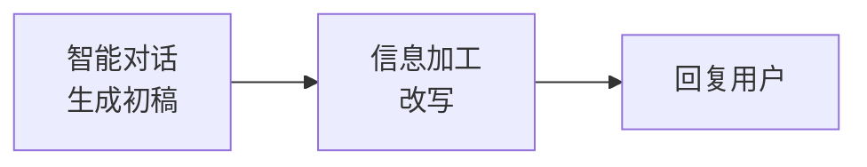
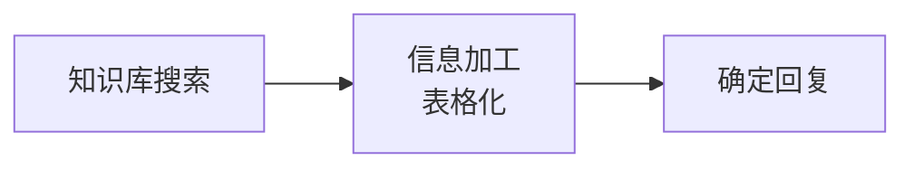
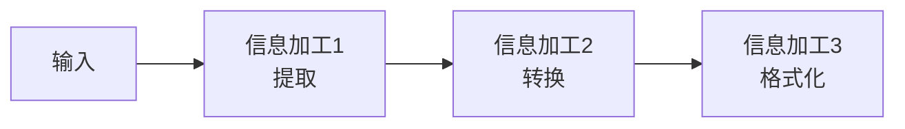
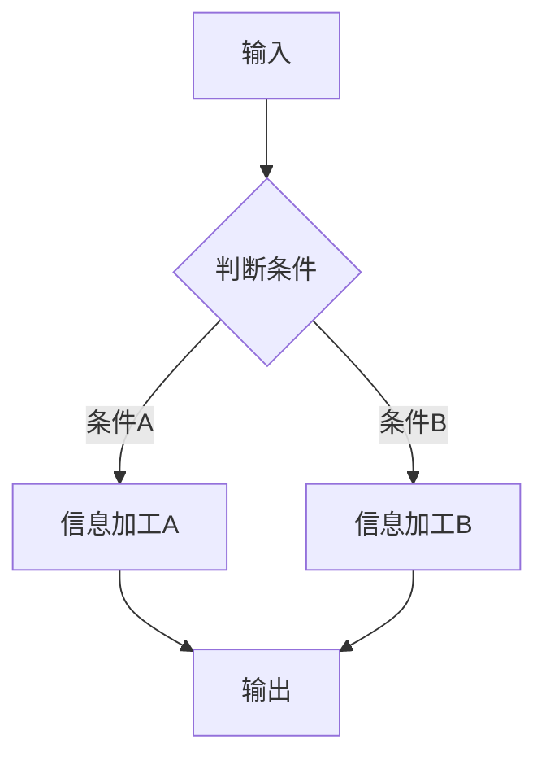
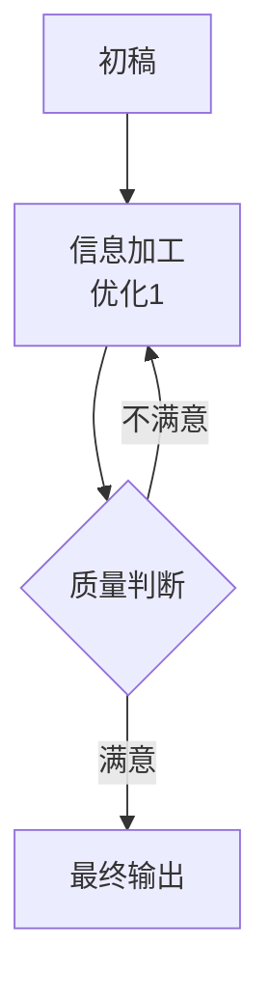

# 信息加工模块

## 模块概述

**功能**：通过编写 prompt 对输入信息进行加工、组合

**位置**：辅助模块

**类型**：系统模块

**应用场景**：内容转换、信息汇总、格式化输出

---

## 模块结构



---

## 参数配置

### 激活条件

| 参数 | 类型 | 说明 |
|------|------|------|
| 联动激活 | 布尔型 | 上游所有条件均为 True 时激活 |
| 任一激活 | 布尔型 | 上游任一条件为 True 时激活 |

---

### 输入参数

| 参数 | 类型 | 说明 |
|------|------|------|
| 信息输入 | 字符串 | 连接上游输出的文本 |
| 知识库搜索结果 | 知识库类型 | 连接知识库搜索结果 |
| 聊天上下文 | - | 可设置 0-6 条聊天记录 |

---

### 加工配置

| 参数 | 说明 | 示例 |
|------|------|------|
| 模型选择 | 选择大语言模型 | Qwen-Plus |
| 提示词(Prompt) | 说明加工规则 | "将以下内容翻译成英文" |

---

## 输出节点

### 回复结束（黄色 - 布尔型）

回复是否完成

**用途**：判断加工状态

---

### 加工结果（蓝色 - 字符串）

加工后的内容

**用途**：传递给下游模块或输出给用户

---

### 模块运行结束（黄色 - 布尔型）

模块运行结束输出 True

**用途**：触发下游流程

---

## 使用场景

### 场景 1：内容翻译

**需求**：将用户输入翻译成其他语言

**流程**：


**提示词**：
```markdown
将以下内容翻译成英文：

{{输入内容}}

要求：
1. 保持原意
2. 使用自然流畅的表达
3. 专业术语保持准确
```

---

### 场景 2：信息汇总

**需求**：汇总多个知识库搜索结果

**流程**：


**提示词**：
```markdown
将以下知识库搜索结果进行汇总：

{{知识库结果1}}

{{知识库结果2}}

{{知识库结果3}}

要求：
1. 提取关键信息
2. 去除重复内容
3. 按重要性排序
4. 保持逻辑清晰
```

---

### 场景 3：格式化输出

**需求**：将提取的信息格式化为报告

**流程**：


**提示词**：
```markdown
根据提取的信息生成格式化报告：

提取结果：
{{提取结果}}

格式要求：
## 查询报告

**查询日期**：{{query_date}}
**查询类型**：{{query_type}}
**部门**：{{department}}

### 数据概览
- 总记录数：xxx
- 数据范围：xxx

### 详细信息
（根据提取结果补充）
```

---

### 场景 4：内容改写

**需求**：改写内容风格或语气

**流程**：


**提示词**：
```markdown
将以下内容改写为正式、专业的商务风格：

{{输入内容}}

要求：
1. 使用正式用语
2. 避免口语化表达
3. 增加专业术语
4. 保持内容完整性
```

---

### 场景 5：数据转换

**需求**：将文本转换为表格或列表

**流程**：


**提示词**：
```markdown
将以下信息整理成表格：

{{输入内容}}

输出格式：
| 项目 | 说明 | 备注 |
|------|------|------|
| ... | ... | ... |
```

---

## 提示词设计

### 加工提示词模板

```markdown
# 任务
[描述加工任务]

## 输入内容
{{输入内容}}

## 加工要求
1. [要求1]
2. [要求2]
3. [要求3]

## 输出格式
[说明输出格式]
```

---

### 高级技巧

#### 1. 多步加工

**场景**：需要多个加工步骤



**优势**：
- 每步专注一个任务
- 提高加工质量
- 便于调试和优化

---

#### 2. 条件加工

**场景**：根据条件执行不同的加工



---

#### 3. 迭代优化

**场景**：多次优化输出质量



---

## 最佳实践

### 1. 明确加工目标

✅ **推荐**：
- 清晰说明加工目标
- 提供详细的加工规则
- 给出输出格式示例

❌ **避免**：
- 加工目标不明确
- 规则模糊
- 缺少格式说明

---

### 2. 输入内容引用

**方法**：
```markdown
输入内容：{{输入内容}}

或分段引用：
开头部分：{{输入内容开头}}
中间部分：{{输入内容中间}}
结尾部分：{{输入内容结尾}}
```

---

### 3. 输出格式控制

**示例**：
```markdown
输出格式：

## 标题

**重点内容**

- 列表项1
- 列表项2

| 列1 | 列2 |
|-----|-----|
| 值1 | 值2 |
```

---

### 4. 错误处理

**方案**：
```markdown
如果输入内容为空或无法加工，请输出：
"无法处理输入内容，请检查输入格式。"
```

---

## 与智能对话的区别

| 特性 | 信息加工 | 智能对话 |
|------|----------|----------|
| 主要用途 | 内容加工、转换 | 对话交互 |
| 输入类型 | 文本、知识库结果 | 文本、图片、知识库结果 |
| 上下文 | 无（默认） | 支持（可设置） |
| 输出控制 | 加工结果 | 回复内容 |
| 用户交互 | 不直接交互 | 直接与用户对话 |

**选择建议**：
- **信息加工**：内容转换、格式化、汇总
- **智能对话**：对话生成、问答、多轮交互

---

## 常见问题

### Q1: 加工结果不符合预期？

**排查步骤**：
1. 检查提示词是否清晰
2. 提供更详细的加工规则
3. 增加输出格式示例
4. 调整模型参数

---

### Q2: 如何处理长文本？

**解决方案**：
1. 分段加工
2. 使用循环模块批量处理
3. 先提取关键信息，再加工
4. 调整模型的"回复字数上限"

---

### Q3: 加工速度慢？

**优化方案**：
1. 简化提示词
2. 减少加工步骤
3. 使用更快的模型
4. 缓存常见加工结果

---

### Q4: 如何保证输出格式？

**方案1：详细说明格式**
```markdown
输出必须严格按照以下格式：

【标题】
内容...

- 项目1：值1
- 项目2：值2
```

**方案2：使用代码块**
```markdown
输出格式：

```json
{
  "field1": "value1",
  "field2": "value2"
}
```
```

---

## 相关模块

- [智能对话](./smart-dialogue) - 对话交互
- [信息提取](./info-extraction) - 提取结构化信息
- [确定回复](./fixed-reply) - 输出固定内容
- [循环](./loop) - 批量加工

---

**最后更新**：2026-03-04
