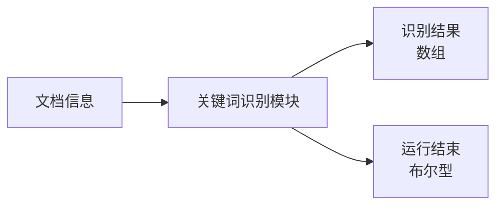
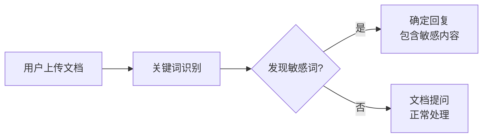
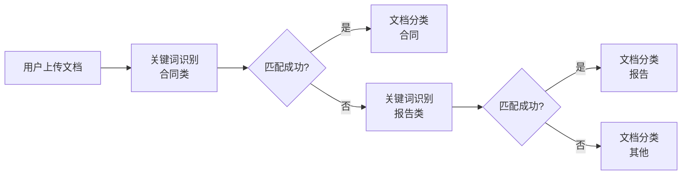
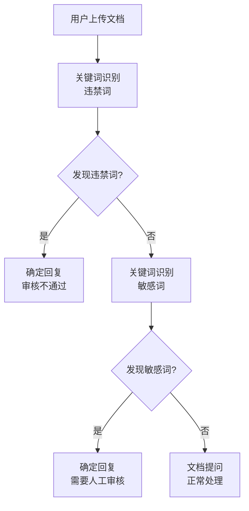

# 关键词识别模块

## 模块概述

**功能**：识别文档中是否包含相关关键词

**位置**：辅助模块

**类型**：系统模块

**应用场景**：敏感词检测、内容审核、文档分类

---

## 模块结构



---

## 参数配置

### 激活条件

| 参数 | 类型 | 说明 |
|------|------|------|
| 联动激活 | 布尔型 | 上游所有条件均为 True 时激活 |
| 任一激活 | 布尔型 | 上游任一条件为 True 时激活 |

---

### 输入参数

| 参数 | 类型 | 说明 |
|------|------|------|
| 文档信息 | 字符串 | 连接"用户提问"模块中"文档信息"节点输出 |

---

### 识别规则

| 参数 | 说明 | 示例 |
|------|------|------|
| 敏感词组 | 英文逗号分隔的关键词列表 | "敏感词1,敏感词2,敏感词3" |
| 识别结果描述 | 对识别结果的说明 | "检测到敏感内容" |

---

## 输出节点

### 识别结果（数组）

检测到的关键词列表

**格式**：
```json
[
  {
    "keyword": "敏感词1",
    "position": 15,
    "context": "包含敏感词的上下文"
  }
]
```

---

### 模块运行结束（黄色 - 布尔型）

模块运行结束输出 True

**用途**：触发下游流程

---

## 使用场景

### 场景 1：敏感词检测

**需求**：检测上传文档是否包含敏感词

**流程**：


**配置**：
- 敏感词组："机密,内部资料,禁止外传"
- 识别结果描述："检测到敏感内容，请谨慎处理"

---

### 场景 2：文档分类

**需求**：根据关键词判断文档类型

**流程**：


**配置**：
- 合同类："合同,协议,条款,甲方,乙方"
- 报告类："报告,总结,分析,数据"

---

### 场景 3：内容审核

**需求**：审核用户上传的文档内容

**流程**：


---

## 最佳实践

### 1. 关键词设计

**建议**：
- 关键词要明确具体
- 使用英文逗号分隔
- 避免过于宽泛的词汇
- 定期更新关键词库

**示例**：
```
✅ 推荐："机密,内部资料,商业机密,禁止外传"
❌ 避免："的,了,是"（过于宽泛）
```

### 2. 多层级检测

**方案**：
- 第一层：违禁词（严格禁止）
- 第二层：敏感词（需要审核）
- 第三层：风险提示词（需要关注）

### 3. 误报处理

**建议**：
- 设置白名单
- 使用上下文分析
- 结合语义理解

---

## 常见问题

### Q1: 识别不准确？

**优化方案**：
1. 使用更精确的关键词
2. 添加上下文判断
3. 使用正则表达式模式

### Q2: 如何处理大量关键词？

**方案**：
- 分批检测
- 使用代码块模块处理
- 建立关键词库

---

## 相关模块

- [用户提问](./user-question) - 上传文档
- [文档提问](./doc-question) - 处理文档
- [文档审查](./doc-review) - 批量审核
- [信息分类](./info-classification) - 文本分类

---

**最后更新**：2026-03-04
