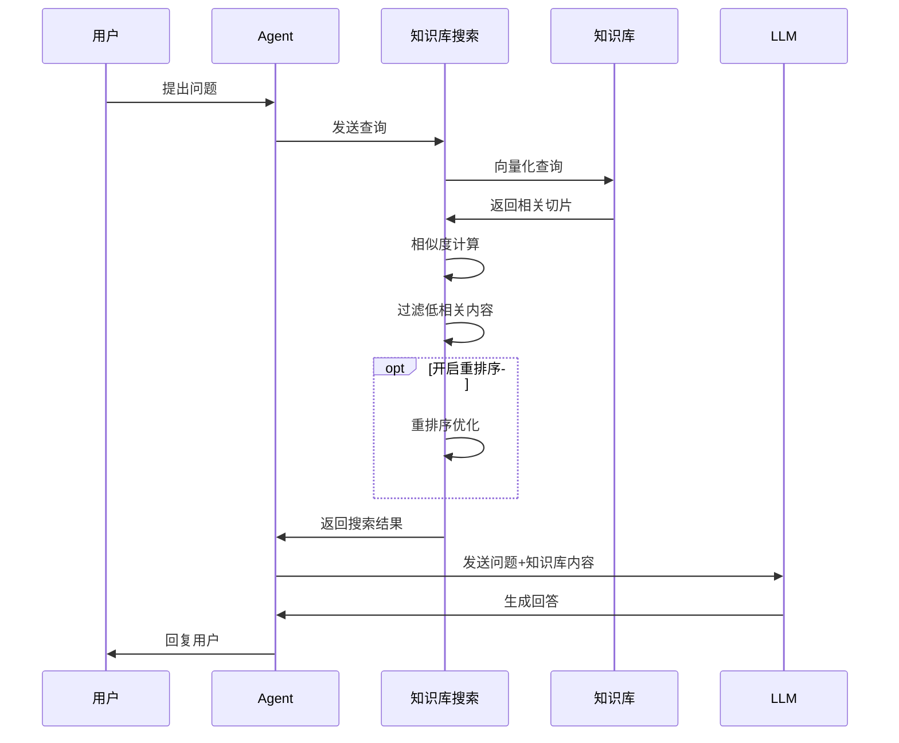
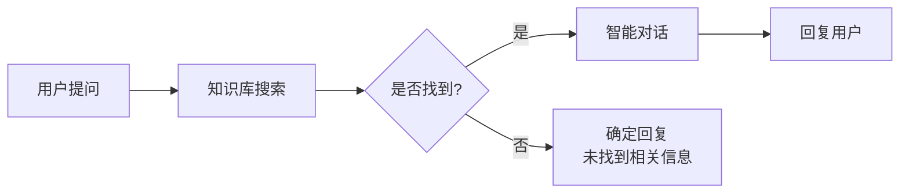
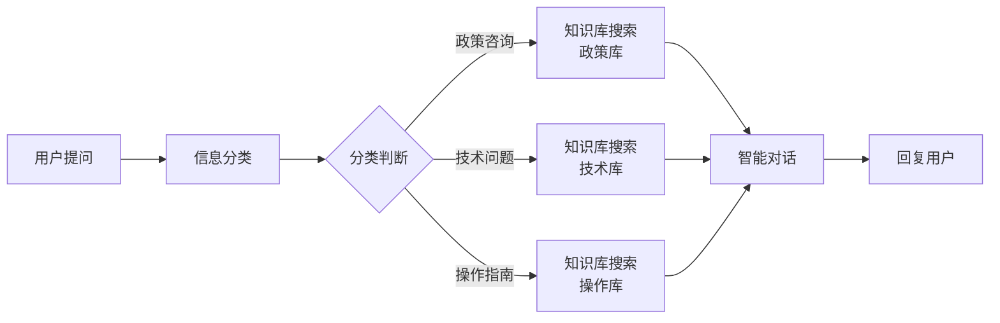
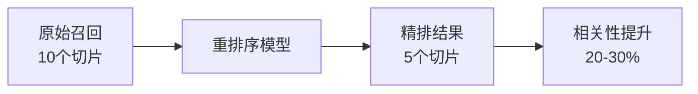
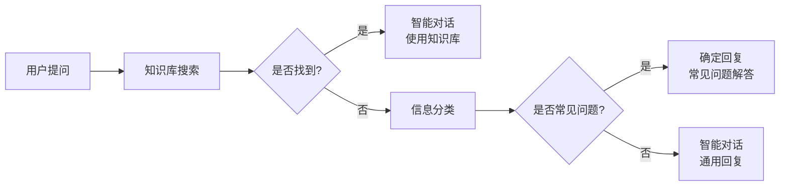
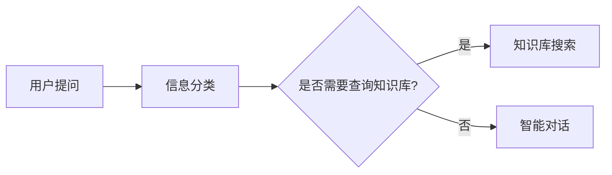

# 知识库搜索模块

## 模块概述

**功能**：在知识库中搜索相关问题与解答，以自然语言输出

**位置**：核心模块

**类型**：系统模块

**应用场景**：RAG（检索增强生成）、知识问答、文档查询

---

## 模块结构


---

## 参数配置

### 激活条件

| 参数 | 类型 | 说明 |
|------|------|------|
| 联动激活 | 布尔型 | 上游所有条件均为 True 时激活 |
| 任一激活 | 布尔型 | 上游任一条件为 True 时激活 |

---

### 基础参数

| 参数 | 类型 | 说明 | 推荐值 |
|------|------|------|--------|
| 信息输入 | 字符串 | 连接上游输出的文本 | - |
| 关联的知识库 | - | 选择搜索的知识库 | 根据场景选择 |
| 相似度阈值 | - | 0-1，低于此阈值的切片将被过滤 | 0.6 |
| 向量相似度权重 | - | 0-1，默认 1（只使用向量检索） | 0.7-1.0 |
| 召回数 | - | 0-100，召回的相关切片数量 | 5-10 |

---

### 高级参数

| 参数 | 类型 | 说明 | 推荐值 |
|------|------|------|--------|
| 扩展上下文 | - | 开启后召回命中分段上下各 1 个分段 | 按需开启 |
| 权限访问控制 | - | 开启后仅检索当前用户有权限的知识库 | 按需开启 |
| 是否开启重排序 | - | 重排序提高精确度但降低速度 | 谨慎使用 |
| 重排序模型 | - | 可选择 bce-rerank 模型 | bce-rerank |
| 重排序召回数 | - | 0-20，重排序后召回数量 | 3-5 |

---

## 输出节点

### 未搜索到相关知识（黄色 - 布尔型）

知识库中没有找到相关内容

**用途**：触发兜底回复或提示用户

---

### 搜索到相关知识（黄色 - 布尔型）

知识库中找到相关内容

**用途**：触发知识库问答流程

---

### 模块运行结束（黄色 - 布尔型）

模块运行结束输出 True

**用途**：触发下游流程

---

### 知识库搜索结果（紫色 - 知识库类型）

数组格式，包含搜索到的内容片段

**用途**：连接到智能对话模块进行回答

---

## RAG 工作流程



---

## 使用场景

### 场景 1：基础知识库问答

**流程**：


**系统提示词**：
```markdown
你是一个知识库助手。
根据提供的知识库内容回答用户问题。

要求：
1. 优先使用知识库内容回答
2. 标注信息来源
3. 如果知识库中没有相关信息，请诚实说明
4. 回答要准确、专业
```

---

### 场景 2：多知识库联合检索

**配置**：
- 关联的知识库：选择多个知识库

**流程**：


**适用场景**：
- 多部门知识库
- 不同类型文档（政策、技术、操作手册）
- 跨领域查询

---

### 场景 3：结合信息分类

**流程**：


**优势**：
- 提高检索精度
- 减少无关内容
- 提升响应速度

---

### 场景 4：重排序优化

**配置**：
- 是否开启重排序：✅ 开启
- 重排序模型：bce-rerank
- 重排序召回数：5

**适用场景**：
- 知识库较大（>1000 文档）
- 对精度要求高
- 可以接受稍慢的响应速度

**对比**：


---

## 参数调优指南

### 相似度阈值

| 阈值 | 召回数量 | 精度 | 适用场景 |
|------|----------|------|----------|
| 0.3-0.5 | 多 | 低 | 探索性查询、广泛召回 |
| 0.5-0.7 | 适中 | 中 | 通用场景（推荐） |
| 0.7-0.9 | 少 | 高 | 精确查询、专业问答 |

---

### 召回数

| 数量 | 上下文长度 | 效果 | 适用场景 |
|------|------------|------|----------|
| 3-5 | 短 | 快速 | 简单问答 |
| 5-10 | 中 | 平衡 | 通用场景（推荐） |
| 10-20 | 长 | 详细 | 复杂问题、需要更多上下文 |

**注意**：召回数越多，token 消耗越大，响应越慢

---

### 向量相似度权重

| 权重 | 检索方式 | 说明 |
|------|----------|------|
| 1.0 | 纯向量检索 | 语义相似，推荐 |
| 0.7 | 混合检索 | 向量 + 关键词 |
| 0.5 | 平衡 | 向量和关键词各占一半 |
| 0.3 | 关键词为主 | 更依赖关键词匹配 |

---

### 重排序使用建议

**✅ 推荐使用**：
- 知识库较大（>1000 文档）
- 对精度要求高
- 用户查询较为复杂

**❌ 不推荐使用**：
- 知识库较小（<500 文档）
- 对响应速度要求高
- 简单的问答场景

**性能对比**：
| 配置 | 响应时间 | 精度 |
|------|----------|------|
| 无重排序 | 1-2秒 | 基线 |
| 开启重排序 | 2-4秒 | +20-30% |

---

## 最佳实践

### 1. 知识库准备

✅ **推荐**：
- 文档质量高：内容准确、结构清晰
- 切片合理：每块 200-500 tokens
- 定期更新：保持知识库时效性
- 分类清晰：不同类型文档分不同知识库

❌ **避免**：
- 文档质量差、内容混乱
- 切片过大或过小
- 长期不更新
- 所有文档混在一起

---

### 2. 检索策略

**简单场景**：
```yaml
相似度阈值: 0.6
召回数: 5
重排序: 关闭
```

**标准场景**：
```yaml
相似度阈值: 0.5
召回数: 8
重排序: 开启
重排序召回数: 5
```

**高精度场景**：
```yaml
相似度阈值: 0.7
召回数: 10
重排序: 开启
重排序召回数: 3
```

---

### 3. 提示词配合

**系统提示词模板**：
```markdown
你是一个专业的知识库助手。

# 工作方式
1. 优先使用知识库内容回答
2. 清晰标注信息来源
3. 如果知识库中没有相关信息，请诚实说明
4. 不要编造或推测答案

# 回复格式
- 先给出直接答案
- 然后提供详细信息
- 最后标注来源

# 引用格式
【来源：文档名称】
```

---

### 4. 兜底机制

**配置**：


---

## 常见问题

### Q1: 召回结果不相关？

**排查步骤**：
1. 检查知识库内容是否包含相关信息
2. 调低"相似度阈值"（如从 0.7 降到 0.5）
3. 增加"召回数"
4. 检查文档切片质量
5. 优化用户问题的表述

---

### Q2: 响应速度慢？

**优化方案**：
1. 减少"召回数"（如从 10 降到 5）
2. 关闭"重排序"
3. 提高相似度阈值（减少召回内容）
4. 优化知识库索引

---

### Q3: 知识库内容找不到？

**排查**：
1. 确认文档已成功解析（状态为"成功"）
2. 使用"检索测试"功能验证
3. 检查文档是否在正确的知识库中
4. 尝试更精确的查询关键词

---

### Q4: 如何处理多轮对话中的知识库查询？

**方案 1：每次查询**
- 每次用户提问都进行知识库搜索
- 适用于：用户问题每次都不同

**方案 2：判断后查询**

- 适用于：部分问题不需要知识库

---

### Q5: 知识库内容过时怎么办？

**解决方案**：
1. 定期更新知识库文档
2. 删除过时文档
3. 添加新文档
4. 在提示词中提醒用户注意时效性

---

## 相关模块

- [用户提问](./user-question) - 获取用户输入
- [智能对话](./smart-dialogue) - 使用知识库内容生成回答
- [信息分类](./info-classification) - 判断是否需要知识库查询
- [知识库管理](../advanced/knowledge-base) - 创建和管理知识库

---

**最后更新**：2026-03-04
