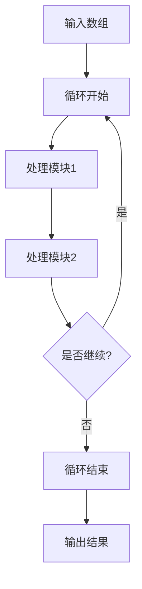
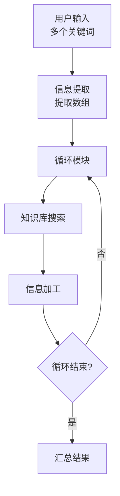
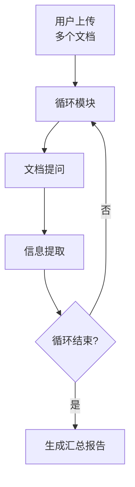
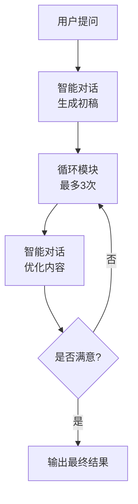
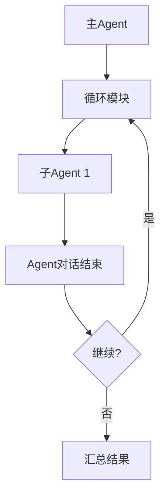
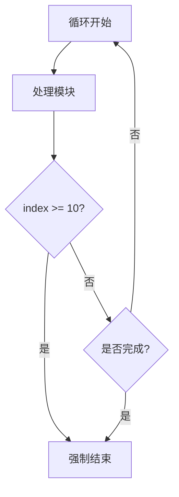
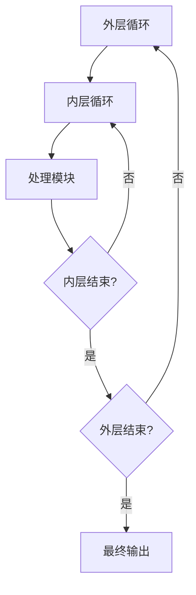
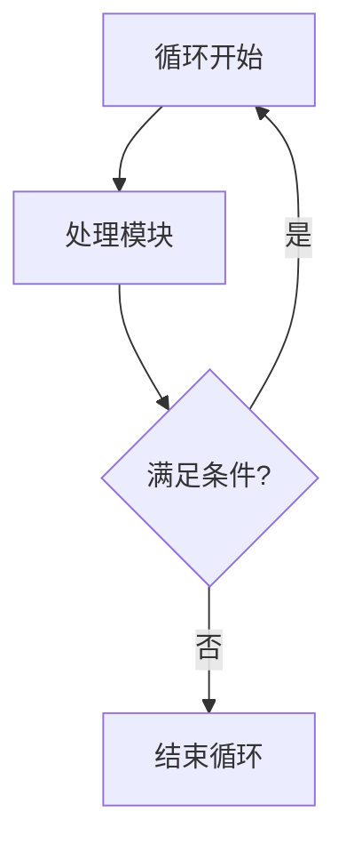

# 循环模块

## 模块概述

**功能**：用于循环流程，圈选循环起点和终点

**位置**：控制模块

**类型**：系统模块

**应用场景**：批量处理、迭代优化、多轮对话

---

## 模块结构



---

## 参数配置

### 激活条件

| 参数 | 类型 | 说明 |
|------|------|------|
| 联动激活 | 布尔型 | 上游所有条件均为 True 时激活 |
| 任一激活 | 布尔型 | 上游任一条件为 True 时激活 |

---

### 输入参数

| 参数 | 类型 | 说明 | 示例 |
|------|------|------|------|
| 信息输入 | 任意类型数组 | 循环输入需为数组类型 | `["item1", "item2", "item3"]` |
| 元素序号 | - | 记录执行循环第 n 次 | `loop.index` |
| 元素值 | - | 数组中某一个元素 | `loop.item` |
| 数组长度 | - | 执行数组长度 | `loop.length` |

---

### 循环控制

| 参数 | 类型 | 说明 |
|------|------|------|
| 循环单元终点 | 布尔型 | 将最后一个模块的"运行结束"连接此节点 |
| 循环单元起点 | 布尔型 | 用于触发循环开始 |

---

## 输出节点

### 循环单元起点（黄色 - 布尔型）

触发循环开始

**用途**：连接循环内的第一个模块

---

### 模块运行结束（黄色 - 布尔型）

循环结束后输出 True

**用途**：触发下游流程

---

## 内置变量

循环模块提供以下内置变量：

| 变量 | 类型 | 说明 | 示例 |
|------|------|------|------|
| `loop.index` | 数字 | 当前循环序号（从1开始） | 1, 2, 3... |
| `loop.item` | 任意类型 | 当前元素值 | 数组中的元素 |
| `loop.length` | 数字 | 数组总长度 | 10 |

**使用方式**：在循环内的模块中引用这些变量

---

## 使用场景

### 场景 1：批量查询

**需求**：用户输入多个查询条件，批量查询结果

**流程**：


**配置**：
1. 信息提取：提取关键词数组
   ```json
   {
     "keywords": ["关键词1", "关键词2", "关键词3"]
   }
   ```

2. 循环模块：
   - 输入：`提取结果.keywords`
   - 处理：对每个关键词进行知识库搜索

3. 信息加工：汇总所有搜索结果

---

### 场景 2：多文档处理

**需求**：用户上传多个文档，逐个处理

**流程**：


**配置**：
1. 用户提问：开启文档上传
2. 循环模块：
   - 输入：文档信息数组
   - 处理：逐个提取文档关键信息

3. 智能对话：生成汇总报告

---

### 场景 3：迭代优化

**需求**：多次优化输出，直到满足要求

**流程**：


**配置**：
1. 智能对话：生成初稿
2. 循环模块：
   - 输入：固定数组 `[1, 2, 3]`
   - 处理：优化内容
   - 判断：用户是否满意

---

### 场景 4：多 Agent 轮询

**需求**：依次调用多个子 Agent

**流程**：


**配置**：
1. 循环模块：
   - 输入：Agent ID 数组
   - 处理：依次调用子 Agent

2. 汇总结果：整合所有子 Agent 的输出

---

## 最佳实践

### 1. 数组准备

✅ **推荐**：
- 确保输入为数组类型
- 数组元素数量合理（<100）
- 提前验证数组格式

❌ **避免**：
- 输入非数组类型
- 数组过长（性能问题）
- 数组元素格式不一致

---

### 2. 循环控制

**限制循环次数**：


**配置**：
- 使用 `loop.index` 判断循环次数
- 设置最大循环次数，避免无限循环

---

### 3. 结果收集

**方法1：使用代码块**
```javascript
// JavaScript 代码块
const results = [];
results.push(currentResult);
return { results };
```

**方法2：使用信息加工**
- 提示词："将当前结果添加到历史结果中"
- 输出：累积的结果字符串

---

### Q3: 循环结果如何汇总？

**方案1：代码块汇总**
```javascript
// 定义全局变量存储结果
if (!global.results) {
  global.results = [];
}

// 添加当前结果
global.results.push({
  index: currentIndex,
  item: currentItem,
  result: currentResult
});

// 最后一次循环输出
if (currentIndex === totalLength) {
  return { results: global.results };
}
```

**方案2：信息加工汇总**
```markdown
将以下内容合并：
历史结果：{{历史结果}}
当前结果：{{当前结果}}

输出格式：
{{历史结果}}
{{当前结果}}
```

---

### Q4: 循环性能差？

**优化方案**：
1. **减少循环次数**：合并相似处理
2. **简化循环逻辑**：减少循环内的模块数量
3. **并行处理**：如果逻辑独立，考虑拆分
4. **批量处理**：使用批量API代替循环
5. **缓存结果**：避免重复计算

---

## 高级技巧

### 1. 嵌套循环

**场景**：二维数组处理



**注意**：嵌套循环会显著增加处理时间，谨慎使用

---

### 2. 条件循环

**场景**：只在特定条件下继续循环



**配置**：
- 使用布尔型节点控制循环继续/结束

---

### 3. 延迟循环

**场景**：需要间隔执行

**方案**：
- 在循环内添加代码块
- 使用 `setTimeout` 或延迟函数
- 注意：可能导致响应超时

---

## 相关模块

- [信息提取](./info-extraction) - 提取数组
- [代码块](./code-block) - 复杂数据处理
- [信息加工](./info-processing) - 汇总结果
- [Agent对话结束](./agent-end) - 多Agent协作

---

**最后更新**：2026-03-04
