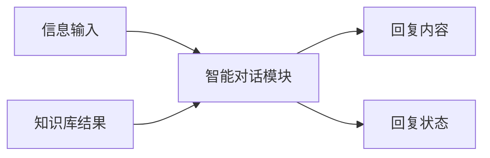
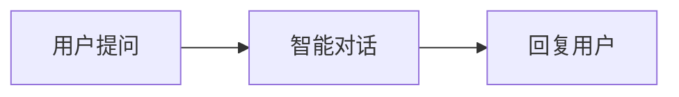
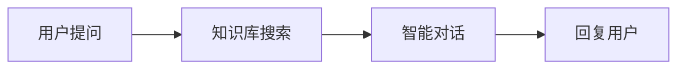
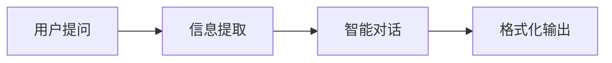
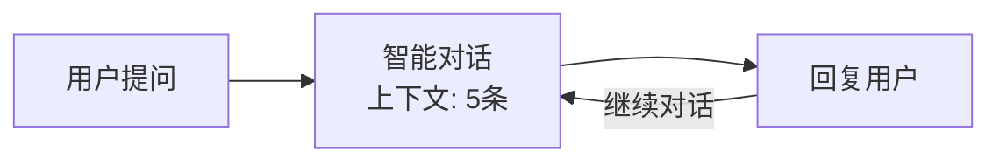
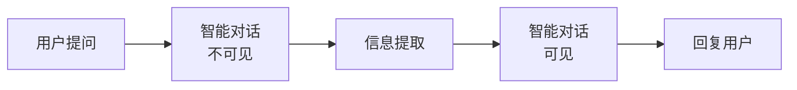

# 智能对话模块

## 模块概述

**功能**：借助 AI 能力，将用户发送内容通过大语言模型处理并回复

**位置**：核心模块

**类型**：系统模块

---

## 模块结构



---

## 参数配置

### 激活条件

| 参数 | 类型 | 说明 |
|------|------|------|
| 联动激活 | 布尔型 | 上游所有条件均为 True 时激活 |
| 任一激活 | 布尔型 | 上游任一条件为 True 时激活 |

---

### 输入参数

| 参数 | 类型 | 说明 |
|------|------|------|
| 信息输入 | 字符串 | 连接上游输出的文本 |
| 图片输入 | 字符串 | 连接上游输出的图片 |
| 知识库搜索结果 | 知识库类型 | 连接知识库搜索组件结果 |
| 聊天上下文 | - | 可设置 0-6 条聊天记录作为输入 |

---

### 模型配置

| 参数 | 说明 | 推荐值 |
|------|------|--------|
| 选择模型 | 大语言模型 | Qwen-Plus / GPT-4 |
| 系统提示词 | 设定模型角色和行为模式 | 详细描述 Agent 功能 |
| 用户提示词 | 说明需要处理的任务 | 具体任务描述 |

---

### 回复控制

| 参数 | 说明 | 推荐值 |
|------|------|--------|
| 回复对用户可见 | 控制是否输出给用户 | 开启（用于最终回复） |
| 回复创意性 | 0-1，越小越严谨 | 0.7（平衡） |
| 核采样 TOP_P | 0-1，控制输出多样性 | 0.9 |
| 回复字数上限 | 控制回复字数 | 100-8192，推荐 2000 |

---

## 输出节点

### 回复结束（黄色 - 布尔型）

回复是否完成

**用途**：判断回复状态，触发下游流程

---

### 回复内容（蓝色 - 字符串）

模型生成的回复内容

**用途**：输出给用户或传递给下游模块

---

### 模块运行结束（黄色 - 布尔型）

模块运行结束输出 True

**用途**：触发下游流程

---

## 提示词设计

### 系统提示词模板

```markdown
# 角色
你是一个[角色描述]，专门负责[具体职责]。

# 能力
- [能力1]
- [能力2]
- [能力3]

# 工作流程
1. [步骤1]
2. [步骤2]
3. [步骤3]

# 约束条件
- [约束1]
- [约束2]
- [约束3]

# 回复风格
- 语气：[友好/专业/简洁]
- 格式：[段落/列表/表格]
- 长度：[简洁/详细]
```

---

### 用户提示词模板

```markdown
请根据以下内容[具体任务]：

{{输入内容}}

要求：
1. [要求1]
2. [要求2]
3. [要求3]
```

---

## 使用场景

### 场景 1：基础问答

**流程**：


**系统提示词**：
```
你是一个智能助手，能够回答用户的问题。
回答要准确、简洁、友好。
如果不确定答案，请诚实说明。
```

---

### 场景 2：知识库问答（RAG）

**流程**：


**系统提示词**：
```
你是一个知识库助手。
根据提供的知识库内容回答用户问题。

要求：
1. 优先使用知识库内容
2. 标注信息来源
3. 如果知识库中没有相关信息，请说明
4. 保持回答准确和专业
```

---

### 场景 3：信息加工

**流程**：


**用户提示词**：
```
根据提取的信息生成报告：

{{提取结果}}

要求：
1. 结构清晰
2. 语言流畅
3. 包含关键数据
```

---

### 场景 4：多轮对话

**配置**：
- 聊天上下文：3-5 条

**流程**：


**系统提示词**：
```
你是一个智能客服助手。
记住之前的对话内容，保持对话连贯性。

要求：
1. 理解上下文
2. 回答与之前对话相关的问题
3. 必要时回顾之前的内容
```

---

## 参数调优指南

### 回复创意性（Temperature）

| 值 | 效果 | 适用场景 |
|----|------|----------|
| 0.0-0.3 | 非常严谨 | 数据查询、事实回答 |
| 0.4-0.7 | 平衡 | 通用问答、客服 |
| 0.8-1.0 | 高创意 | 创意写作、头脑风暴 |

---

### 聊天上下文数量

| 数量 | 效果 | 适用场景 |
|------|------|----------|
| 0 | 无记忆 | 单次查询 |
| 2-3 | 短期记忆 | 简单对话 |
| 4-6 | 长期记忆 | 复杂多轮对话 |

**注意**：上下文越多，消耗 token 越多，响应越慢

---

### 回复字数上限

| 字数 | 适用场景 |
|------|----------|
| 100-500 | 简短回复、摘要 |
| 500-1000 | 中等长度回答 |
| 1000-2000 | 详细解答、报告 |
| 2000+ | 长文本生成 |

---

## 最佳实践

### 1. 提示词设计原则

✅ **推荐**：
- 角色清晰：明确定义 Agent 角色
- 任务具体：详细说明要做什么
- 约束明确：设定边界条件
- 示例丰富：提供示例对话

❌ **避免**：
- 提示词过于简单
- 角色定义模糊
- 任务描述不清
- 缺少约束条件

---

### 2. 参数组合建议

**高准确场景**（数据查询、事实问答）：
```yaml
回复创意性: 0.3
核采样 TOP_P: 0.9
回复字数上限: 1000
聊天上下文: 2-3
```

**平衡场景**（通用客服、咨询）：
```yaml
回复创意性: 0.7
核采样 TOP_P: 0.9
回复字数上限: 1500
聊天上下文: 3-5
```

**高创意场景**（创意写作、头脑风暴）：
```yaml
回复创意性: 0.9
核采样 TOP_P: 0.95
回复字数上限: 2000
聊天上下文: 2-3
```

---

### 3. 中间流程处理

**当用于中间流程时**：
- 关闭"回复对用户可见"
- 将输出传递给下游模块
- 避免不必要的用户交互

**示例**：


---

## 常见问题

### Q1: 回复不准确？

**排查步骤**：
1. 检查系统提示词是否清晰
2. 优化用户提示词
3. 调低"回复创意性"参数
4. 添加示例对话
5. 检查知识库内容是否相关

---

### Q2: 回复太长/太短？

**解决方案**：
- 调整"回复字数上限"
- 在提示词中明确要求长度
- 使用信息加工模块进行摘要

---

### Q3: 多轮对话不连贯？

**排查**：
1. 检查"聊天上下文"数量是否足够
2. 检查系统提示词是否包含上下文处理要求
3. 考虑使用循环模块实现更复杂的对话逻辑

---

### Q4: 如何使用图片输入？

**配置**：
1. 上游连接图片信息节点
2. 选择支持视觉的模型（如 GLM-4v）
3. 在提示词中说明图片处理任务

**示例**：
```markdown
请分析这张图片，回答以下问题：
1. 图片的主要内容是什么？
2. 图中有哪些关键信息？
```

---

## 相关模块

- [用户提问](./user-question) - 获取用户输入
- [知识库搜索](./knowledge-search) - 提供知识库内容
- [信息加工](./info-processing) - 加工回复内容
- [确定回复](./fixed-reply) - 固定回复内容

---

**最后更新**：2026-03-04
