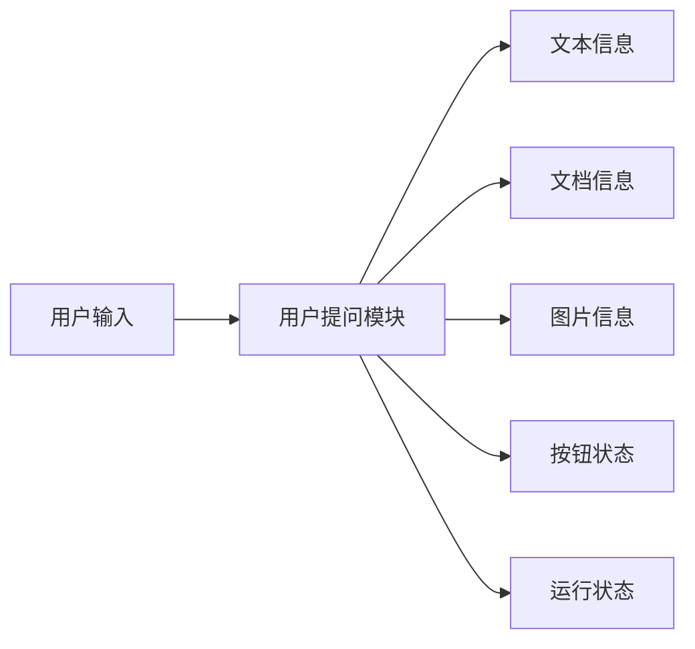
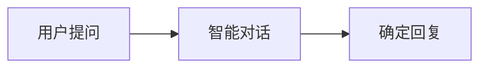
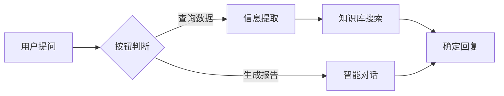

# 用户提问模块

## 模块概述

**功能**：获取用户提问/选择内容，并传输给其他模块

**位置**：所有 Agent 的入口模块

**类型**：系统模块

---

## 模块结构



---

## 参数配置

### 基础参数

| 参数 | 类型 | 说明 | 默认值 |
|------|------|------|--------|
| 联动激活 | 布尔型 | 上游所有条件均为 True 时激活 | - |
| 任一激活 | 布尔型 | 上游任一条件为 True 时激活 | - |
| 输入文本 | 字符串 | 允许用户通过输入框输入文本 | ✅ 开启 |
| 上传文档 | 字符串 | 允许用户上传文档 | ❌ 关闭 |
| 上传图片 | 字符串 | 允许用户上传图片 | ❌ 关闭 |
| 文档审查 | 字符串 | 开启文档审查功能 | ❌ 关闭 |
| 添加按钮 | - | 可作为明确执行节点或上游反馈 | - |

### 文档上传限制

- **数量**：最多 9 个
- **大小**：每个最大 50MB
- **格式**：pdf / doc / docx / txt

### 图片上传限制

- **数量**：最多 9 张
- **大小**：单个最大 30MB
- **格式**：png / jpg / jpeg

---

## 输出节点

### 文本信息（蓝色 - 字符串）

用户输入的文本内容

**用途**：连接到智能对话、信息分类、信息提取等模块

---

### 文档信息（蓝色 - 字符串）

用户上传的文档信息

**用途**：连接到文档提问、文档审查、关键词识别等模块

---

### 图片信息（蓝色 - 字符串）

用户上传的图片信息

**用途**：连接到图片提问模块

---

### 未点击按钮（黄色 - 布尔型）

用户未点击按钮时值为 true

**用途**：用于判断用户是否点击了预设按钮

---

### 按钮节点（黄色 - 布尔型）

点击按钮且对话框有输入则执行

**用途**：作为流程触发条件

---

### 模块运行结束（黄色 - 布尔型）

模块运行结束输出 True

**用途**：触发下游流程

---

## 使用场景

### 场景 1：纯文本对话

**配置**：
- 输入文本：✅ 开启
- 上传文档：❌ 关闭
- 上传图片：❌ 关闭

**流程**：


---

### 场景 2：文档问答

**配置**：
- 输入文本：✅ 开启
- 上传文档：✅ 开启
- 上传图片：❌ 关闭

**流程**：


---

### 场景 3：图片识别

**配置**：
- 输入文本：✅ 开启
- 上传文档：❌ 关闭
- 上传图片：✅ 开启

**流程**：


---

### 场景 4：带按钮引导

**配置**：
- 输入文本：✅ 开启
- 添加按钮：预设按钮（如"查询数据"、"生成报告"）

**流程**：


---

## 最佳实践

### 1. 输入提示设计

**推荐**：
- "请输入您的问题..."
- "请描述您的需求..."

**避免**：
- 过于复杂的提示语
- 多个问题的组合

---

### 2. 按钮设计

**建议**：
- 按钮数量：2-4 个
- 文案清晰：明确操作内容
- 功能互斥：每个按钮对应不同流程

**示例**：
```
📊 查询数据
📝 生成报告
❓ 常见问题
📞 人工客服
```

---

### 3. 多模态输入

**建议组合**：
- 纯文本：通用场景
- 文本 + 文档：文档问答、文档审查
- 文本 + 图片：图片识别、OCR 识别
- 文本 + 文档 + 图片：综合处理场景

---

## 常见问题

### Q1: 用户输入过长怎么办？

**解决方案**：
1. 在智能对话模块设置"回复字数上限"
2. 使用信息加工模块预处理
3. 提示用户简化问题

---

### Q2: 如何限制用户只能点击按钮？

**配置**：
1. 关闭"输入文本"
2. 添加按钮选项
3. 使用"未点击按钮"节点判断

---

### Q3: 文档上传失败？

**排查**：
1. 检查文件格式是否符合要求
2. 检查文件大小是否超限
3. 检查网络连接
4. 检查平台存储配额

---

## 相关模块

- [智能对话](./smart-dialogue) - 处理用户文本输入
- [文档提问](./doc-question) - 处理文档问答
- [图片提问](./image-question) - 处理图片识别
- [关键词识别](./keyword-recognition) - 识别文档关键词
- [文档审查](./doc-review) - 文档审核

---

**最后更新**：2026-03-04
