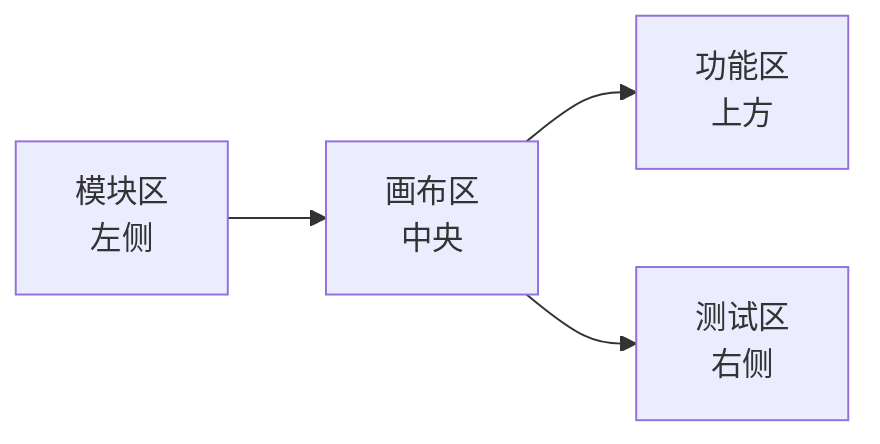
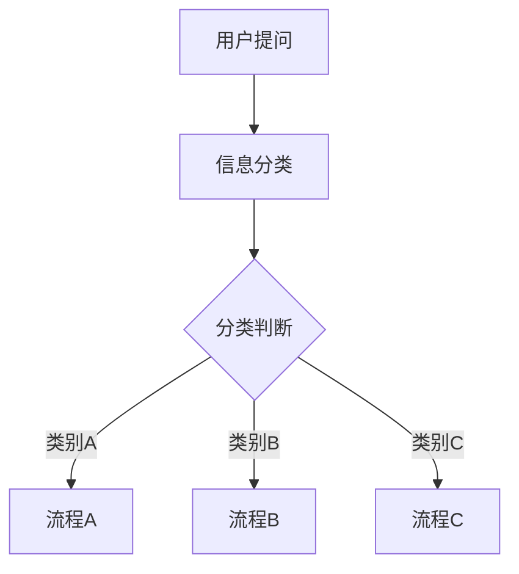
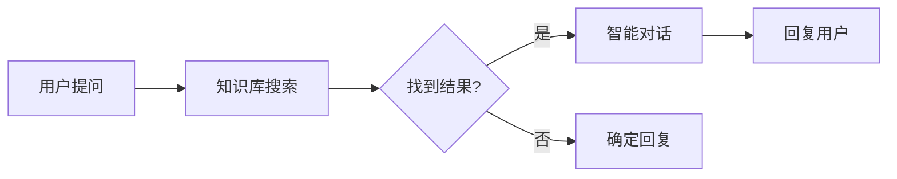
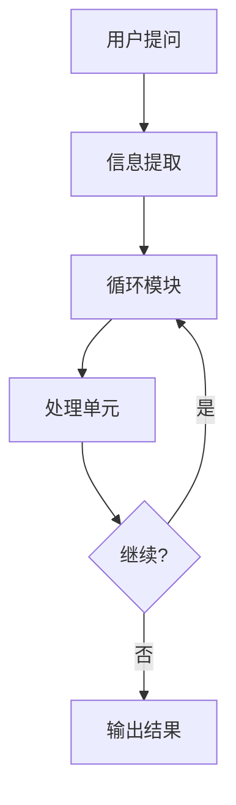
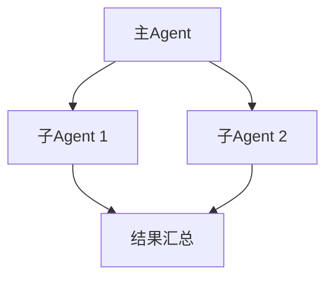

# 规划概述

## 界面布局

灵知平台的规划页面分为 **4 个主要区域**：

---

## 1. 模块区（左侧）

模块区提供可用的组件，分为 **4 大类**：

### 1.1 系统模块

**基础模块**：
- 用户提问
- 智能对话
- 信息分类
- 信息提取
- 知识库搜索
- 信息加工
- 确定回复
- 信息处理
- 循环
- 代码块
- 关键词识别
- 文档提问
- 文档审查
- 图片提问
- Agent对话结束

**使用方式**：
1. 点击模块分类展开
2. 拖拽模块到画布
3. 配置模块参数

---

### 1.2 智能体

**功能**：调用已上线的智能体，进行更复杂能力规划

**使用方式**：
1. 展开智能体列表
2. 拖拽智能体到画布
3. 连接数据节点

**注意**：只有包含 **Agent对话结束** 模块的智能体才会显示在列表中

---

### 1.3 工具

**分类**：
- **自定义工具**：亲自创建的独特工具
- **官方工具**：系统提供的预设工具集
- **新建工具**：创建自定义工具

**使用方式**：
1. 选择工具类型
2. 拖拽工具到画布
3. 配置工具参数

---

### 1.4 MCP

**功能**：通用协议打通 Agent 与外部工具、数据源的交互

**使用方式**：
1. 展开已创建的 MCP 服务
2. 拖拽 MCP 到画布
3. 选择 MCP 工具
4. 连接流程

---

## 2. 画布区（中央）

### 2.1 基本操作

**拖拽组件**：
- 从左侧模块区拖拽组件到画布

**连接节点**：
- 将一个模块的输出节点拖拽到另一个模块的输入节点
- 只能连接"输出"和"输入"，不能连接"输出和输出"或"输入和输入"

**删除连线**：
- 点击连线中间的 "x" 图标

**删除模块**：
- 点击模块右上角的删除图标

**移动模块**：
- 拖拽模块到新位置

---

### 2.2 节点类型与颜色

| 节点颜色 | 数据类型 | 说明 |
|----------|----------|------|
| 🟡 黄色 | 布尔型 | true/false，用于条件判断 |
| 🔵 蓝色 | 字符串 | 文本、图片、文档信息 |
| 🟣 紫色 | 知识库结果 | 知识库搜索的返回结果 |
| 🔴 红色 | 任意类型 | 仅在循环模块中，需为 JSON 数组或对象 |

---

### 2.3 连接原则

✅ **可以连接**：
- 同类型节点互相连接
- 黄色 → 黄色
- 蓝色 → 蓝色
- 紫色 → 紫色
- 红色 → 任意类型

❌ **不能连接**：
- 不同类型节点（除了红色节点）
- 输入节点 ↔ 输入节点
- 输出节点 ↔ 输出节点

---

## 3. 功能区（上方）

### 3.1 画布功能区

**导入/导出编排**：
- 导出当前画布配置（JSON）
- 导入已有的编排配置

**试运行**：
- 点击"试运行"按钮
- 在右侧对话框测试 Agent
- 查看中间输出结果

**清空画布**：
- 删除所有模块和连线
- 重新开始设计

---

### 3.2 智能体功能区

**分享**：
- Http应用：生成分享链接
- API服务：获取 API 接口
- MCP Server：发布为 MCP 服务
- 应用集成：嵌入网页代码

**删除**：
- 删除当前智能体

**保存**：
- 保存当前编排配置

**发布**：
- 发布智能体，使其可被调用

---

## 4. 测试区（右侧）

### 4.1 试运行对话框

**功能**：
- 输入测试问题
- 查看回复结果
- 测试对话流程

**使用方式**：
1. 点击画布上方的"试运行"
2. 在右侧对话框输入问题
3. 查看 Agent 的回复

---

### 4.2 中间输出

**功能**：
- 查看每个模块的中间输出
- 调试流程逻辑
- 优化参数配置

**使用方式**：
1. 执行试运行
2. 点击模块查看详细输出
3. 根据输出调整配置

---

## 编排流程设计

### 设计原则

**1. 从用户提问开始**

**2. 明确输入输出**
- 每个模块都有明确的输入和输出
- 确保数据类型匹配

**3. 逻辑清晰**
- 流程要符合业务逻辑
- 避免复杂的循环嵌套

**4. 异常处理**
- 添加错误判断节点
- 提供友好的错误提示

---

### 常见编排模式

#### 1. 线性流程

**最简单的流程**：

---

#### 2. 条件分支

**根据条件执行不同流程**：

---

#### 3. 知识库问答

**RAG 流程**：

---

#### 4. 循环处理

**批量处理流程**：

---

#### 5. 多 Agent 协作

**主从架构**：

---

## 编排技巧

### 1. 模块命名

**建议**：
- 给模块起有意义的名称
- 如"客服对话"、"订单查询"、"错误提示"
- 便于理解和维护

---

### 2. 模块分组

**建议**：
- 将相关模块放在一起
- 使用颜色或位置区分功能区域
- 添加注释说明

---

### 3. 流程文档

**建议**：
- 记录流程设计思路
- 说明关键决策点
- 保存多版本编排

---

### 4. 性能优化

**建议**：
- 减少不必要的模块
- 合并相似的流程
- 避免过度复杂的判断

---

## 常见问题

### Q1: 模块连接不上？

**排查**：
1. 检查节点类型是否匹配（颜色是否相同）
2. 确认是"输出"连接到"输入"
3. 检查是否已经有连线

---

### Q2: 试运行无响应？

**排查**：
1. 检查流程是否完整（从用户提问开始）
2. 检查模块配置是否正确
3. 检查是否有死循环
4. 刷新页面重试

---

### Q3: 如何复制已有的编排？

**方法**：
1. 导出编排配置（JSON）
2. 创建新的智能体
3. 导入编排配置

---

### Q4: 如何查看模块的详细输出？

**方法**：
1. 执行试运行
2. 点击画布中的模块
3. 查看右侧的详细输出信息

---

## 相关资源

- [快速开始](./quick-start) - 创建第一个 Agent
- [模块概览](./modules/) - 了解所有模块
- [基础配置](./basic-config) - 配置智能体基本信息

---

**最后更新**：2026-03-04
