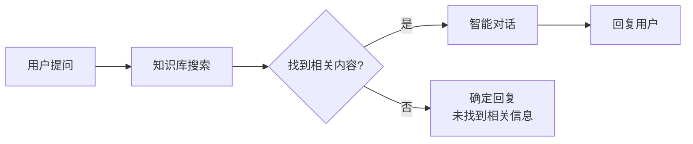
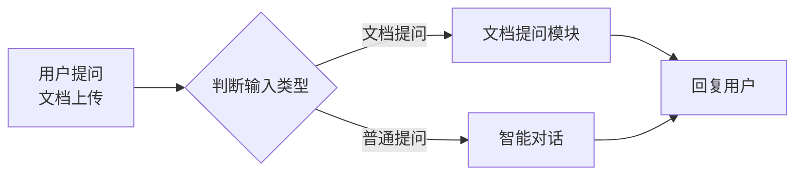

# 快速开始

## 前置准备

在开始之前，请确保：

- ✅ 已注册灵知平台账号
- ✅ 已登录平台
- ✅ 了解基本概念（Agent、模块、知识库）

---

## 创建第一个 Agent

### 步骤 1：创建智能体

1. 点击左侧菜单 **"智能体"**
2. 点击右上角 **"创建智能体"**
3. 填写基本信息：

| 配置项 | 内容 |
|--------|------|
| 智能体名称 | 智能客服助手 |
| 智能体描述 | 一个能够回答用户问题的智能客服 |
| 开场白 | 您好！我是智能客服助手，请问有什么可以帮助您的？ |

4. 点击 **"确定"** 完成创建

---

### 步骤 2：配置对话模型

在 **基础配置** 页面：

1. **对话模型**：选择 `Qwen-Plus`
2. **提示词**（系统提示词）：
   ```markdown
   你是一个友好的智能客服助手。
   
   你的职责：
   - 回答用户的问题
   - 提供准确、有用的信息
   - 保持友好、专业的态度
   
   注意事项：
   - 如果不确定答案，请诚实说明
   - 不要编造信息
   - 保持回答简洁明了
   ```

---

### 步骤 3：添加问题建议

在 **基础配置** 页面：

点击 **"添加问题建议"**，添加 3-6 个预设问题：

```
1. 你能做什么？
2. 如何联系人工客服？
3. 有哪些常见问题？
4. 如何使用智能服务？
```

---

### 步骤 4：编排流程（规划）

点击 **"规划"** 标签，进入编排界面：

#### 4.1 添加用户提问模块

1. 从左侧 **系统模块** 中拖拽 **"用户提问"** 到画布
2. 配置：
   - 输入文本：✅ 开启
   - 上传文档：❌ 关闭
   - 上传图片：❌ 关闭

#### 4.2 添加智能对话模块

1. 从左侧 **系统模块** 中拖拽 **"智能对话"** 到画布
2. 连接：
   - 将 **用户提问** 的"文本信息"连接到 **智能对话** 的"信息输入"
3. 配置：
   - 选择模型：Qwen-Plus
   - 系统提示词：（已在基础配置中设置）
   - 回复创意性：0.7
   - 回复字数上限：1000

#### 4.3 测试运行

1. 点击画布上方的 **"试运行"** 按钮
2. 在右侧对话框输入测试问题：
   ```
   你好，请问你能做什么？
   ```
3. 查看回复结果
4. 调整参数，优化回复

---

### 步骤 5：保存并发布

1. 点击右上角 **"保存"** 按钮
2. 点击右上角 **"···"** → **"发布"**
3. 选择发布方式：
   - **Http应用**：生成分享链接
   - **API服务**：获取 API 接口

---

## 创建知识库问答 Agent

### 步骤 1：创建知识库

1. 点击左侧菜单 **"知识库"**
2. 点击 **"创建知识库"**
3. 填写信息：
   - 知识库名称：产品知识库
   - 描述：公司产品相关文档
4. 点击 **"确定"**

---

### 步骤 2：上传文档

1. 进入知识库 → **"数据集"**
2. 点击 **"上传"**，选择文档（PDF、Word、TXT）
3. 上传完成后，点击 **"更新到知识库"**
4. 点击 **"解析"** 按钮
5. 等待状态变为 **"成功"**

---

### 步骤 3：配置 Agent

创建新的智能体，配置如下：

#### 基础配置

| 配置项 | 内容 |
|--------|------|
| 智能体名称 | 产品知识库助手 |
| 智能体描述 | 基于产品知识库回答用户问题 |
| 开场白 | 您好！我可以回答关于产品的问题，请问您想了解什么？ |
| 知识库 | 选择刚创建的"产品知识库" |

---

#### 编排流程



**配置步骤**：

1. **用户提问**模块：
   - 输入文本：✅ 开启

2. **知识库搜索**模块：
   - 信息输入：连接用户提问的文本信息
   - 关联的知识库：选择"产品知识库"
   - 相似度阈值：0.6
   - 召回数：5

3. **智能对话**模块：
   - 信息输入：连接用户提问的文本信息
   - 知识库搜索结果：连接知识库搜索的结果
   - 系统提示词：
     ```markdown
     你是一个产品知识库助手。
     
     根据提供的知识库内容回答用户问题。
     
     要求：
     1. 优先使用知识库内容回答
     2. 标注信息来源
     3. 如果知识库中没有相关信息，请诚实说明
     4. 保持回答准确和专业
     ```

4. **确定回复**模块：
   - 联动激活：连接知识库搜索的"未搜索到相关知识"
   - 回复内容：
     ```
     抱歉，我在知识库中没有找到相关信息。
     
     您可以：
     1. 换个方式提问
     2. 联系人工客服
     3. 查看其他相关文档
     ```

---

### 步骤 4：检索测试

在知识库页面：

1. 点击 **"检索测试"** 标签
2. 输入测试问题
3. 查看召回结果
4. 调整参数（相似度阈值、召回数）
5. 优化检索效果

---

## 创建文档问答 Agent

### 步骤 1：创建智能体

| 配置项 | 内容 |
|--------|------|
| 智能体名称 | 文档问答助手 |
| 智能体描述 | 用户上传文档后回答相关问题 |

---

### 步骤 2：编排流程



**配置**：

1. **用户提问**模块：
   - 输入文本：✅ 开启
   - 上传文档：✅ 开启

2. **信息分类**模块：
   - 标签：文档提问、普通提问
   - 提示词：
     ```markdown
     判断用户是上传了文档还是普通提问：
     - 文档提问：用户上传了文档
     - 普通提问：用户没有上传文档
     ```

3. **文档提问**模块：
   - 联动激活：连接信息分类的"文档提问"
   - 文档信息：连接用户提问的文档信息
   - 信息输入：连接用户提问的文本信息

4. **智能对话**模块：
   - 任一激活：连接信息分类的"普通提问"
   - 信息输入：连接用户提问的文本信息

---

## 创建多轮对话 Agent

### 步骤 1：配置上下文

在 **智能对话** 模块中：

- 聊天上下文：设置为 **3-5 条**

---

### 步骤 2：优化系统提示词

```markdown
你是一个智能客服助手。

记住之前的对话内容，保持对话连贯性。

要求：
1. 理解上下文
2. 回答与之前对话相关的问题
3. 必要时回顾之前的内容
4. 保持回答一致性
```

---

### 步骤 3：添加引导

在开场白中添加：

```
您好！我是智能客服助手，我可以：
1. 回答您的问题
2. 记住我们的对话内容
3. 提供连续的服务

请问有什么可以帮助您的？
```

---

## 常见问题

### Q1: Agent 回复不准确？

**解决方案**：
1. 优化系统提示词，更清晰地定义角色和任务
2. 添加示例对话
3. 调低"回复创意性"参数
4. 检查知识库内容是否相关

---

### Q2: 如何测试 Agent？

**方法**：
1. 使用 **"试运行"** 功能
2. 输入多种测试问题
3. 检查回复质量和准确性
4. 调整参数后重新测试

---

### Q3: 如何分享 Agent？

**方式**：
1. **Http应用**：生成链接，分享给他人使用
2. **API服务**：获取 API，集成到自己的应用中
3. **应用集成**：嵌入到网页或应用中

---

### Q4: 如何优化 Agent 性能？

**优化方向**：
1. **提示词优化**：更清晰、更具体
2. **知识库优化**：内容准确、结构清晰
3. **参数调优**：调整相似度、召回数等
4. **流程优化**：简化不必要的步骤

---

## 下一步

- 📖 [基础配置](./basic-config) - 详细了解 Agent 配置
- 📖 [规划概述](./planning-overview) - 学习编排界面
- 📖 [模块概览](./modules/) - 了解所有模块功能
- 📖 [知识库管理](./advanced/knowledge-base) - 深入了解知识库

---

**最后更新**：2026-03-04
