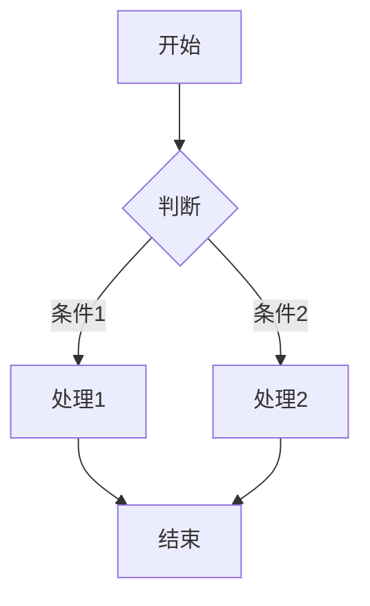
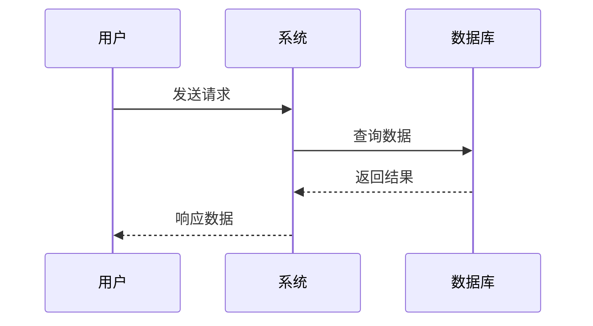
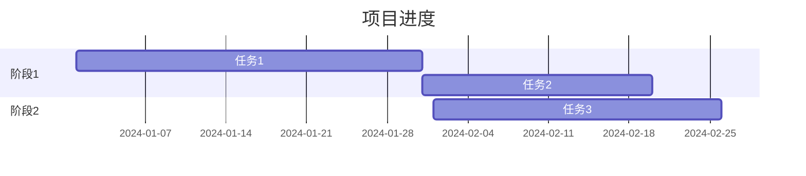

# Markdown语法参考

## 基础语法

### 标题
```markdown
# 一级标题
## 二级标题
### 三级标题
#### 四级标题
##### 五级标题
###### 六级标题
```

### 段落和换行
```markdown
这是一个段落。段落之间需要空行。

这是另一个段落。
```

### 强调
```markdown
*斜体* 或 _斜体_
**粗体** 或 __粗体__
***粗斜体*** 或 ___粗斜体___
~~删除线~~
```

### 列表

#### 无序列表
```markdown
- 项目1
- 项目2
  - 子项目2.1
  - 子项目2.2
- 项目3
```

#### 有序列表
```markdown
1. 第一步
2. 第二步
3. 第三步
   1. 子步骤3.1
   2. 子步骤3.2
```

### 链接
```markdown
[链接文本](https://example.com)
[链接文本](https://example.com "标题")
[引用式链接][id]

[id]: https://example.com "标题"
```

### 图片
```markdown


```

### 引用
```markdown
> 这是一段引用文本。
> 可以跨越多行。
>
> > 这是嵌套引用。
```

### 代码

#### 行内代码
```markdown
使用 `print()` 函数输出内容。
```

#### 代码块
```markdown
```python
def hello():
    print("Hello, World!")
```
```

### 水平线
```markdown
---
***
___
```

### 表格
```markdown
| 表头1 | 表头2 | 表头3 |
|-------|-------|-------|
| 单元格 | 单元格 | 单元格 |
| 单元格 | 单元格 | 单元格 |
```

## 扩展语法

### 任务列表
```markdown
- [x] 已完成任务
- [ ] 未完成任务
- [ ] 另一个未完成任务
```

### 脚注
```markdown
这是一个带脚注的文本[^1]。

[^1]: 这是脚注的内容。
```

### 定义列表
```markdown
术语1
: 定义1

术语2
: 定义2
```

### 上标和下标
```markdown
H~2~O (下标)
X^2^ (上标)
```

### 高亮
```markdown
==高亮文本==
```

## 特殊图表语法

### ASCII图表
```markdown
```ascii
+------------------+
|     开始        |
+------------------+
         |
         v
+------------------+
|    处理数据     |
+------------------+
         |
         v
+------------------+
|      结束       |
+------------------+
```
```

### Mermaid流程图
```markdown

```

### Mermaid时序图
```markdown

```

### Mermaid甘特图
```markdown

```

## 本Skill支持的特性

### 基础渲染
- ✅ 所有标准Markdown语法
- ✅ 表格（斑马纹样式）
- ✅ 代码块（语法高亮）
- ✅ 引用块（左侧边框样式）
- ✅ 列表（自定义bullet样式）
- ✅ 标题（层级分明，带锚点）

### 图表转换
- ✅ ASCII字符图 → PNG图片
- ✅ Mermaid流程图 → 图形化图片
- ✅ Mermaid时序图 → 图形化图片
- ✅ Mermaid甘特图 → 图形化图片

### 排版特性
- ✅ 专业封面设计
- ✅ 自动生成目录
- ✅ 页眉页脚
- ✅ 页码
- ✅ A4纸张优化
- ✅ 打印优化

## 最佳实践

### 文档结构
1. 使用一级标题作为文档主标题
2. 使用二级标题作为章节划分
3. 使用三级及以下标题作为小节
4. 保持标题层级连续（不要跳级）

### 内容排版
1. 段落不宜过长，建议3-5行
2. 适当使用列表提高可读性
3. 重要内容使用引用块突出
4. 复杂流程使用图表表示

### 图片使用
1. 所有图片使用相对路径
2. 图片放在与Markdown相同目录
3. 为图片添加替代文本（alt text）
4. 图表使用ASCII或Mermaid语法

## 参考资料

- [CommonMark规范](https://commonmark.org/)
- [GitHub Flavored Markdown](https://github.github.com/gfm/)
- [Mermaid文档](https://mermaid-js.github.io/mermaid/)
